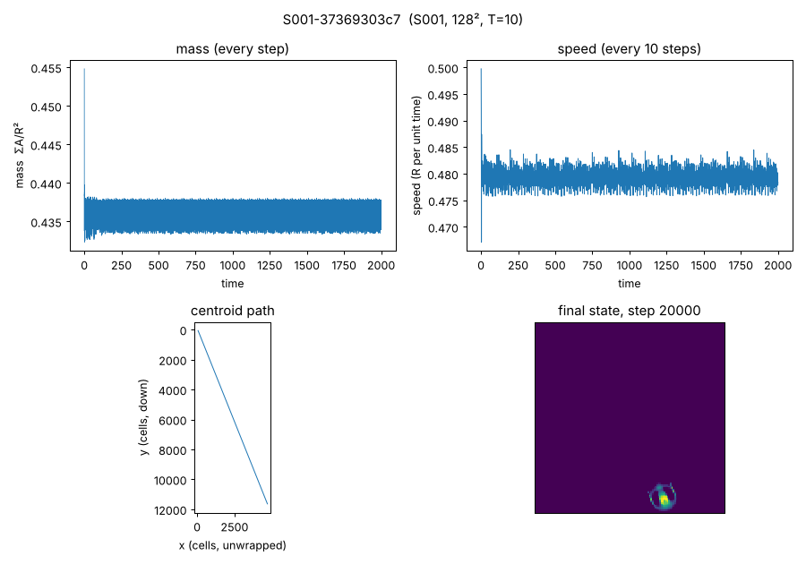

# L2-S001-baseline: S001 long baseline under the ALM simulator

Owner: Lane 2 (Simulation & Instrumentation), 2026-10-07.

## Question

Does `src/alm` reproduce S001 (Orbium, O2u) as the dossier describes, and does the
organism keep bounded mass and steady locomotion over a long horizon?

## Setup

- Specimen S001, dossier `research/specimens/S001-orbium.md`, cells from
  `S001-orbium/initial-cells-u8.csv` (sha256 of int16le cells recorded in the manifest).
- Rule: R = 13, T = 10, μ = 0.15, σ = 0.015, β = [1], polynomial core, polynomial growth,
  Euler + clip, float64, periodic 128 × 128. No intervention, no randomness (seed 0 unused).
- Metric definitions were fixed before the run: mass = ΣA/R²; alive = raw ΣA > 1e−10; speed =
  net unwrapped-centroid displacement over the window; window = steps 1000–20000.

## Reproduction

```bash
./scripts/bootstrap.sh
.venv/bin/python -m alm.run --specimen S001 --steps 20000 --every 10 --size 128 --seed 0 --burn-in 1000
.venv/bin/python -m alm.plot research/traces/S001-37369303c7
```

The run ID `S001-37369303c7` holds for code commit `1ed2696`. A later commit gives a new
ID for the same command.

## Result (run `S001-37369303c7`, OBSERVED, REPRODUCED bitwise from a clean process)

| Metric (steps 1000–20000) | Value |
| --- | --- |
| alive at step 20000 (2000 time units) | yes |
| mass ΣA/R² | 0.435804 ± 0.001113, range 0.433186–0.438022 |
| speed | 0.47941 R per unit time = 0.623233 cells/step |
| heading | 68.198° (from +x toward +y, image y-down) |
| net displacement | 11 841 cells, about 92 laps of the 128 torus |
| mean gyradius | 0.43764 R |
| dominant mass period | 4.320 steps |

Mass and locomotion are stationary. In four consecutive windows (1000–5000, 5000–10000,
10000–15000, 15000–20000) mean mass is 0.435803–0.435804, speed is 0.62322–0.62324
cells/step, and heading is 68.198° in every window. Speed over 100-step windows stays in
0.62253–0.62392 cells/step. A second clean-process run gave the same `final_state_sha256`.



## Agreement with Lane 1

`tests/test_run.py::test_s001_matches_lane1_reference_trace` compares a 4000-step ALM run
with Lane 1's `reference-trace.csv`, which came from a separate numpy transcription. Mass,
gyradius and growth agree to within 5.4e−7 at every sampled step, which is the reference
file's 6-decimal print precision. Centroids agree to 5e−4 cells (3-decimal print precision).
The two paths differ in FFT layout: ALM uses `rfft2` with the kernel centred at index (0, 0),
while Lane 1 and upstream use `fft2`, a centred kernel and `fftshift`. This is agreement
between two transcriptions of the same rule. It is not Lane 3's independent check.

## Proposed claim (for the coordinator to ledger)

**S001 glides stably under the ALM simulator.** Over 20 000 steps on 128² at T = 10, mass
stays at 0.4358 ± 0.0011 (range 0.4332–0.4380), and the creature translates at a constant
0.4794 R/time along a fixed 68.2° heading. Status OBSERVED, REPRODUCED. Run
`S001-37369303c7`. Caveats: one grid size, one timestep, one orientation. The 4.32-step mass
period is the lattice artifact the dossier describes, not an intrinsic oscillation.
