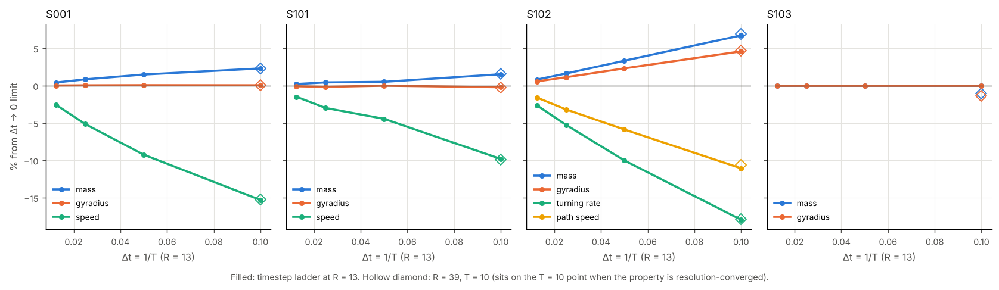

# L3-002 results: which specimen properties persist as R and T are refined

Lane 3, Night 1, numerical-ecology expedition. Protocol: [`PREREGISTRATION.md`](PREREGISTRATION.md)
(committed in `6c52536` before any run). Runner: [`src/alm_check/persistence.py`](../../../src/alm_check/persistence.py)
(committed in `fc93152`, before the 28 runs). Data: [`research/traces/lane3/L3-002/`](../../traces/lane3/L3-002/)
(`runs.csv`, `labels.csv`, one `.json` and `.npz` per run).

## Bottom line

1. **Resolution is not the problem; the timestep is.** For every moving specimen, every mean
   property at R = 13 is within 0.5% of its R = 39 value (e_R ≤ 0.0047). Every timestep error
   is larger, from 0.05% to 18%.
2. **Speeds and turning are biased at T = 10.** S001 speed is 15% below its Δt → 0 limit, S101
   speed 10%, and S102 turns 18% slower (94.8 vs ≈ 115.5°/tu) along a path 11% slower. Mass and
   size are biased by under 2.5% for S001 and S101, but S102 is 6.7% heavier and 4.6% larger
   at T = 10.
3. **S102 is not finite-resolution-only.** It persists at R = 26 and R = 39 as a circler with
   the same mass (0.5234). **This disagrees with C039**, which says S102 dies at R = 26. The
   difference is the seed resize: Lane 6 used bilinear interpolation, and that seed dies
   within 10 time units. Block-replicated, nearest-neighbour and cubic seeds all live for
   1000 time units (exploratory check below). C039 should be narrowed to "dies from a
   bilinearly resized seed".
4. **S103's exactness is a property of T, not of R.** It is a bitwise fixed point at every
   timestep (confirms C042), but block-scaled to R = 26 or 39 it relaxes to a slightly
   different static ring (mass +0.5% and −1.0%) that is not the seed. Each resolution has its
   own exact ring.
5. **Mass fluctuations are discretisation-dependent everywhere.** For S001 they shrink with R
   (C003). For S101 they grow 5× as T increases (0.0013 at T 10, 0.0063 at T 80), which is not
   converged and is worth a look.



## Labels (preregistered rule, applied mechanically)

e_T = |X(T10) − X∞| / X∞ with X∞ = 2·X(T80) − X(T40); e_R = |X(R13) − X(R39)| / X(R39).
All four specimens persist (P1) in all seven conditions, so every property gets a label.

| Specimen | Property | T10 R13 | Δt → 0 (X∞) | R39 T10 | e_T | e_R | Label |
| --- | --- | --- | --- | --- | --- | --- | --- |
| S001 | mass | 0.4358 | 0.4260 | 0.4359 | 2.3% | 0.02% | NOT-CONVERGED (T) |
| S001 | gyradius (R) | 0.4376 | 0.4374 | 0.4376 | 0.05% | 0.02% | NOT-CONVERGED (T) |
| S001 | speed (R/tu) | 0.4794 | 0.5660 | 0.4797 | 15.3% | 0.05% | DISCRETISATION-BIASED (T) |
| S001 | mass sd/mean | 2.6e−3 | 1.1e−3 | 2.4e−4 | | | DISCRETISATION-BIASED (T, R) |
| S101 | mass | 0.8736 | 0.8605 | 0.8738 | 1.5% | 0.01% | CONTINUUM-STABLE |
| S101 | gyradius (R) | 0.8151 | 0.8168 | 0.8146 | 0.2% | 0.05% | CONTINUUM-STABLE |
| S101 | speed (R/tu) | 0.4727 | 0.5241 | 0.4724 | 9.8% | 0.06% | DISCRETISATION-BIASED (T) |
| S101 | mass sd/mean | 1.3e−3 | 7.5e−3 | 1.3e−4 | | | NOT-CONVERGED (T) |
| S102 | mass | 0.5223 | 0.4894 | 0.5234 | 6.7% | 0.2% | DISCRETISATION-BIASED (T) |
| S102 | gyradius (R) | 0.5156 | 0.4930 | 0.5163 | 4.6% | 0.1% | DISCRETISATION-BIASED (T) |
| S102 | turning rate (°/tu) | 94.8 | 115.5 | 94.9 | 18.0% | 0.1% | DISCRETISATION-BIASED (T) |
| S102 | path speed (R/tu) | 0.4432 | 0.4983 | 0.4453 | 11.1% | 0.5% | DISCRETISATION-BIASED (T) |
| S102 | mass sd/mean | 1.9e−2 | 1.8e−2 | 1.6e−2 | 5.0% | 18% | DISCRETISATION-BIASED (T, R) |
| S103 | mass | 0.3787 | 0.3787 | 0.3748 | 0 | 1.0% | NOT-CONVERGED (R) |
| S103 | gyradius (R) | 0.3873 | 0.3873 | 0.3821 | 0 | 1.4% | NOT-CONVERGED (R) |
| S103 | exact fixed point | yes | yes at T 20, 40, 80 | no | | | yes at every T; no at R 26, R 39, corner |

All values for every condition, including T20, T40, T80, R26 and the corner, are in `labels.csv`.
Phenotype classes (P2) matched the registered class in all 28 runs.

**Separability.** The corner (R 26, T 40) matches X(T40) + X(R26) − X(B) within 1% for every
mean property. Only the mass fluctuation (P8) is not separable. The T and R effects are
independent, so the two ladders can be read separately.

## Reading the labels honestly

The rule was fixed in advance, and some labels it produces are stricter than the physics:

- **S001 mass and gyradius are "NOT-CONVERGED (T)"** because the convergence test asks the
  T 40 → 80 change to be at most half the T 10 → 20 change. For mass the changes are 0.0035
  (T 10 → 20) and 0.0018 (T 40 → 80), just missing the bar. Night 0's runs at T = 160 and 320
  (`research/traces/lane3/timestep.csv`) continue the series (0.4266, 0.4257), so mass does
  converge, just more slowly than first order predicts in this range. Gyradius is flat in T
  (all values 0.4375–0.4377); the rule has a flatness escape for R but not for T, so a 0.05%
  wobble fails it. Both stay labelled as the rule says. For later tests I propose adding the
  same 0.5% flatness clause for T.
- **S103 "NOT-CONVERGED (R)"** reflects that the block-scaled ring is a different fixed point
  at each R, not a slowly converging quantity.

## Disagreement with C039 (S102 at R = 26), exploratory follow-up

Not preregistered. [`s102_resize_check.py`](s102_resize_check.py) runs S102's seed, resized to
R = 26 and 39 four ways, under the coexistence rule for 1000 time units
([`s102_resize_check.txt`](s102_resize_check.txt)):

| Resize | R = 26 | R = 39 |
| --- | --- | --- |
| block replication (L3-002) | alive, mass 0.5234 | alive, mass 0.5234 |
| `ndimage.zoom` order 0 (nearest) | alive, 0.5234 | alive, 0.5234 |
| `ndimage.zoom` order 1 (bilinear, Lane 6) | **died at t = 9** | **died at t = 6** |
| `ndimage.zoom` order 3 (cubic) | alive, 0.5235 | alive, 0.5234 |

Both engines agree that the bilinear seed dies, so this is not an implementation difference.
The bilinear seed's mass (0.575) lies between the block (0.560) and cubic (0.582) seeds, so it
is the seed's shape, not its mass, that puts it outside the circler's basin at R ≥ 26. This
is an initial-condition sensitivity result. It belongs to the attractor-geography expedition
and is passed to Lane 6.

## S001 at very small timesteps (exploratory follow-up)

Not preregistered; prompted by the archivist's note that Kojima reports Orbium vanishing at
dt = 0.002 (T = 500), while Chan runs it to T = 2560. [`s001_small_dt.py`](s001_small_dt.py)
runs S001 for 300 time units ([`s001_small_dt.txt`](s001_small_dt.txt)):

| T (dt) | Fate | Mass | Speed (R/tu) |
| --- | --- | --- | --- |
| 640 (0.0016) | alive | 0.4252 | 0.5691 |
| 1280 (0.00078) | alive | 0.4250 | 0.5707 |
| 2560 (0.00039) | alive | 0.4249 | 0.5714 |

S001 does not vanish at small dt under its own rule, and the values land on Night 0's
Richardson prediction (mass 0.4249, speed ≈ 0.572; C009). Kojima's vanishing Orbium is
probably a different rule or variant; we have not checked which. This also settles the S001
mass label above: mass converges, to 0.4249, so the T = 10 value is 2.6% high.

On Davis's "non-Platonic" definition (fails when resolution is refined, survives when
coarsened): under block, nearest or cubic resizing S102 does **not** fail on refinement, so
it does not meet that definition at its registered rule. Only the bilinear seed does.

## Deviations from the protocol

- Before committing the runner I ran one smoke test (S103 at the baseline) to check the code
  executed. Its numbers matched the S103 dossier. The results directory was deleted, and all
  28 runs were made afterwards from the committed runner.
- None otherwise.

## Proposed claims (for the coordinator to ledger)

1. **At R = 13, the mean properties of S001, S101 and S102 are resolution-converged to 0.5%
   (R 13 vs 39); their timestep errors at T = 10 are larger: speed −15% (S001), −10% (S101),
   turning rate −18% and path speed −11% (S102).** OBSERVED, single engine (`alm_check`),
   preregistered. Supports C009 and C014; extends them to S101 and S102.
2. **S102 persists at R = 26 and R = 39 from block, nearest or cubic seeds; only the bilinear
   seed dies.** OBSERVED. Proposes narrowing C039 from NUMERICALLY_FRAGILE to "fragile to the
   seed resize method".
3. **S103 is an exact fixed point at every T tested (10–80), but the block-scaled seed at
   R = 26 and 39 relaxes to a different static ring.** OBSERVED. Supports C042's T statement;
   adds that the exact state is resolution-specific.
4. **S101 and S001 mass and size are continuum-stable within 2.5%; S102's are T-biased by
   5–7%.** OBSERVED.
5. **S101's mass fluctuation grows about 5× from T = 10 to T = 80.** OBSERVED, not converged;
   candidate for a follow-up.
6. **S001 survives at T = 640, 1280 and 2560 and converges to mass 0.4249, speed 0.571 R/tu.**
   OBSERVED (exploratory). Confirms C009's extrapolated limit directly; no small-dt vanishing
   under S001's rule.

## Reproduction

```bash
./scripts/bootstrap.sh
.venv/bin/python -m alm_check.persistence          # 28 runs, ~10 min on 4 cores, then labels
.venv/bin/python research/experiments/L3-002-property-persistence/plot.py
.venv/bin/python research/experiments/L3-002-property-persistence/s102_resize_check.py
```
