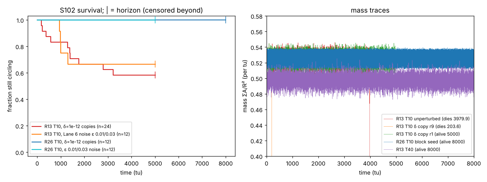

# L3-003: S102 circler lifetime, independent replication of Lane 6 (PR #27)

Lane 3, Night 1, 2026-10-08. Protocol: [PREREGISTRATION.md](PREREGISTRATION.md) (committed
0677cb9, before any run), with **Amendment 1** (6485cb1, written while the main runs were in
progress and before any result was read) that makes the lifetime *distribution* the target, after
Lane 7's HR-009 (PR #30) showed the circler is chaotic. The original Q1–Q5 rules are kept and
reported; Q6 is the amendment's addition. Engine: `alm_check` (Lane 3), FFT, float64, torus.
Rule: μ 0.155, σ 0.020, poly/poly, Euler + clip. Runner `src/alm_check/lifetime.py`; data
`research/traces/lane3/L3-003/` (`lifetimes.csv`, `q6.csv`, one `.npz` mass + centroid series per
run). Every run stopped at its preregistered horizon; nothing was extended.

## Answer in one paragraph

At the registered discretisation (R 13, T 10) the circler is a transient: Lane 6's exact death step
and all 12 of their noisy fates reproduce bit for bit, and 10 of 24 copies perturbed by 1e-12 stop
circling within 5000 tu (9 die, 1 fills the world), which agrees with Lane 7. Under refinement no
copy dies: 0 of 29 runs at R 26 (12 at 1e-12 and 2 unperturbed to 8000 tu, 12 with Lane 6's noise
to 5000 tu) and 0 of 3 at R 39 (8000 tu). If R 26 had the R 13 collapse rate, at least one of those
R 26 deaths would be almost certain (post-hoc estimate below). So the finite lifetime replicates
across implementations but **not** across resolution: on the evidence here it is a property of the
R 13 grid, and whether S102 at R 26 is an attractor or a much longer transient is not established
(all refined runs are censored at their horizons). The timestep result is inconclusive (one run
each at T 20 and T 40, both alive at 8000 tu).

## Results by question

| Q | What | Result | Label |
| --- | --- | --- | --- |
| Q1 | unperturbed R13 T10 death step | **39799** (3979.9 tu), Lane 6: 39799 | REPLICATED-EXACT |
| Q2 | Lane 6's 12 noisy starts | 4 deaths at **933.7, 977.6, 1291.0, 988.8 tu**, the same starts and the same steps as Lane 6; other 8 alive at 5000 tu | REPLICATED (12/12) |
| Q3 | R 26 block (= nearest, bitwise), cubic; R 39 block, nearest, cubic; 8000 tu | **all 5 runs alive** and circling at 8000 tu (path speed 0.445 R/tu, net speed ≤ 0.006) | preregistered rule: "R 13 lifetime is a finite-resolution feature" (see Amendment caveat below) |
| control | bilinear seeds | die at 8.3 tu (R 26) and 6.0 tu (R 39) | as expected (C047) |
| Q4 | R13 T20, T40, 8000 tu | both alive at 8000 tu | single draws: INCONCLUSIVE |
| Q5 | R 26, Lane 6's noise recipe, 12 starts, 5000 tu | **0 of 12** dead | (descriptive; R 13: 4 of 12) |
| Q6-13 | R13 T10, 24 copies at δ = 1e-12, 5000 tu | 9 die (164.0, 203.6, 569.7, 1274.9, 1376.4, 1388.1, 1750.1, 2797.6, 3219.0 tu); 1 **fills the world** at 364 tu (mass → 20.7, not a death under the mass < 0.01 rule); 14 censored, still circling at 5000 tu | **TRANSIENT** |
| Q6-26 | R26 T10 block seed, 12 copies at δ = 1e-12, 8000 tu | **0 of 12** dead; all 12 censored, circling at 8000 tu | **NO DEATH OBSERVED** (this does not show an attractor) |

Q1/Q2 note (Amendment 1): the exact matches show that `alm_check` does the same floating-point
arithmetic as Lane 6's engine for this run (both are numpy `rfft2` steppers). They do not make the
death step a property of the rule; Lane 7 and Q6-13 show a 1e-12 change moves it by thousands of tu.
The alive-start masses (`mass_last_100tu`) differ from Lane 6's in the fourth decimal because this
runner samples mass once per tu and Lane 6 every step; not scored.

Q3 caveat (Amendment 1): each Q3 run is one draw. The R 26 conclusion rests on Q3, Q5 and Q6-26
together (29 R 26 runs), not on Q3 alone. The R 39 evidence is only the 3 Q3 runs.

## How unlikely is "no R 26 death" if R 26 behaved like R 13? (post-hoc, not preregistered)

Treating Q6-13 as a constant-hazard sample (10 ends of circling in 83 107 tu of exposure,
λ ≈ 1.2e-4 per tu), the 172 000 tu of R 26 exposure would give zero ends with probability ≈ 1e-9,
and the 24 000 tu of R 39 exposure ≈ 0.06. The hazard model is crude (the R 13 curve flattens after
~3000 tu, so a "long-lived subpopulation" model would give a larger probability), and Q5 and Q6-26
copies are correlated with each other through the shared seed. This is a scale for the
contrast, not a test.

## What this agrees with and what it contradicts

- **Lane 6 (L6-007 follow-up, PR #27):** fully reproduced at R 13, T 10. "The S102 circler at its
  registered rule is a long transient, not an attractor" holds **at R 13, T 10**. It does not carry
  over to R 26 (or R 39, 3 runs): no transient death was observed there.
- **Lane 7 (HR-009 E1, PR #30):** agrees. Lane 7's δ = 1e-12 row (5 of 8 dead by 5000 tu,
  292–3556 tu) and Q6-13 (10 of 24 ended, 164–3219 tu) are similar counts and ranges, with
  independent random draws and an independent engine.
- **Disagreement to preserve:** any reading of PR #27 or HR-009 as "S102 is a transient of the rule"
  (rather than of the R 13, T 10 discretisation) is contradicted by Q3, Q5 and Q6-26. Lane 3 has
  not shown S102 is an attractor at R 26; only that its R 13 collapse rate is absent there within
  8000 tu.

The mass traces hint at a mechanism but this was not tested: at R 13 the circler's mass oscillates
over 0.49–0.547 per tu, at R 26 and R 39 over 0.511–0.540; the R 13 collapses are abrupt, not a
slow decline.

## Proposed discriminating experiment (not run)

The open question is which discretisation knob produces the collapse: the spatial grid (R) or the
step (T)? A bounded, preregistered L3-004 would run the Q6 recipe (24 copies at δ = 1e-12) at
**R 13, T 20** and **R 13, T 40** to 8000 tu. If copies die at T 20/T 40 at roughly the R 13, T 10
rate, the collapse is a spatial-lattice effect; if none die, the step is implicated too (Q4's single
runs cannot tell). Cost: 48 runs, roughly half an hour on 4 cores. A second, cheaper discriminator is
Lane 7's separation growth rate at R 26: if the R 26 circler is still chaotic (positive rate) but
never collapses, then chaos and collapse are separate properties.

## Proposed claims (for the coordinator and archivist; not written to the ledger by Lane 3)

1. Independently replicated (Lane 3, `alm_check`): at μ 0.155, σ 0.020, R 13, T 10, the unperturbed
   S102 seed dies at step 39799 and Lane 6's 12 noisy starts end exactly as Lane 6 reports. The
   step is one floating-point trajectory (Lane 7 HR-009; Q6-13), not a lifetime.
2. At R 13, T 10, S102 is a transient: 10 of 24 copies perturbed at 1e-12 stop circling within
   5000 tu (9 deaths at 164–3219 tu, 1 world-fill at 364 tu); 14 are censored at 5000 tu.
3. At R 26 (block seed), 0 of 12 copies at 1e-12 die in 8000 tu and 0 of 12 with Lane 6's noise die
   in 5000 tu; at R 39, 0 of 3 seeds die in 8000 tu. The R 13 collapse is not observed under spatial
   refinement within these horizons. Whether S102 is an attractor at R 26 is not established.
4. Timestep dependence of the lifetime: not established (single runs at T 20 and T 40 alive at
   8000 tu).
