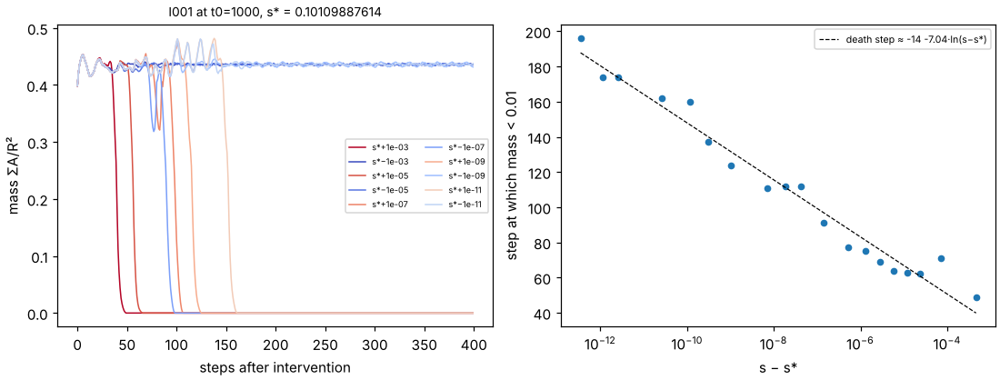
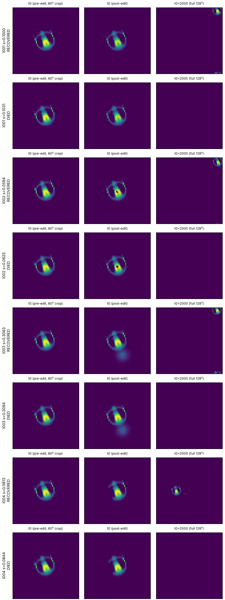

# L4-001: S001 disturbance battery, results

Lane 4 (Disturbance Laboratory), Night 0. The pre-registered design is [`protocol.md`](protocol.md)
(committed in aa4cd5c before any perturbation run; amendments A1 and A2 are appended there). The
generated tables are in [`results/summary.md`](results/summary.md) and
[`results/transitions.csv`](results/transitions.csv).

## Headline

S001 (Orbium, LeniaND rule, R = 13, T = 10) is **fragile and all-or-nothing**. Each of the four
standardized disturbances has one edge where the outcome switches from full recovery to death
within a few time units. No run of 530 at the primary setting ended TRANSFORMED, EXPLODED, or
anywhere between.

| Intervention | Survives | Dies | Edge in mass terms |
| --- | --- | --- | --- |
| I001 uniform attenuation | s ≤ 0.1000 | s ≥ 0.1031 | lose 10.0 % → live, 10.3 % → die (all 5 phases identical) |
| I002 central disc deletion | radius ≤ 0.059–0.084 R | radius ≥ 0.063–0.088 R | lose 3.9–4.0 % → live, 5.2–5.4 % → die |
| I003 frontal Gaussian addition (1 R ahead) | peak ≤ 0.306–0.316 | peak ≥ 0.309–0.319 | gain 27.5–28.5 % → live, 27.8–28.7 % → die |
| I004 port-side cut | s ≤ 0.078–0.088 | s ≥ 0.081–0.091 | lose 7.8–8.8 % → live, 8.3–9.1 % → die |

Ranges are over the five phase replicates (t0 = 1000…1004, one lattice-wobble period). By the
pre-registered rule (all five s* within 0.05, monotone coarse sweep) every edge is **sharp**.

- **Recovery is complete below the edge.** In every RECOVERED bracket run, mass and gyradius never
  left the ±20 % bands, and the final body correlates with the unperturbed control at r ≥ 0.990
  after recentring and heading alignment. The ±10 % and ±30 % bands give the same class for every
  one of the 410 coarse runs.
- **Death is fast.** Just above the edge, mass collapses to zero 30–80 steps (3–8 time units)
  after the edit. A 5000-step horizon changes no bracket outcome (8/8).
- **Where the mass is taken matters more than how much.** Removing 4–5 % of the mass from the
  centre kills it, while removing 10 % uniformly does not. Post-edit total mass is therefore not a
  predictor across interventions: the surviving I001 states (mass 0.392–0.393) are lighter than
  the dying I002 states (0.412–0.414). A naive look at a few instantaneous features (peak
  potential, positive-growth mass, one-step mass change) found no single threshold that separates
  all four interventions either. That search is open for Lane 5, and the bracket-end states are
  saved for it (see "Saved states").

## Robustness

| Check | Result |
| --- | --- |
| Second execution path: Lane 2's `src/alm` simulator (rfft2, kernel centred at the origin) | 40/40 bracket ends classify identically |
| Horizon 5000 steps instead of 2000 (t0 = 1000) | 8/8 identical |
| World N = 192 instead of 128 (bracket ends re-run, then full re-bisection) | 37/40 identical. Three brackets move down by exactly one bisection step (1/256), and the other 17 are unchanged. Cause and fix below. |
| A3: size-independent centroid, N = 128 vs N = 192 | 40/40 identical |
| A1: dt halved (T = 20) | I001 +3 %, I002 unchanged in mass terms, I003 +11 %, I004 +11 % (relative s* shift) |
| A1: resolution doubled (R = 26, cells zoomed 2×, N = 256) | I001 −3 %, I002 unchanged in mass terms, I003 identical, I004 identical to the t0 = 1000 value |

Lane 3 (PR #8) reproduced all 20 transition points on independent code. Their T = 40 run agrees
with T = 20: the I003 and I004 edges rise 11–13 %, I001 moves about 4 %, and I002 does not move.

**Why N = 192 moves three brackets: the centroid estimator, not the physics.** The protocol
places the edits on the *circular-mean* centroid. On a torus that estimator has a bias that
depends on N: between N = 128 and N = 192 it differs from the exact translation by 0.004–0.007
cells, while a linear refinement agrees to 6e−6. That shift is enough to change which pixels fall
inside the 0.8-cell critical disc (I002 removed 5.3 % instead of 4.0 % of the mass, which is past
the edge). It also nudges the Gaussian enough to cross the I003 edge at t0 = 1003. Lane 7 found
the same cause independently (PR #7, HR-007).

Amendment A3 adds a size-independent centroid (`disturb.local_centroid`, run suffix `-cL`). With
it, all 40 bracket ends classify identically at N = 128 and N = 192
(`results/check-ref-N128-cL.csv`, `results/check-ref-N192-cL.csv`). Against the original
circular-centroid brackets, the same three runs flip. So those three edges sit one bisection
step (1/256) lower with the corrected placement, and nothing else changes. **In mass units, the
I002 edge does not move.** Treat each edge as known to ±1 bisection step (±0.003 in s), not to
1/256. Radius is a poor strength coordinate for I002, because the critical hole is about one cell.

## Exploratory: the edge is a saddle with fine structure (not pre-registered)

[`explore_separatrix.py`](explore_separatrix.py) and [`plot_separatrix.py`](plot_separatrix.py)
bisect the I001 edge at t0 = 1000 down to 1e−12 (s* = 0.101098876141, ref engine).

- **The collapse time diverges logarithmically** as s → s* from above. It rises from 49 steps at
  s − s* = 4.5e−4 to 196 steps at 1e−12, fitting death step ≈ −14 − 7.0·ln(s − s*). This is the
  signature of passing close to an unstable edge state with one unstable direction, growing at
  about 1.4 per time unit. A state lingering near it (131 steps after an edit at s* + 1e−11) is
  saved as `states/edge-I001-t1000.npz` as a candidate for Lane 6.
- **Survival below s* is not monotone.** A linear scan of s* − 4e−7 … s* (41 points) finds two
  death islands, ref: `RRRRRRRRRRRRRRRRRRRRRRDDDDRRDDDDDDDRRRRRR`. Lane 2's engine shows the same
  kind of islands at different offsets: `RRRRRRRRRRRDDDDRDDDDDDDRRRRRRDDDDDDDDDDDD`. **The existence
  of fine structure reproduces across engines, but its location is numerically fragile** below
  about 1e−6 in s. Survivors near the edge make a large mass excursion (up to 0.48) and then
  "decide again", which is consistent with a boundary that is not a single smooth surface.

## Proposed claims (for the coordinator / archivist)

These are meant to replace the archivist's provisional C023 wording and to add new entries.
Common fields: specimen S001 (dossier as of PR #2/#3); rule R = 13, T = 10, μ = 0.15, σ = 0.015,
β = [1], poly/poly, Euler + clip, float64, periodic torus N = 128; phases t0 = 1000…1004; horizon
2000 steps; the classifier from `protocol.md` with bands fixed before any run. Run IDs are
`L4-001-<I>-s<strength 6dp>-t<t0>-N<N>-<engine>[-T20|-R26]`, listed per row in `results/*.csv`.
Reproduce with `research/experiments/L4-001-disturbance-battery/reproduce.sh` (stages `base`,
`checks`, `a1`, `states`, `analyze`).

1. **S001 has a single sharp, all-or-nothing survival edge for each of four standardized
   disturbances.** Uniform attenuation: survives ≤ 10.0 % mass loss, dies ≥ 10.3 %. Central
   deletion: survives ≤ 4.0 %, dies ≥ 5.2 %. Port-side cut: edge at 7.8–9.1 % loss. Frontal
   addition: edge at +27.5–28.7 % gain. 530 primary runs, all RECOVERED or DIED, five phases.
   Status proposal: **REPRODUCED** (clean-process alm engine 40/40, horizon 5000 8/8) and
   **INDEPENDENTLY_CHECKED** (Lane 3, PR #8, 20/20 transitions). Run IDs: the bracket rows in
   `results/bisect-brackets.csv`, e.g. `L4-001-I001-s0.100000-t1000-N128-ref` (R) /
   `L4-001-I001-s0.103125-t1000-N128-ref` (D). Caveat: the edges are known to ±0.003 in s (three
   brackets sit one step lower with the A3 size-independent centroid); I003
   and I004 shift 11–13 % with dt (T = 20 / T = 40), so their exact values are timestep-dependent.
2. **For S001, the lethal mass loss depends on where the mass is removed: about 4–5 % from the
   centre, 8–9 % from one side, 10 % uniformly.** The ordering holds at T = 20, at R = 26, and at
   N = 192. Status proposal: **REPRODUCED**. Caveat: these are three geometries, not a fitted
   spatial law.
3. **Post-edit total mass does not predict S001's survival across disturbance types.** Surviving
   I001 states (0.392–0.393 ΣA/R²) are lighter than dying I002 states (0.412–0.414). Status
   proposal: **OBSERVED** (single engine; it follows from claim 2). It refutes a trivial predictor
   and leaves the question open for Lane 5.
4. **Near the I001 edge, collapse time grows like −7.0·ln(s − s*) steps** (s − s* from 4.5e−4 to
   1e−12): S001's survival boundary passes near an unstable edge state. Status proposal:
   **OBSERVED** (ref engine, t0 = 1000 only, exploratory; `results/separatrix-I001-t1000.csv`).
5. **Below about 1e−6 in strength, S001's survival boundary is non-monotone (death islands), and
   the island positions are engine-dependent.** Status proposal: **NUMERICALLY_FRAGILE** (ref and
   alm scans in `results/separatrix-scan-I001-t1000-{ref,alm}.csv`).

## Saved states

`states/` holds `before` (t0, pre-edit), `during` (t0, post-edit) and `after` (t0 + 2000) arrays
(`.npz`, float64, 128²) with 10-step traces, at phase t0 = 1000, for the coarse strengths either
side of each edge and the two bisection bracket ends. The index is in `states/index.csv`.
`states/gallery.png` shows the bracket ends.

## Files

| File | What |
| --- | --- |
| `protocol.md` | pre-registered design, amendments A1 (T/R check), A2 (run-ID format), A3 (size-independent centroid) |
| `run.py` | runner: `one`, `sweep`, `bisect`, `check`; engines `ref` (Lane 1 stepper) and `alm` (Lane 2) |
| `../../../src/alm/disturb.py` | interventions I001–I004, creature frame, the classifier (tests: `tests/test_disturb.py`) |
| `analyze.py` | `results/summary.md`, `results/transitions.csv`, `results/response.png` |
| `save_states.py` | `states/` |
| `explore_separatrix.py`, `plot_separatrix.py` | exploratory edge study |
| `reproduce.sh` | every command above, in order |

## Known gaps

- The interventions are not yet registered with Lane 2's `alm.interventions` hook. They need the
  creature's heading, which needs the previous centroid, and the hook only sees the current state.
  `run.py` steps the simulator directly instead.
- A1 used a single phase per condition, so its shifts are compared with the five-phase spread at
  T = 10, R = 13.
- The ±20 % speed band is centred on T = 10 speed, which Lane 3 shows is 16 % below the dt → 0
  limit. The A1 runs use their own control instead.
