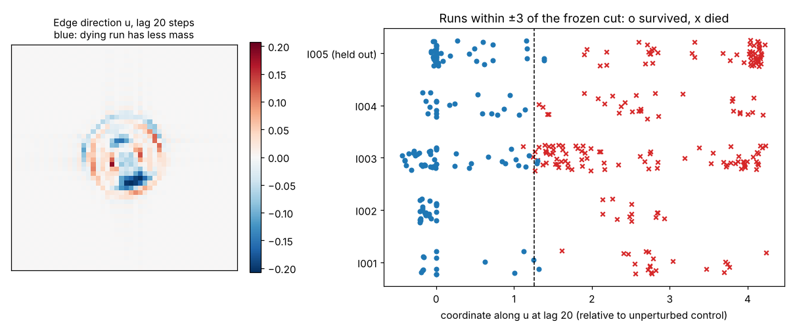

# L5-003: does a coordinate along the edge-pair split direction predict S001 survival across disturbances?

Lane 5, 2026-10-07. The pre-registration is [`PREREGISTRATION.md`](PREREGISTRATION.md), committed in
`846ed50` before any state was projected. The I005 bisection (`f2ccfdb`) was generated and
labelled before any projection. There are no amendments. Lane 7's review of L5-002 (HR-008)
arrived after the pre-registered result was in. The scoped analysis it prompted is labelled
exploratory below.

**Answer: the pre-registered test passes, but the result does not show an edge-state mode.**

- **Pre-registered test.** Leave-one-disturbance-out over I001–I004, measured 2 time units after
  the edit. A single number scores a worst fold of **0.90** and a mean of **0.97** in near-edge
  balanced accuracy against a 0.90 bar, with 2 errors in 120 near-edge runs. That number is the
  disturbed creature's displacement from an undisturbed Orbium, projected onto the direction in
  which near-edge survivor/death pairs split. A shape-deficit null scores 0.78 / 0.90.
- **Unseen disturbance.** On rear deletion (I005), the frozen model scores 0.98 (all runs) and
  0.93 (near edge). The null scores the same.
- **Scoped check (exploratory).** Lane 7 found a genuine unstable edge state (one mode, λ ≈
  1.5–1.8/tu) only for attenuation (I001) and frontal addition (I003). The other edits remove
  whole pixels and never approach an edge state at R = 13. Built from I001 and I003 alone, the
  direction **does not transfer between them** (0.75 and 0.50 at lag 20). At every tested lag it
  is no better than the null.
- **Conclusion.** The pre-registered success is an empirical "split direction" learned across
  mixed edit types. It is not evidence that one unstable mode decides survival.



*Left: the pre-registered direction u at lag 20 steps (2 time units), in the creature's comoving
frame. Blue marks where the run that will die has less mass than its survivor twin. Right: every
run's coordinate along u near the frozen cut (dashed line). I005 was never used to build u or the cut.*

## Method (as pre-registered)

1. **Edge pairs.** For each disturbance and phase, take the highest-strength survivor and the
   lowest-strength death from Lane 4's coarse + bisection runs (I005 has its own new bisection).
2. **Comoving frame.** Shift every state so that its centroid sits at the grid centre, using an
   exact Fourier sub-pixel shift. No rotation is needed: every run sits on the 68.2° heading plateau.
3. **Direction.** u_k = the normalized mean of the unit pair differences (death − survivor) over
   the *training* disturbances at lag k.
4. **Coordinate.** c_k = ⟨state − unperturbed control, u_k⟩, both taken at lag k.
5. **Classify.** A threshold stump on c_k. Empty states are called "die".
6. **Score.** Leave-one-disturbance-out over I001–I004. The score is the worst fold's balanced
   accuracy on that disturbance's near-edge runs. The lag is the smallest k ≥ 0.90. The model is
   then refit on all four disturbances, frozen, and applied to I005.

## Results

**Hold-one-disturbance-out, near-edge balanced accuracy (worst fold / mean). Per fold, near-edge
(all runs):**

| Lag | Edge coordinate | Null coordinate (shape deficit) | Edge coordinate per fold |
| --- | --- | --- | --- |
| 0 | 0.50 / 0.50 | 0.50 / 0.54 | |
| 5 | 0.50 / 0.61 | 0.50 / 0.67 | |
| 10 | 0.50 / 0.69 | 0.50 / 0.67 | |
| **20** | **0.90 / 0.97** | 0.78 / 0.90 | I001 0.90 (0.97), I002 1.00 (1.00), I003 0.97 (0.99), I004 1.00 (1.00) |
| 30 | 0.90 / 0.94 | 0.80 / 0.91 | |

- **Selected lag:** 20 steps (2 time units).
- **Errors:** the edge coordinate makes 2 near-edge errors in 120 runs. One is the last
  surviving I001 run at one phase, and the other is a bisection death in I003, 0.003 in s from
  its edge. The null coordinate makes 10 errors, 7 of them in I003.
- **I005, held out:** the frozen model is a cut at 1.259 with survive below it. It scores
  **0.977** on all 220 runs and **0.929** on the 25 near-edge runs. Its two errors are the two
  survivors closest to the edge at t0 = 1000 (s = 0.15625 and 0.159375, edge ≈ 0.161). The null
  coordinate scores the same 0.977 / 0.929 on I005.
- **Lead time:** at lag 20, 53 of the 68 near-edge dying runs still have mass within Lane 4's
  ±20% band. The 15 that have left it are 10 central deletions and 5 attenuations.

**Do the disturbances split the same way?** These are the cosines between the per-disturbance
mean split directions at lag 20 (`directions.json`):

| | I001 | I002 | I003 | I004 | I005 |
| --- | --- | --- | --- | --- | --- |
| I001 | | 0.16 | 0.92 | 0.82 | 0.88 |
| I002 | | | 0.17 | 0.12 | 0.25 |
| I003 | | | | 0.88 | 0.90 |
| I004 | | | | | 0.83 |

Attenuation, frontal addition, the port cut and rear deletion all split along nearly the same
direction (cosines 0.82–0.92). I005 was not used to build any u. Its own split direction was
computed only for this diagnostic. Central deletion splits along a different direction
(0.12–0.25), and its dying runs are already collapsing by lag 20 (mass ratio 0.56 in L5-002).
Before lag 20 the directions do not agree (cosines ≤ 0.46 at lag 10). Read this as a similar
*pattern* of incipient collapse, which is mostly core loss (the blue in the figure). It does not
show a shared saddle; see the scoped check below.

## Scoped to the genuine edge state (exploratory, after Lane 7 HR-008)

The directions come from I001 only, I003 only, or both (`x_*` columns in `coords.csv`). The
pre-registered columns are byte-identical after this re-run. Script: `score_scoped.py`; data:
`results-scoped-exploratory.json`. Values are near-edge balanced accuracy, with all-runs accuracy
in brackets.

| Lag | Train → test | Edge direction | Null (shape deficit) |
| --- | --- | --- | --- |
| 20 | I001 → I003 | 0.75 (0.89) | 0.78 (0.96) |
| 20 | I003 → I001 | 0.50 (0.83) | 0.50 (0.83) |
| 20 | I001+I003 → I004 / I005 / I002 | 0.73 / 0.64 / 1.00 | 0.93 / 0.93 / 1.00 |
| 30 | I001 → I003 | 0.93 (0.93) | 0.96 (0.99) |
| 30 | I003 → I001 | 0.70 (0.90) | 0.98 (1.00) |
| 30 | I001+I003 → I004 / I005 / I002 | 0.83 / 0.93 / 1.00 | 0.80 / 1.00 / 1.00 |

Between the two disturbances that really pass near an edge state, the split directions point
the same way (cosine 0.92). But the coordinate's survive/die cut does not carry over from one to
the other. This fits Lane 7's finding that the I001 and I003 lingering states correlate only
about 0.90 with each other, so the two trajectories meet different edge states, or meet one at
different times. The mixed-type LOIO success depends on averaging a cut over three disturbances,
including the pixel-quantized I004.

## Proposed claims (for the coordinator)

1. **A coordinate along the edge-pair split direction passes the pre-registered
   hold-one-disturbance-out test at 2 time units.** Near-edge balanced accuracy is 0.90 worst
   fold / 0.97 mean, with 2 errors in 120 runs, against a shape-deficit null of 0.78 / 0.90. It
   ties the null on the unseen I005 (0.98 all, 0.93 near edge). OBSERVED, pre-registered,
   single engine, R = 13. The phases are consecutive steps, so each fold holds about 5
   independent edges, not 30 independent runs.
2. **The split directions of I001, I003, I004 and I005 are similar at 2 time units (pairwise
   cosine 0.82–0.92). Central deletion's is not (0.12–0.25).** OBSERVED, descriptive. This does
   not show a shared edge state: in the exploratory check, I001 and I003 do not share a
   transferable cut.
3. **No evidence yet that a single unstable mode's coordinate predicts survival beyond the
   shape-deficit null.** OBSERVED, exploratory. The test needs smooth edits on both sides, for
   example R = 26, where I004-type cuts are less quantized, or an adjoint (left-eigenvector)
   projection instead of the split direction.

## Caveats

- The worst fold sits exactly on the bar (0.90). It is one error among I001's 5 near-edge
  survivors, so the pass is narrow. The phases are consecutive steps, so each fold has about
  5 independent edges.
- I002, I004 and I005 are pixel-quantized edits. Their "edge pairs" are two different discrete
  edits, not two trajectories straddling a saddle (Lane 7 HR-008). The pre-registered direction
  therefore mixes a real edge mode (I001, I003) with something else.
- On I005 the edge coordinate does not beat the null. Its advantage over the null rests on
  LOIO (I003 and I004), not on the unseen disturbance.
- The edge-pair members are within 1/256 in s of each other but not on the separatrix, so u is
  an estimate. The averaged directions agree better across disturbances (0.82–0.92) than single
  pairs do within one (0.53–0.60). That pattern fits a shared direction plus per-pair noise.
- Lag 20 is where L5-002 saw bulk features start to split (> 1% in gyradius at 20–27 steps).
  The coordinate reads that split coherently across 16 384 pixels before any bulk feature
  crosses 1%. It is an early reading of the divergence, not a prediction made before it begins.
- One engine, one resolution, one heading plateau. The direction is a 128 × 128 pattern at
  R = 13. Whether it transfers across R or T is untested.

## Reproduction

```bash
P=research/experiments/L5-003-edge-direction
.venv/bin/python $P/bisect_i005.py   # i005-bisect.csv (15 runs), about 15 s
.venv/bin/python $P/project.py       # coords.csv, directions.json/.npz, about 2 min on 4 cores
.venv/bin/python $P/score.py         # results.json (pre-registered)
.venv/bin/python $P/score_scoped.py  # results-scoped-exploratory.json
.venv/bin/python $P/plot.py          # edge-direction.png
```

This needs L5-002's `i005-runs.csv` and Lane 4's L4-001 code and results (PR #5).
