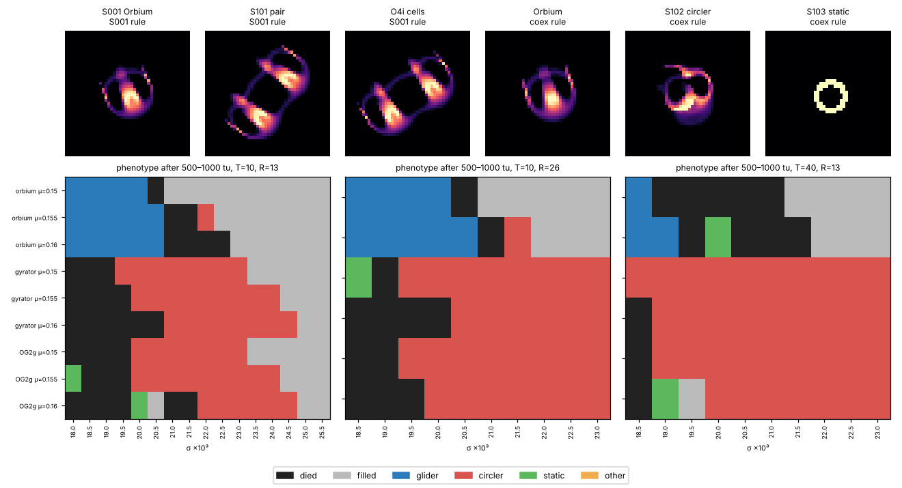

# L6-field: bounded field exploration around S001

Owner: Lane 6 (Field Exploration), Night 0, 2026-10-07. Specimens:
[S101](../../specimens/S101-orbium-pair.md), [S102](../../specimens/S102-circler.md),
[S103](../../specimens/S103-static-ring.md).

## Bottom line

1. **No uncatalogued creature, so no nickname.** Every distinct phenotype found in the
   searched box is a known catalog species. When the catalog's own cells are dropped into the
   same rule, they converge to the same attractor as the Lane 6 seed: masses agree to 1e-4.
2. **One rule supports three catalogued phenotypes at once.** Under μ = 0.155, σ = 0.020
   (otherwise S001's rule), an Orbium glider, a Gyrorbium-like circler (S102) and a
   Circium-like static ring (S103) all persist. Which one you get depends only on history.
   Glider/circler coexistence survives a timestep change (T = 40) and a resolution change
   (R = 26), but the band moves in σ by 0.0005–0.0015 between them.
3. **Disturbances never turned a glider into a circler, or a circler into a glider** (316 runs
   at the coexistence rule). The one phenotype switch seen was circler → static ring after a
   port injury (2 of the 38 port-injury runs on the circler, both in one phase).
4. **S001's own rule has a second stable phenotype: a bound Orbium pair (S101).** It formed
   from 7 of 175 two-Orbium starts, and it is the catalogued Synorbium ignis (`O4i`) carried
   over to the S001 rule. Its disturbance response differs from Orbium's: it survives port
   injury that removes 10–50% of its mass (18/18 runs) by fissioning into one ordinary Orbium,
   while a single Orbium dies at 10% (36/36). The obvious explanation also fits: the cut
   removes one partner and the other carries on. See the claim caveats.
5. **Negative results.** No other phenotype appeared from Orbium's own cells anywhere in a
   441-rule μ × σ box (62 Orbium-like gliders, 2 circlers, the rest died or filled the world).
   Random soups under the S001 rule all died (96/96). Resized or rescaled Orbium either became
   Orbium or died (135 starts).



Top: settled states (T = 10, R = 13). Bottom: phenotype after 1000 time units (T = 10, R = 13)
or 500 time units (the other two) for three seeds across a σ strip, at three numerical settings.
"Gyrator" is the S102 seed and OG2g the catalog Gyrorbium gyrans cells.

## Method

All runs use ALM semantics: poly kernel and poly growth (catalog `kn = gn = 1` as executed),
β = [1], Euler with hard clip, float64, periodic torus, 128² at R = 13 (scaled with R). The
batched stepper [`field.py`](field.py) builds its kernel with `alm.lenia.kernel` and growth with
`alm.lenia.growth`. It matches `alm.lenia.Lenia` bitwise (checked at 300 steps for S001). Clean
reruns of every specimen go through Lane 2's runner (`python -m alm.run`).

Every run records per-step mass and unwrapped periodic centroid. Summaries come from the last
100 time units (200 for L6-004). The motion classes were fixed before the T = 40 and R = 26
reruns:

| Class | Rule |
| --- | --- |
| died | final mass ΣA/R² < 0.01 |
| filled | > 25% of cells above 0.1, or mass > 30 × Orbium |
| GLIDER | net speed > 0.2 R per time unit |
| CIRCLER | net speed < 0.1 and path speed > 0.2 |
| STATIC | path speed < 0.02 |
| OTHER | anything else |

**Correction made during the night.** The first version classified rotation by the rate of the
principal axis, sampled every 5 time units. The circler turns about 95°/tu, so that sample
aliases. Its first T = 10 run of L6-005 recorded "ROTATOR" outcomes on that basis. All tables
here are recomputed from net and path speed by [`tables.py`](tables.py). The `axis_rate` column
in the CSVs is kept but not used. Later runs also record `turn_rate`, the turning rate of the
one-time-unit velocity.

## Experiments

| ID | Script | Question | Output |
| --- | --- | --- | --- |
| L6-001 | [`sweep_musigma.py`](sweep_musigma.py) | What does Orbium become across μ 0.100–0.200 (step 0.005) × σ 0.008–0.028 (step 0.001)? 441 rules, 500 tu | `musigma-T10.csv`, `-final.npz` |
| L6-002 | [`sweep_soup.py`](sweep_soup.py) | Do random patches (side 1–3 R, uniform up to a peak of 0.5–1) make anything under the S001 rule? 96 starts | `soup-*.csv/.npz` |
| L6-003 | [`sweep_seeds.py`](sweep_seeds.py) `zoom` / `pairs` | Orbium resized ×0.6–2.0 and rescaled ×0.6–1.4 (135 starts); two Orbia at 5 relative rotations × 35 offsets (175 starts), S001 rule | `seeds-*.csv/.npz` |
| ref | [`catalog_neighbours.py`](catalog_neighbours.py) | Behaviour of every single-shell catalog entry with μ ∈ [0.09, 0.21], σ ∈ [0.006, 0.030], under its own rule | `catalog-neighbours.csv` |
| L6-004 | [`bistability.py`](bistability.py) | Orbium, the circler seed and catalog OG2g on one σ strip; T10/R13 (1000 tu), T40/R13 and T10/R26 (500 tu) | `bistab-*.csv/.npz` |
| L6-005 | [`disturb_switch.py`](disturb_switch.py) | Lane 4's I001–I004 on the full L4-001 strength grids at 2 phases, then 500 tu: control (Orbium, S001 rule), Orbium and circler at the coexistence rule, pair at the S001 rule | `switch-*.csv` |
| L6-006 | [`persistence.py`](persistence.py) | Each candidate, plus the matching catalog cells, at T10/R13, T40/R13 and T10/R26 | `persist-*.csv/.npz` |

Seeds are rebuilt deterministically by [`make_seeds.py`](make_seeds.py). The I001–I004
definitions are copied from Lane 4 (branch `claude/night0-disturbance-np4adr` @ `7bd1a42`,
`src/alm/disturb.py`) into [`disturb_helpers.py`](disturb_helpers.py), so this lane does not
depend on an unmerged branch.

## Results

### L6-001: the μ × σ neighbourhood is one Orbium continuum

Of 441 rules: 212 died, 165 filled the world and 64 kept a localized creature. 62 of those 64
are visibly Orbium (same crescent body), with mass 0.322–0.493 and speed 0.43–0.59 R/tu varying
smoothly with (μ, σ). Lane 5's component count at threshold 0.1 split Orbium's thin tail into
2–9 pieces, so it is not used as a phenotype test. The other two:

- **μ 0.155, σ 0.022:** Orbium turns into a circler within 100 tu and stays one for at
  least 2000 tu. It is the catalogued Gyrorbium gyrans (`OG2g`, μ 0.156, σ 0.0224), with
  matching mass (0.570 vs 0.580 for the catalog cells under their own rule).
- **μ 0.135, σ 0.018:** Orbium becomes a circler that looks like Gyrorbium revolvens (`OG2r`,
  μ 0.133, σ 0.0177), then fills the world at about t = 850 tu. A long-lived transient, not a
  specimen. The catalog's own OG2r cells also fill the world under their own rule (below).

There is no σ at which Orbium "wobbles" into a distinct periodic form before dying. The edges
are sharp. On the high-σ side there is glider, then death over one to three grid steps of σ, then filling.

### L6-002/003: under the S001 rule, Orbium is the only attractor from those starts, except pairs

- Soups: 96/96 died.
- Resize × rescale: Orbium for zoom 0.9–1.2 with amplitude ≥ 0.9–1.4 (the corner depends on
  zoom), death everywhere else. No third outcome.
- Pairs (175): 84 both died; 67 left one Orbium; 2 filled; 1 chaotic merged blob still alive
  at 500 tu (φ = 180°, offset (−1.5, 1) R; mass sd 17%; not followed up); 21 left double mass.
  Of those 21, **7 were one bound body** (gyradius 0.813 ± 0.001 R, mass 0.8736 ± 0.0002,
  speed 0.472 R/tu), reached from 4 different relative rotations. The other 14 were two Orbia
  still travelling separately. The bound body is S101.

### Reference check

[`catalog-neighbours.csv`](catalog-neighbours.csv) lists the 17 single-shell entries in the box,
run under their own rules. Under ALM semantics, four catalog entries do not persist under their
own rule: `O2bi` and `O2p` die, and `OG2r` and `O8?` fill the world. This is a disagreement with
the catalog, not resolved here. The catalog's cells may need settings the catalog does not
record, or they may be transients. **Flag for Lanes 1 and 3.**

Each candidate was checked by putting the nearest catalog species' own cells into the
candidate's rule:

| Candidate | Nearest catalog species (own rule) | Catalog cells under the candidate's rule | Candidate seed |
| --- | --- | --- | --- |
| S101 pair (S001 rule) | `O4i` Synorbium ignis (μ 0.152, σ 0.0156) | mass 0.8737, gyr 0.8154, speed 0.4723 | 0.8736, 0.8152, 0.4727 |
| S102 circler (coex rule) | `OG2g` Gyrorbium gyrans (μ 0.156, σ 0.0224) | mass 0.5228, gyr 0.5155, path 0.498 | 0.5223, 0.5158, 0.497 |
| S103 static (coex rule) | `C0la` Circium lithos apertus (R 15, μ 0.16, σ 0.022; resized to R 13) | mass 0.378698, static | 0.378698, static |

All three are catalogued species carried to a nearby rule. None is new.

### L6-004: glider and circler coexist on a narrow σ band at all three numerics

Phenotype codes by σ (×10⁻³). G = glider, C = circler, S = static, . = died, # = filled.
Orbium-seed rows and circler-seed rows are shown. The OG2g rows match the circler rows except
for scattered static outcomes (see the figure).

| Numerics | μ | Orbium seed G up to | Circler seed C from | Both persist at σ |
| --- | --- | --- | --- | --- |
| T10, R13 | 0.150 | 0.0200 | 0.0195 | **0.0195, 0.0200** |
| T10, R13 | 0.155 | 0.0205 | 0.0200 | **0.0200, 0.0205** |
| T10, R13 | 0.160 | 0.0205 | 0.0210 | none (adjacent) |
| T10, R26 | 0.150 | 0.0200 | 0.0195 | **0.0195, 0.0200** |
| T10, R26 | 0.155 | 0.0205 | 0.0205 | **0.0205** |
| T40, R13 | 0.150 | 0.0185 | ≤ 0.0185 | **0.0185** |
| T40, R13 | 0.155 | 0.0190 | 0.0190 | **0.0190** |

The coexistence itself is robust: it appears at every setting. Its location in σ is
numerically fragile. At T = 40, Orbium's upper σ edge drops by about 0.0015 (Lane 3 saw
L4 edges shift 11–13% at T = 40 too), and the circler's lower edge drops with it. At R = 26 the
circler seed dies at the exact S102 rule (μ 0.155, σ 0.020) but lives at σ 0.0205. **S102 at its
registered rule is therefore NUMERICALLY_FRAGILE under resolution.** S103 does not move at all:
a clip fixed point does not depend on T (see its dossier), and at R = 26 its resized seed is
static too.

At T = 40 Orbium at the coexistence rule became a *different* static body (mass 0.3873, not S103's
0.3787). It was not followed up.

### L6-005: disturbance responses at the coexistence rule

Outcome counts over the L4-001 grids × 2 phases (t0 = 3000 and 3002 steps). The control is
Orbium under the S001 rule. Survival edges are the largest strength at which both phases
survive.

| Case | I001 attenuate | I002 central delete | I003 frontal add | I004 port injury | Switches |
| --- | --- | --- | --- | --- | --- |
| control: Orbium, S001 rule | survives ≤ 0.05 (0.10 in one phase) | ≤ 0.05 | ≤ 0.30 | ≤ 0.05 | none; all failures DIED |
| Orbium, coex rule | ≤ 0.10 | ≤ 0.05 | ≤ 0.15 | ≤ 0.05 | none; I003 FILLED instead of dying in 22/40 runs, at strengths ≥ 0.45 |
| circler, coex rule | phase-dependent even at 0.05 | phase-dependent at 0.05–0.10 | ≤ 0.10 | phase-dependent at 0.05–0.10 | **I004 0.15 and 0.25, phase 3002 → STATIC** (S103, mass 0.3787) |
| S103 ring, coex rule (quick check, 1 phase) | returns bitwise to S103 at ≤ 0.20, dies ≥ 0.30 | no-op (hole in the middle) | ≤ 0.10, then FILLED | ≤ 0.05 | none |
| S101 pair, S001 rule | ≤ 0.05, 0.10 → single Orbium in one phase | ≤ 0.50 (mostly hits the empty gap) | mixed: pair, single Orbium or died, phase-dependent | **0.10–0.50 → single Orbium** (18/18) | pair → Orbium |

The three phenotypes under the coexistence rule have a clear robustness ranking under uniform
attenuation (I001): the static ring tolerates 20%, the glider 10%, and the circler not even 5%
in every phase. Gliders never switched phenotype. The only switches were circler → ring and
pair → single Orbium.

### L6-006: persistence at a second T and R

| Candidate (rule) | T10, R13 | T40, R13 | T10, R26 |
| --- | --- | --- | --- |
| S101 pair (S001) | GLIDER m 0.8736 v 0.473 | GLIDER m 0.8642 v 0.508 | GLIDER m 0.8738 v 0.472 |
| O4i cells (S001) | GLIDER m 0.8737 v 0.472 | GLIDER m 0.8643 v 0.508 | GLIDER m 0.8738 v 0.472 |
| S102 circler (coex) | CIRCLER m 0.523, turn 95°/tu | CIRCLER m 0.497, turn 109°/tu | **DIED** |
| S103 ring (coex) | STATIC m 0.3787 | STATIC m 0.3787 | STATIC m 0.3787 |
| Orbium (coex) | GLIDER m 0.487 v 0.548 | STATIC m 0.3873 | GLIDER m 0.487 v 0.549 |

As in Lane 3's S001 result, the pair's speed at T = 10 is about 7% below its T = 40 value.

### Clean-process reruns (Lane 2 runner, commit `26b596e`, clean tree)

| Specimen | Run (T = 10, 10 000 steps) | Second process, same config | T = 40, 20 000 steps |
| --- | --- | --- | --- |
| S101 | `S101-3ffd856fba`, final sha256 `107c9d26…` | identical | `S101-046982cbd6` |
| S102 | `S102-5bfac8f95f`, final sha256 `10d65755…` | identical | `S102-7b439113e1` |
| S103 | `S103-1d8c158cdd`, final sha256 = initial sha256 `a81efdac…` | identical | `S103-4982ff6f4d` (also = initial) |

Traces are under [`../../traces/`](../../traces/).

## Proposed claims (for the ledger; Lane 0 assigns IDs)

- **L6-a (OBSERVED → REPRODUCED).** Under S001's rule except σ = 0.020 and μ = 0.155 (T 10,
  R 13, 128²), three phenotypes persist ≥ 500 tu: glider (Orbium), circler (S102) and static
  ring (S103). The glider and circler also coexist at T 40 (σ 0.019) and R 26 (σ 0.0205), so
  coexistence is robust and its σ location is NUMERICALLY_FRAGILE. Runs: `bistab-*.csv`,
  `persist-*.csv`, traces above.
- **L6-b (OBSERVED).** At the coexistence rule, Lane 4's I001–I004 never turn a glider into a
  circler or the reverse (0/316). Port injury turned a circler into the S103 ring in 2 of 38 runs.
  Strength grids and thresholds are Lane 4's, fixed before these runs. Single T/R only.
- **L6-c (OBSERVED, R26/T40 persistence checked).** Under the S001 rule, the bound pair S101
  survives I004 port injury of 10–50% by becoming one Orbium (18/18; mass 0.4358 afterwards),
  where a single Orbium dies (36/36). **Caveat (trivial baseline):** I004 cuts along the
  heading and the partners sit side by side, so the cut mostly removes one partner. The claim
  is only that the pair's coupling does not drag the uninjured partner down, not that the pair
  heals. The I002 "robustness" is the trivial case: the disc sits on the empty gap between the
  partners.
- **L6-d (REFUTED as a novelty claim).** None of S101–S103 is uncatalogued (reference table above).
- **L6-e (OBSERVED, flag).** Under ALM semantics, catalog `O2bi`, `O2p`, `OG2r` and `O8?` do not
  persist under their own catalog rules.

## Discovery-protocol status

| Requirement | S101 | S102 | S103 |
| --- | --- | --- | --- |
| 1. stable ID + serialized state | yes | yes | yes |
| 2. clean-process rerun | yes (bitwise) | yes (bitwise) | yes (bitwise) |
| 3. survives a T or R perturbation | yes (T40, R26) | T40 yes, R26 **no** at its rule | yes (T-independent; R26) |
| 4. behaviour shown by intervention | yes (I004 fission) | partly (fragility, switch to S103) | yes (exact return after I001 ≤ 0.2) |
| 5. reference check fails to identify it | **no: it is O4i** | **no: it is OG2g** | **no: it is C0la** |
| 6. second lane reproduces | not yet | not yet | not yet |

No nickname is proposed. Sir Wobbles is still out there, or nowhere near Orbium.

## Reproduction

```bash
./scripts/bootstrap.sh
.venv/bin/python research/experiments/L6-field/make_seeds.py            # rebuilds the 3 seeds (~1 min)
.venv/bin/python research/experiments/L6-field/persistence.py --T 10 --R 13  # ~30 s
.venv/bin/python research/experiments/L6-field/bistability.py            # ~1 h on 4 cores
.venv/bin/python research/experiments/L6-field/disturb_switch.py         # ~1 h
.venv/bin/python research/experiments/L6-field/tables.py bistab-T10-R13.csv switch-T10-R13.csv
.venv/bin/python -m alm.run --specimen S103 --steps 10000 --every 10 --burn-in 5000
```

Run from the repo root. `tables.py` reads files relative to its own directory.

## Next experiments (by information value)

1. **Second-lane reproduction of L6-a** in `alm_check` (Lane 3). Two seeds, one rule, does each
   persist? This is the claim closest to the stop condition.
2. **Map the edge of the pair's binding** (S101): the offset at which two Orbia bind versus pass,
   at R 26, to see whether binding is a lattice effect.
3. **Resolve the catalog disagreement** (L6-e) before any lane cites `OG2r` or `O2bi`.
