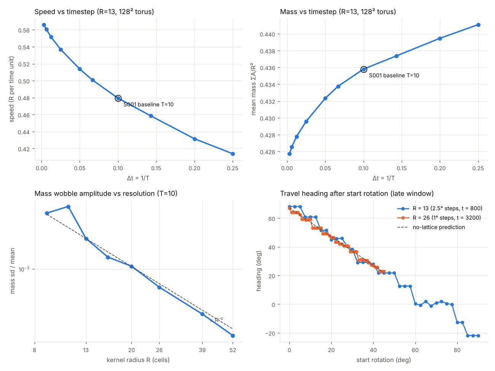

# L3-numerics: independent replication and numerical red team for S001

Owner: Lane 3 (Independent Replication / Numerical Red Team), 2026-10-07.
Code: [`src/alm_check/`](../../../src/alm_check/). Summary CSVs: [`research/traces/lane3/`](../../traces/lane3/).
Tests: [`tests/replication/`](../../../tests/replication/).

## Bottom line

1. **No disagreement between implementations.** Four execution paths give the same S001 run:
   Lane 3's `alm_check` (FFT path, and an FFT-free real-space path), upstream's own
   `Automaton` class, Lane 1's reference trace and Lane 2's `alm` trace (PR #6).
2. **S001's speed is a timestep artifact at the 16% level.** At the baseline T = 10 Orbium
   moves at 0.479 R/time. As Δt → 0 it converges to about 0.571 R/time. Mass is 2.6% high at
   T = 10. Gyradius barely moves. Every speed number in the dossiers is a T = 10 number, not
   a property of continuous Lenia.
3. **S001's heading locks to lattice directions at R = 13.** After a start rotation the travel
   heading falls on a staircase of plateaus (for example 68.20° = atan(5/2) for start
   rotations 0–5°, and 21.80° = atan(2/5) for 42.5–50°). At R = 26 the lock is weaker but
   still there: 46 start rotations 1° apart settle onto 20 headings, on plateaus 2–5° wide.
   Heading is a grid property at both resolutions, not an organism trait. (An earlier
   version of this report said the lock "mostly disappears" at R = 26. That came from a
   2.5° sweep that stepped over the narrower plateaus; see "Heading lock".)
4. **Resolution is otherwise fine at R = 13.** Mass, size and speed at R = 13 are within 0.1%
   of their values at R = 52. The mass wobble shrinks roughly as R⁻², which supports Lane 1's
   claim that it is a lattice artifact. Orbium dies at R ≤ 7, and survival is non-monotone
   from R = 8 to 10.
5. **Lane 4's disturbance edges reproduce.** On the independent stepper, all 20 survive/die
   transitions of L4-001 fall inside Lane 4's brackets. They hold at R = 26 with less phase
   scatter. Two of the four (frontal addition, port-side injury) move 11–13% at T = 40.
6. **Boundaries.** Any periodic torus from 32² to 256² gives the same statistics to 2e−5, so
   128² has no self-interaction. A dead (zero-padded) edge does not kill Orbium: it slides
   along the wall into the corner and parks there, alive.

## Execution paths compared

All on the S001 baseline: R = 13, T = 10, μ = 0.15, σ = 0.015, poly/poly, Euler + clip,
float64, 128² torus, catalog cells centred.

| Path | How it differs | max \|ΔA\| vs `alm_check` FFT | Metrics |
| --- | --- | --- | --- |
| `alm_check` direct | `scipy.ndimage.correlate`, 27×27 stencil, no FFT | 1.7e−13 @100, 3.0e−9 @500, 2.1e−6 @1000, 8.9e−7 @4000 | same to 1e−6 |
| upstream `Automaton` (LeniaND.py @ adfc542, lifted with `ast`, CPU path) | `fftn` of centred kernel + `fftshift` | 8.9e−16 @1, 4.7e−14 @100, 5.3e−6 @1000, 5.6e−7 @2000 | mass to 1e−8 |
| Lane 1 `reference-trace.csv` (4000 steps, every 10) | separate numpy transcription | n/a (trace only) | all columns within print precision (5.4e−7; centroid 5e−4) |
| Lane 2 `alm` run `S001-37369303c7` (PR #6, 20 000 steps) | `alm.lenia` | **final state bitwise identical** at step 20 000 | all columns within print precision (5e−10; centroid 5e−7) |

`alm_check` was written from upstream `LeniaND.py` and the S001 dossier without reading
`src/alm`. The comparison with Lane 2 used only its published trace files
(`python -m alm_check.compare_lane2 <trace dir>`). The bitwise match with Lane 2 is expected
because both happen to put the kernel at index (0, 0) and use `rfft2`. The FFT-free direct
path is the numerically distinct check, and it agrees to the level that float rounding,
amplified by the creature's neutral translation mode, allows. The difference grows to ~1e−6
and then stops growing, which is what a sub-cell position offset looks like rather than
chaos.

The RLE decoder in `alm_check` was also written independently. It reproduces
`initial-cells-u8.csv` exactly (level sum 19 600).

## Timestep (T) sweep

128² torus, R = 13, 400 time units per run, statistics over t = 100–400. Command:
`python -m alm_check.sweeps timestep`.

| T | Fate | Mass | Mass sd/mean | Gyradius (R) | Speed (R/time) | Heading |
| --- | --- | --- | --- | --- | --- | --- |
| 1, 2, 3 | dies | | | | | |
| 4 | persists | 0.4411 | 1.2e−2 | 0.4393 | 0.4140 | 78.9° |
| 5 | persists | 0.4395 | 1.0e−2 | 0.4388 | 0.4316 | 78.5° |
| 7 | persists | 0.4374 | 3.0e−3 | 0.4371 | 0.4586 | 67.7° |
| **10** | persists | **0.4358** | 2.6e−3 | 0.4376 | **0.4794** | 68.2° |
| 15 | persists | 0.4338 | 1.6e−3 | 0.4377 | 0.5008 | 68.2° |
| 20 | persists | 0.4323 | 8.9e−4 | 0.4377 | 0.5137 | 68.6° |
| 40 | persists | 0.4296 | 1.5e−3 | 0.4376 | 0.5369 | 67.9° |
| 80 | persists | 0.4278 | 1.3e−3 | 0.4375 | 0.5515 | 66.6° |
| 160 | persists | 0.4266 | 1.6e−3 | 0.4374 | 0.5606 | 66.5° |
| 320 | persists | 0.4257 | 1.4e−3 | 0.4373 | 0.5661 | 66.8° |

Euler error is first order, so Richardson extrapolation from T = 160 and 320 gives the
Δt → 0 limits: speed ≈ **0.572** R/time (from T = 80/160: 0.570), mass ≈ 0.4249,
gyradius ≈ 0.4372. At T = 10 the speed is 16% below the limit and the mass 2.6% above it.
Upstream's own default is T = 10, so this is a property of the reference rule as published,
and Lane 1/2's numbers are correct for that rule. Any claim about how fast Orbium moves, or
any comparison of speeds across rules or interventions, needs to state T, and ideally be
repeated at T ≥ 40.

## Resolution (R) sweep

T = 10, world size N = 2·round(64R/13) so the world is about 9.85 R wide in every run. The
catalog cells were resampled from R = 13 with nearest-neighbour zoom (`z0`, upstream GUI
behaviour) and bilinear zoom (`z1`). Command: `python -m alm_check.sweeps resolution`.

| R | N | z0 fate | z1 fate | Mass | Mass sd/mean | Gyradius | Speed | Heading |
| --- | --- | --- | --- | --- | --- | --- | --- | --- |
| 5, 6, 7 | ≤ 68 | dies | dies | | | | | |
| 8 | 78 | dies | persists | 0.4351 (z1) | 1.5e−2 | 0.4400 | 0.4742 | 68.2° |
| 9 | 88 | persists | persists | 0.4360 | 5.6e−3 | 0.4379 | 0.4809 | 63.2° |
| 10 | 98 | **dies** | persists | 0.4324 (z1) | 1.3e−2 | 0.4378 | 0.4756 | 74.9° |
| 11 | 108 | persists | persists | 0.4357 | 6.8e−3 | 0.4376 | 0.4772 | 67.3° |
| **13** | 128 | persists | — | **0.4358** | 2.6e−3 | 0.4376 | **0.4794** | 68.2° |
| 16 | 158 | persists | persists | 0.4360 | 1.4e−3 | 0.4376 | 0.4797 | 67.9° |
| 20 | 196 | persists | persists | 0.4359 | 1.1e−3 | 0.4376 | 0.4796 | 67.3° |
| 26 | 256 | persists | persists | 0.4359 | 5.7e−4 | 0.4375 | 0.4797 | 68.0° |
| 39 | 384 | persists | persists | 0.4359 | 2.5e−4 | 0.4376 | 0.4797 | 64.3° |
| 52 | 512 | persists | persists | 0.4359 | 1.3e−4 | 0.4375 | 0.4797 | 65.0° |

(Values are z0 unless marked.) Mass, gyradius and speed converge quickly: R = 13 is within
0.03% of R = 52 in mass and 0.06% in speed. Below R ≈ 11 Orbium is fragile, and survival
depends on how the start state was resampled (R = 10 nearest-neighbour dies, bilinear lives).

**Test of Lane 1's lattice-wobble claim.** Two predictions follow if the mass wobble is a
grid artifact. First, its amplitude should vanish as R grows: it falls from 2.6e−3 at
R = 13 to 1.3e−4 at R = 52, close to R⁻² (figure, lower left). That prediction holds.
Second, its period should equal the grid-crossing period 1/|v_x| (aliased into
[0, 0.5] cycles/step). Of the 17 persisting runs, this holds to ≤ 3% in 6 (R = 8 z1,
10 z1, 13, 26 z0, 39 z1, 52 z0): at R = 26 the predicted 2.14-step period is observed at
2.13 steps. Two more (R = 9) match the x−y beat to 3–4%. It fails in the rest (R = 11, 16,
20, 26 z1, 39 z0, 52 z1), where the dominant period matches no single-axis crossing or
simple beat. So the claim survives as "grid artifact", but "the period is 1/|v_x|" is only true
at some headings.

## Heading lock

Rotate the catalog cells by 0–90° in 2.5° steps (bilinear, padded), run 800 time units, and
measure the heading over t = 700–800. Command: `python -m alm_check.heading --R 13`
(and `--R 26`, which upscales the cells bilinearly first).

In continuous Lenia the heading would be heading₀ − rotation (the dashed line in the
figure). At R = 13 it is a staircase instead:

| Start rotation | Late heading | Comment |
| --- | --- | --- |
| 0, 2.5, 5° | 68.20° | atan(5/2) = 68.199° |
| 7.5, 10, 12.5° | 60.82° | |
| 15, 17.5° | 51.5° | |
| 20–25° | 44.9–46.0° | near the diagonal |
| 32.5–37.5° | 29.2° | |
| 42.5–50° | 21.80° | atan(2/5) = 21.801°, mirror of the 0° plateau |
| 52.5–57.5° | 12.68° | |
| 60–77.5° | −1.2 to 1.9° | axis-locked, jittering |
| 80, 82.5° | −12.68° | mirror of 12.68° |
| 85–90° | −21.80° | mirror of 21.80° |

The plateau set is symmetric under the lattice's reflections (68.20 ↔ 21.80 across 45°,
±12.68 across 0°), which a property of the organism would not be. Speed also depends on
the locked direction at R = 13: 0.4794 on the 5/2 and 2/5 plateaus, 0.4778 at ±12.68°, and
0.474 near the axis (a 1.2% anisotropy; Lane 1 saw no difference because its three test
angles all landed on 5/2-type plateaus). At R = 26 speed is 0.4794–0.4798 at every angle.

**R = 26, settled by a finer and longer sweep.** Lane 7 (PR #7) found 17 headings for 46 start
rotations at R = 26, while the 2.5° sweep above looked close to the continuum line. To tell
sweep resolution from run length apart, I reran R = 26 with 1° steps over 0–45° for 3200
time units (32 000 steps, 4× Lane 7's horizon) and recorded the heading at t = 800, 1600,
2400 and 3200 (`python -m alm_check.heading --R 26 --step 1 --max-angle 45 --horizon 3200
--tag=-fine-long`; data in `heading-R26-fine-long.csv`).

| Window ending at t = | 800 | 1600 | 2400 | 3200 |
| --- | --- | --- | --- | --- |
| distinct headings (within 0.1°) of 46 starts | 22 | 20 | 20 | 20 |
| starts sharing a heading with a neighbour | 38 | 39 | 39 | 39 |
| largest empty gap | 5.6° | 5.6° | 5.6° | 5.6° |

The gap was **sweep resolution**. Plateaus at R = 26 are 2–5 start-degrees wide (11–15° all
give 53.28°, 16–18° give 49.33°, 29–32° give 36.72°), so 2.5° steps landed at most one or
two starts on each and hid them. Run length matters only for the last few runs: two more
starts snapped between t = 800 and 1600 (rotation 4°: 63.39° → 64.10°; rotation 10°:
58.95° → 59.36°), and nothing changed after t = 1600. Every settled heading then holds to
±0.03° for 1600+ time units, so these are real attractors, not slow drift. My count (20)
and Lane 7's (17) differ only in the clustering tolerance and horizon; the conclusions
match: pinning persists at R = 26, with narrower plateaus (2–5° vs up to ~17° at R = 13)
and a smaller largest gap (5.6° vs 9.3°).

The heading of the baseline run, 68.198°, sits on the atan(5/2) plateau at T = 10 and 15, but
moves to 68.6° at T = 20 and to 66.5–66.8° at T ≥ 80. The baseline heading is selected
jointly by the grid and the timestep.

## Lane 4 disturbance battery, replicated (L4-001)

Lane 4's first result (PR #5, ledger C023) is a sharp survive/die edge for each of four
disturbances, from Lane 1/2 code only. `alm_check.disturb` re-implements the battery from
Lane 4's pre-registered `protocol.md` (including amendment A1), without reading Lane 4's or
Lane 2's code, and runs it on the `alm_check` stepper: the same coarse grids, five phase
replicates (t0 = 1000–1004 steps at T = 10, i.e. 100 time units + 0.1-unit offsets), the same
±20% outcome bands and window, and bisection to a bracket of 1/1280 (Lane 4 used 1/320).
At T ≠ 10 or R ≠ 13 the bands are centred on that condition's own s = 0 control, as A1
specifies. Commands: `python -m alm_check.disturb --T 10 --R 13`, `--T 40 --R 13`,
`--T 10 --R 26`. Data: `disturb-<condition>.csv` and `disturb-<condition>-brackets.csv`.

**Baseline (T = 10, R = 13): reproduced.** All 20 of my transition estimates s* (4
interventions × 5 phases) fall inside Lane 4's bisection brackets. The coarse class pattern
is identical, every failure is DIED (no EXPLODED or TRANSFORMED anywhere in 1260 runs
across the three conditions), and no strength above a transition recovers.

Transition s* across the five phases (min–max), by discretisation:

| Intervention (strength unit) | Lane 4, T10 R13 | Lane 3, T10 R13 | Lane 3, **T40** R13 | Lane 3, T10 **R26** |
| --- | --- | --- | --- | --- |
| I001 mass attenuation (fraction) | 0.1016 (all phases) | 0.1004–0.1027 | 0.1020–0.1082 | 0.0988–0.0996 |
| I002 central deletion (radius/R) | 0.0609–0.0859 | 0.0598–0.0871 | 0.0605–0.0871 | 0.0809–0.0902 |
| I003 frontal addition (peak) | 0.3078–0.3172 | 0.3090–0.3168 | **0.3348–0.3566** | 0.3074–0.3098 |
| I004 port-side injury (fraction) | 0.0797–0.0891 | 0.0793–0.0887 | **0.0887–0.1004** | 0.0801–0.0816 |

What this says:

- **The edges are real at the finer grid.** At R = 26 every transition sits where it was at
  R = 13, and the phase spread shrinks 3–6× (I003 0.0078 → 0.0023, I004 0.0094 → 0.0016).
  The phase smear Lane 4 saw at R = 13 is mostly lattice, not organism.
- **I002's smear is pixel quantisation.** At R = 13 the critical disc is 0.8–1.1 cells across,
  so the bisection is really choosing which pixel shell is included. In mass units every
  phase behaves the same: Orbium survives losing 3.9–4.0% of its mass from the centre and
  dies at 5.2–5.4% (the next shell). At R = 26 the threshold is 4.6–5.0% → 5.3–5.6%.
  Report I002 by removed mass (≈ 5%), not by radius.
- **I001's ~10% edge is robust**: 0.099 at R = 26, 0.105 at T = 40 (+4%).
- **I003 and I004 move with the timestep.** At T = 40 the frontal-addition edge rises 11%
  (0.313 → 0.347 mean) and the port-injury edge 13% (0.083 → 0.094). Both shifts are larger
  than the T10/R13 phase spread, so by A1's rule they are **discretisation-sensitive (T)**.
  This matches the baseline finding above that speed is 16% off at T = 10: the creature at
  T = 10 is a slightly different, more fragile organism than the Δt → 0 one. I001 and I002
  barely move.

## Boundary and precision

`python -m alm_check.sweeps boundary` and `... precision`.

- **Torus size.** N = 32, 40, 44, 48, 52, 56, 64, 96, 128 and 256 all give mass 0.435803,
  speed 0.47942 and heading 68.198° (differences ≤ 2e−5, except gyradius at N = 32, which
  is +0.1% because the periodic gyradius is truncated at N/2). The creature does not feel
  its own wake through the wrap even at N = 32 ≈ 2.5 R.
- **Dead edge** (zero padding, real-space path). Before contact the run is bitwise equal to
  the torus (tested). Orbium reaches the bottom wall at about step 100, slides along it,
  and from about step 200 sits in the corner, centroid (122, 122), alive for the rest of the
  4000 steps with mass 0.31–0.39 and 10% fluctuations. This is not upstream semantics
  (upstream is always periodic), but it is a cheap new behaviour for Lane 6 to look at.
- **float32** (upstream's GPU precision). Mass 0.435755 vs 0.435803 (−0.01%), speed +0.02%,
  heading 68.04° vs 68.20°. Statistics are robust; exact trajectories are not.

## Proposed claims (for the coordinator to ledger)

1. **S001 replicates across four execution paths.** Lane 3 FFT and FFT-free paths, upstream
   `Automaton` and Lane 2 `alm` agree on the baseline run (state to ~1e−6, Lane 2 bitwise
   over 20 000 steps). INDEPENDENTLY_CHECKED. This supports Lane 1 claim 1 and Lane 2's
   baseline claim.
2. **S001 speed at T = 10 (0.479 R/time) is 16% below its Δt → 0 limit (≈ 0.572).** Mass is
   2.6% high; gyradius is stable to 0.1%. OBSERVED, by Richardson extrapolation over
   T = 4–320. Status for any speed claim at T = 10: NUMERICALLY_FRAGILE (timestep).
3. **S001's heading locks to a discrete set of lattice directions; the lock weakens but
   persists at R = 26.** OBSERVED and INDEPENDENTLY_CHECKED with Lane 7: 46 starts give 20
   settled headings at R = 26 (plateaus 2–5° wide, stable from t = 1600 to 3200), versus
   about 10 at R = 13. The baseline heading of 68.2° is a lattice plateau (atan 5/2).
   Heading is NUMERICALLY_FRAGILE.
4. **Lane 1 claim 3 (mass wobble is a lattice artifact)**: amplitude ∝ ~R⁻² supports it. The
   specific period rule 1/|v_x| holds in 6 of 17 runs (8 counting beats) and fails in the rest. Suggest
   rewording to "amplitude vanishes with resolution".
5. **S001 survives on a 32² torus and parks in a corner of a dead-edge box.** OBSERVED.
6. **S001 needs R ≥ 8–11 and T ≥ 4 to survive** from the catalog cells. OBSERVED; the
   R = 8–10 band is non-monotone and depends on the resampling method.
7. **Lane 4's survive/die edges (C023) reproduce on an independent implementation.** All 20
   T = 10, R = 13 transitions fall inside Lane 4's brackets; INDEPENDENTLY_CHECKED. They
   also hold at R = 26 with 3–6× less phase spread. Mass attenuation (≈ 10%) and central
   deletion (≈ 5% of mass) are robust to T; frontal addition and port-side injury shift
   11–13% at T = 40, so their exact values are NUMERICALLY_FRAGILE (timestep). Every failure
   is death; no intermediate TRANSFORMED state appears.

## Caveats

- One specimen, one rule (poly/poly, σ = 0.015). The exp/exp paper rule was not swept.
- Speed and heading come from centroid motion; mass period from a Hann-windowed FFT of the
  per-step mass over t = 100–400. Fate "persists" means mass > 1e−10 at t = 400, no blow-up.
- Rotated and rescaled start states are interpolated, so they are not the catalog organism
  exactly; they relax to the same attractor within ~100 time units (mass and speed agree).
