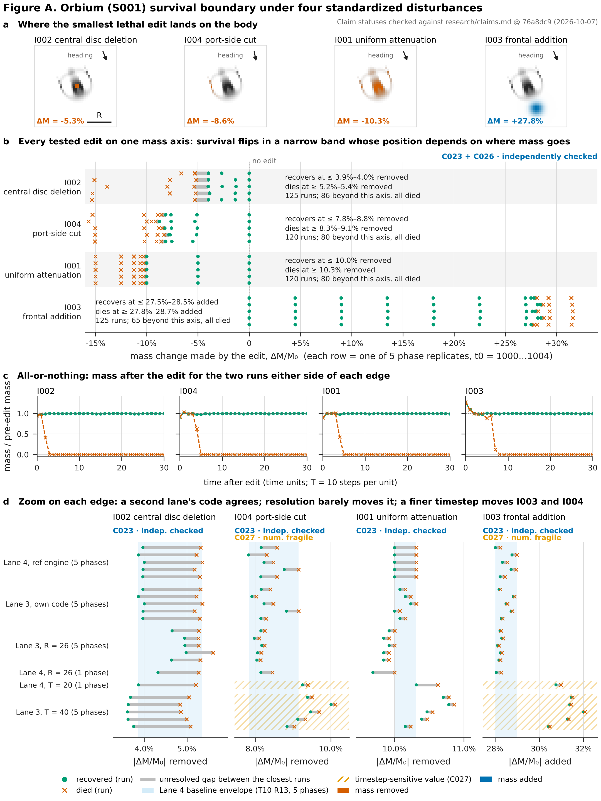

# Figure A: Orbium (S001) survival boundary under four disturbances



[PNG](figure-A.png) · [SVG](figure-A.svg) · [PDF](figure-A.pdf) ·
plotted edges [`figure-A-edges.csv`](figure-A-edges.csv) · plotted runs [`figure-A-runs.csv`](figure-A-runs.csv) ·
provenance [`figure-A.provenance.json`](figure-A.provenance.json)

## What it shows

| Claim | Status in `research/claims.md` | Where in the figure |
| --- | --- | --- |
| **C023**: S001 has one sharp, all-or-nothing survival edge for each of four standardized disturbances | INDEPENDENTLY_CHECKED (T = 10, R = 13) | b, c, d |
| **C026**: where mass is removed matters more than how much | INDEPENDENTLY_CHECKED | a, b |
| **C027**: the I003 and I004 edges move 11–13 % when the timestep is quartered | NUMERICALLY_FRAGILE | d (hatched rows) |

The build reads these statuses from `research/claims.md` and stops if any of them no longer
matches what the figure's encoding assumes. The rendered figure is a snapshot: its top-right
stamp names the ledger commit it was checked against. `figure-A.provenance.json` (`ledger`)
records that commit, the ledger's SHA-256, and each claim's status text at that revision. A CI
test fails if a later ledger change alters any of these statuses. The figure does not assign or
change any status.

## Caption

**Orbium (S001) survives an edit or dies; which one depends on where the edit lands, not only on how
much mass it changes.** Rule: S001 baseline (poly/poly, μ = 0.15, σ = 0.015, R = 13, T = 10, Euler),
128² torus, edit applied once at t0 = 1000…1004 (five phase replicates), outcome classified on the
last 500 of 2000 steps (Lane 4 protocol `L4-001`, preregistered).

**a.** The body just before the edit (grey), with the edit of the *smallest lethal* bracket run
tinted (vermillion = mass removed, blue = mass added). Tint is scaled per panel to show *where*
the edit acts; the amount is in panel b. Uniform attenuation removes the same fraction everywhere,
so its tint follows the body's density. Arrow: direction of travel. Scale bar: R = 13 cells.

**b.** Every Lane 4 run at the baseline setting (490 runs), placed by the mass change the edit
actually made (ΔM/M₀). Each intervention has five thin rows, one per phase replicate. Filled circle =
recovered; cross = died; grey bar = the gap between the closest recovered and died runs, where the
outcome was not sampled. Runs beyond the axis are counted in the row text. All of them died. The
edges sit at about −5 % (centre), −8 to −9 % (port side), −10 % (uniform) and +28 % (frontal
addition).

**c.** Mass after the edit for the two bracket runs at t0 = 1000, sampled every 10 steps (1 time
unit). The recovered run returns to its pre-edit mass. The run one bisection step stronger
collapses to zero within 3–8 time units. No run in any dataset shown here ended between these two
outcomes (2,276 runs: 1,741 died, 535 recovered, none transformed or exploded).

**d.** Each edge in |ΔM/M₀|, zoomed. One row per phase replicate, grouped by who ran it and at
which discretisation. "Lane 3, own code" is Lane 3's independent re-implementation of the battery,
written from the protocol alone (`alm_check`). Blue band: Lane 4's T10 R13 envelope. Hatched rows:
finer timestep (T = 20, T = 40), where the ledger marks the I003 and I004 edge *values* as
numerically fragile (C027).

## How to read the limits

- **The edges are brackets, not points.** The truth is somewhere in each grey bar. Nothing is
  interpolated, and the figure draws no curve between sampled strengths.
- **The I002 gap cannot be narrowed at R = 13.** The central disc removes whole cells. Three
  cells (3.9–4.0 % of the mass) survive, four (5.2–5.4 %) die, and no edit in between exists on
  this grid (C023 caveat, Lane 3 and HR-007). That is why the I002 bars are wide in panel d.
- **Phases are a thin sample.** The five t0 are consecutive steps, a narrow slice of the 2-D
  sub-pixel phase (HR-002, open). Lane 6 reports that I001 s = 0.10, which survives at all five
  phases here, **dies at t0 = 3002** (C023 caveat, from Lane 6's PR #11, not yet merged). So the
  I001 edge sits within about 0.002 of 10 %, and its phase dependence is not fully sampled. That
  run is not plotted, because its data is not on `main`.
- **Resolution moves I001 and I002 slightly.** At R = 26, I001 dies at 9.9–10.0 % (Lane 3) and
  10.0 % (Lane 4), so "survives 10 % uniformly" holds at R = 13 only. The I002 survive side rises to
  4.3–5.0 %. C023 and C026 record both shifts.
- **Timestep moves I003 and I004 most** (C027). At T = 40 the I001 edge also moves by about 4 %.
  C027 does not count that shift as fragile, because it overlaps the T = 10 phase range of Lane 3.
- **Bracket positions depend on the edit-placement centroid** at the one-bisection-step level
  (HR-007, amendment A3). This figure uses Lane 4's original circular-centroid runs. With the
  corrected centroid, three brackets sit one step (1/256 in s) lower, and I002 does not move in
  mass units.
- **Fine structure is not shown.** Below about 10⁻⁶ in s, the I001 edge has engine-dependent
  "death islands" (C030, NUMERICALLY_FRAGILE). That is far below this figure's resolution.

## Alt text

Four-part figure. (a) Four small greyscale maps of the Orbium creature, each with the lethal edit
tinted: a small central spot removed (−5.3 %), a sliver removed from its left flank (−8.6 %), the
whole body dimmed (−10.3 %), and a blue blob added ahead of it (+27.8 %). (b) A dot plot of mass
change per run for each disturbance. Green circles (survived) and orange crosses (died) meet at
about −5 % for central deletion, −8 to −9 % for the side cut, −10 % for uniform dimming and +28 %
for frontal addition. (c) Four line charts of mass over 30 time units. In each, the surviving run
stays at 1.0 and the dying run drops to 0 within 3 to 8 time units. (d) Four zoomed strip plots of
each edge, with rows for Lane 4, Lane 3's independent code, two resolutions and two timesteps. The
independent rows fall inside the baseline band. The finer-timestep rows for side cut and frontal
addition are hatched and shifted to larger edits.

## Sources

| Data | File | Lane |
| --- | --- | --- |
| Baseline runs (coarse + bisection, 5 phases) | `research/experiments/L4-001-disturbance-battery/results/coarse.csv`, `bisect.csv` | 4 |
| A1 re-runs | `…/results/T20/{coarse,bisect}.csv`, `…/results/R26/{coarse,bisect}.csv` | 4 |
| Bracket states and 10-step traces (panels a, c) | `…/states/*.npz`, `*.trace.csv`, `index.csv` | 4 |
| Independent replication | `research/traces/lane3/disturb-T10-R13.csv`, `disturb-T10-R26.csv`, `disturb-T40-R13.csv` | 3 |
| Claim text and statuses | `research/claims.md` (C023, C026, C027) | archivist |

SHA-256 hashes and the last commit of every input are in
[`figure-A.provenance.json`](figure-A.provenance.json). The script runs no simulation. To
regenerate the underlying runs, use `research/experiments/L4-001-disturbance-battery/reproduce.sh`
(Lane 4) and `python -m alm_check.disturb --T {10,40} --R {13,26}` (Lane 3).

## Reproduce

```bash
python3 -m venv .venv && .venv/bin/pip install -e .   # numpy, matplotlib
.venv/bin/python research/figures/A-survival-boundary/make_figure.py
```

Output is byte-for-byte deterministic: re-running it reproduces the same PNG, SVG and PDF (checked
with matplotlib 3.11.2, numpy 2.5.3).
