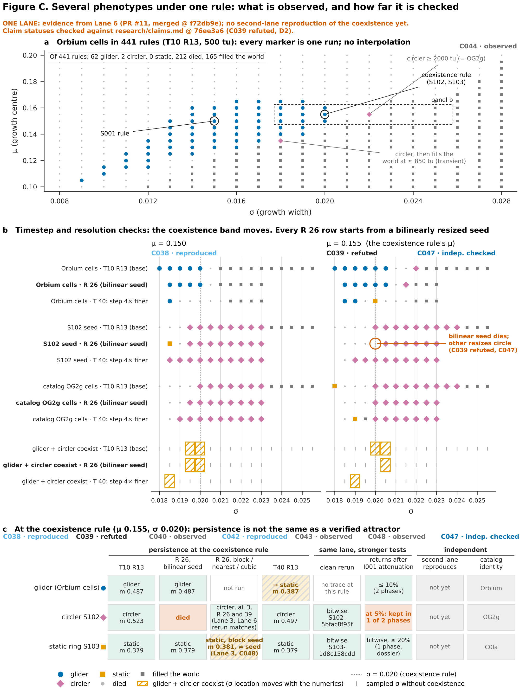

# Figure C: several phenotypes under one rule (one lane)



[PNG](figure-C.png) · [SVG](figure-C.svg) · [PDF](figure-C.pdf) ·
plotted runs [`figure-C-data.csv`](figure-C-data.csv) · evidence matrix [`figure-C-matrix.csv`](figure-C-matrix.csv) ·
provenance [`figure-C.provenance.json`](figure-C.provenance.json)

> **One lane.** Everything plotted comes from Lane 6's PR #11, now merged. It is read with
> `git show` at the merge commit `f72db9e`, whose files are identical (same blob ids) to the
> `f40f303` head this figure was first drawn from. The coexistence itself (C038) has one lane
> behind it and has not been reproduced by a second lane. The seed-resize check at R 26 (C047)
> has two engines behind it.

## What it shows

| Claim | Status in `research/claims.md` | Where |
| --- | --- | --- |
| **C044**: Orbium's μ × σ neighbourhood is one continuum, apart from two circlers | OBSERVED | a |
| **C038**: one rule (μ 0.155, σ 0.020) supports a glider, a circler (S102) and a static ring (S103) | REPRODUCED (clean-process reruns, one lane) | b, c |
| **C039**: the circler dies at R = 26 at its own rule | REFUTED as worded; only the bilinearly resized seed dies (that narrower fact is INDEPENDENTLY_CHECKED) | b, c |
| **C047**: from block, nearest or cubic seeds, S102 circles at R = 26 and 39 | INDEPENDENTLY_CHECKED (Lane 3 `alm_check`, Lane 6 `field.py`) | b (note), c |
| **C048**: S103 is a fixed point at every T, but block-scaled to R 26 it relaxes to a different static ring | OBSERVED (R statement) | c |
| **C040**: disturbances never switch glider and circler | OBSERVED | c (recovery column uses its runs) |
| **C042**: S103 is an exact fixed point of the clipped map | REPRODUCED (one lane) | c |
| **C043**: all three are catalogued species | OBSERVED | c |

The statuses are read from the ledger at build time (`figlib.ledger`). The build stops if any
of them changes. The figure is stamped with the ledger commit it was checked against.

**Ledger revision.** This build is checked against `research/claims.md` as updated in the
archivist's PR #22 (`db4b894`, not yet merged), which records dispute D2 as resolved: C039 refuted
as worded, C047 added. The manifest stores, for each claim, both that status and the one `main`
had at build time (`base_status`). The CI test accepts either the PR #22 status (once it merges)
or the unchanged `main` status (until then), and fails on anything else. After #22 merges, the
figure should be rebuilt so it is stamped with `main`.

## Caption

**a.** L6-001: S001's Orbium cells, run once under each of 441 rules (μ 0.100–0.200 by 0.005,
σ 0.008–0.028 by 0.001; T = 10, R = 13, 500 time units). Each marker is one run, placed at its
rule. Nothing is interpolated between grid points. The glider region is one connected block. Only
two rules give a circler. At μ 0.135, σ 0.018 the circler fills the world at about 850 tu, so it
is a transient. At μ 0.155, σ 0.022 it is still circling at 2000 tu and equals catalog OG2g.

**b. Timestep and resolution sensitivity.** L6-004: three seeds (Orbium cells, the S102 circler
seed, catalog OG2g cells) on a σ strip at μ 0.150 and μ 0.155. Each seed's base run (T10 R13) sits
directly above its resolution re-run (R 26: grid 2× finer, bold) and its timestep re-run (T 40:
step 4× finer), so shifts read vertically. Every R 26 row starts from a seed resized with bilinear
interpolation (`ndimage.zoom(order=1)`), so these rows test resolution and that resize method
together. The bottom three rows of each panel give, per setting,
the σ samples where the Orbium cells glide *and* the S102 seed circles (hatched). Grey ticks are
sampled σ without coexistence. The dashed line is σ = 0.020, the rule S102 and S103 are registered
under. Glider/circler coexistence appears at every setting, but its σ moves. At T 40 the band moves
down by 0.001 to 0.0015 in σ. At R 26 (bilinear seeds) the circler's lower edge at μ 0.155 rises from
σ 0.020 to 0.0205, so the bilinearly resized S102 seed dies at its registered rule (circled).
**That death is a resize effect, not a resolution effect:** the same seed resized by block
replication, nearest-neighbour or cubic interpolation circles at R 26 and R 39 for 1000 tu, in
Lane 3's and Lane 6's engines alike (C047; C039 refuted as worded). The rest of the R 26 band
shift has been measured only from bilinear seeds and has not been rerun with other resizes, so
how much of it is resolution is open. μ 0.160 was run only at T10 R13. It shows no coexistence and
is listed in `figure-C-data.csv` but not drawn.

| μ | T10 R13 | T10 R26 (bilinear seeds) | T40 R13 |
| --- | --- | --- | --- |
| 0.150 | 0.0195, 0.0200 | 0.0195, 0.0200 | 0.0185 |
| 0.155 | 0.0200, 0.0205 | 0.0205 | 0.0190 |
| 0.160 | none | not run | not run |

**c.** At the registered rule (μ 0.155, σ 0.020), the evidence for each phenotype, split by
kind:
- **Persistence at a second T or R.** Resolution and seed resize get separate columns. At R 26
  from bilinear seeds, the glider and S103 persist and the S102 seed dies. At R 26 from block,
  nearest or cubic seeds, S102 circles (also at R 39) in two engines (C047). S103 block-scaled to
  R 26 stays static but settles at mass 0.381, not the seed's 0.379 (Lane 3, C048). The glider was
  not rerun with other resizes. At T 40 the Orbium cells settle into a *different* static body
  (mass 0.387, not S103's 0.379), so at T 40 the three phenotypes do not coexist at this exact
  rule.
- **Stronger tests by the same lane.** S102 and S103 have bitwise-identical clean-process
  reruns. S103 also returns bitwise to itself after 5–20% attenuation, which is evidence of an
  attracting fixed point. That evidence is from one phase and is recorded only as a table in
  its dossier, with no run file. The glider keeps its phenotype after ≤ 10% attenuation in both
  phases. The circler loses its phenotype in one of two phases at 5%.
- **Independent verification.** The coexistence has not been reproduced by a second lane. Each
  phenotype is a catalogued species carried to this rule (C043). C047's resize check is two-lane,
  but it covers S102 alone and is exploratory, from one seed position.

## How to read the limits

- **Persistence is not an attractor.** A run that is still a glider after 500 or 1000 tu has
  persisted. That says nothing about the size of its basin, or whether a second code agrees.
  Only S103 has a direct return-to-self test, and it is single-phase.
- **Sampled grids.** Panel a has one run per rule, from one seed, at one T and R, with a 500 tu
  horizon. A cell that died might hold a creature from another seed. The phenotype boundaries
  sit somewhere between the plotted samples.
- **Resolution versus resize method.** Lane 6 resized every seed bilinearly for R 26. The figure
  shows the R 26 rows as measured but labels them "bilinear seed", and keeps the other-resize
  evidence in its own column. It does not claim the band shift is a resolution effect.
- **Classifier.** The phenotype labels re-apply Lane 6's own motion classes (`tables.py`,
  fixed before the T40 and R26 reruns) to the recorded speeds. The `outcome` column in
  `switch-T10-R13.csv` still holds the superseded "ROTATOR" labels, which Lane 6 says not to
  use, so it is ignored here.
- **One lane, one pinned commit.** The data is read at the PR #11 merge commit. If Lane 6's files
  change on `main` later, this figure keeps showing the merged revision until it is rebuilt.

## Alt text

Three-part figure, marked as one-lane evidence. (a) A grid of 441 markers over μ (0.10–0.20) and
σ (0.008–0.028). Blue gliders form a diagonal band from low μ and σ up to about μ 0.16 and
σ 0.020. Grey dots (died) lie to the left, and dark squares (filled the world) to the right. Two
pink diamonds mark circlers at μ 0.135/σ 0.018 and μ 0.155/σ 0.022. (b) Two strip plots, for μ 0.150 and 0.155. Each seed's base run sits above
its R 26 and T 40 re-runs. Hatched boxes at the bottom mark where glider and circler coexist. At
μ 0.155 the band moves from σ 0.0200–0.0205 (base) to 0.0205 (R 26) and 0.019 (T 40). A red circle
marks the bilinearly resized S102 seed dying at σ 0.020 at R 26, noted as refuted: block, nearest
and cubic seeds circle there (C047). (c) A 3 × 8 table for the glider, circler S102 and static ring S103, with separate columns for R 26
from a bilinear seed and from block, nearest or cubic seeds. The glider becomes a different static
body at T40 and was not run with other resizes. The circler dies at R 26 only from the bilinear
seed, circles from the other three in two engines, and loses its phenotype at 5% attenuation in
one of two phases. The ring block-scaled to R 26 stays static at a slightly different mass. The ring persists everywhere and returns bitwise after attenuation. The
"second lane reproduces" column reads "not yet" for all three.

## Sources

All Lane 6 L6-field data is read at the PR #11 merge commit `f72db9e`.

| Data | Path | Used in |
| --- | --- | --- |
| L6-001 μ × σ sweep | `research/experiments/L6-field/musigma-T10.csv` | a |
| L6-004 σ strips | `…/bistab-T10-R13.csv`, `bistab-T10-R26.csv`, `bistab-T40-R13.csv` | b |
| L6-006 persistence | `…/persist-T10-R13.csv`, `persist-T40-R13.csv`, `persist-T10-R26.csv` | c |
| L6-005 disturbance runs | `…/switch-T10-R13.csv` (I001 rows, cases `orb@coex`, `gyr@coex`) | c |
| Clean reruns | `research/traces/S102-5bfac8f95f/`, `S103-1d8c158cdd/`, and the README's rerun table | c |
| S103 perturbations | `research/specimens/S103-static-ring.md` (table only) | c |
| D2 seed-resize rerun (Lane 6, `field.py`) | `research/experiments/L6-007-attractor-geography/d2-resize.csv` at `413003d` (branch `claude/night0-field-tmbx06`, no PR yet) | c |
| Seed-resize check (Lane 3, `alm_check`), cross-checked against the row above | `research/experiments/L3-002-property-persistence/s102_resize_check.txt` at the PR #18 merge commit `56ae421` | c |
| S103 block-scaled to R 26 (Lane 3) | `research/traces/lane3/L3-002/labels.csv` at `56ae421` | c |
| Claim statuses | `research/claims.md` at PR #22 head `db4b894` (unmerged) | all |

Blob IDs and SHA-256s of every file read are in `figure-C.provenance.json` (`pinned_inputs`).

## Reproduce

```bash
git fetch origin claude/night0-field-tmbx06 claude/night1-claims-l3002-w1iy56
.venv/bin/python research/figures/C-phenotypes-one-rule/make_figure.py
```

The output is byte-for-byte deterministic.
