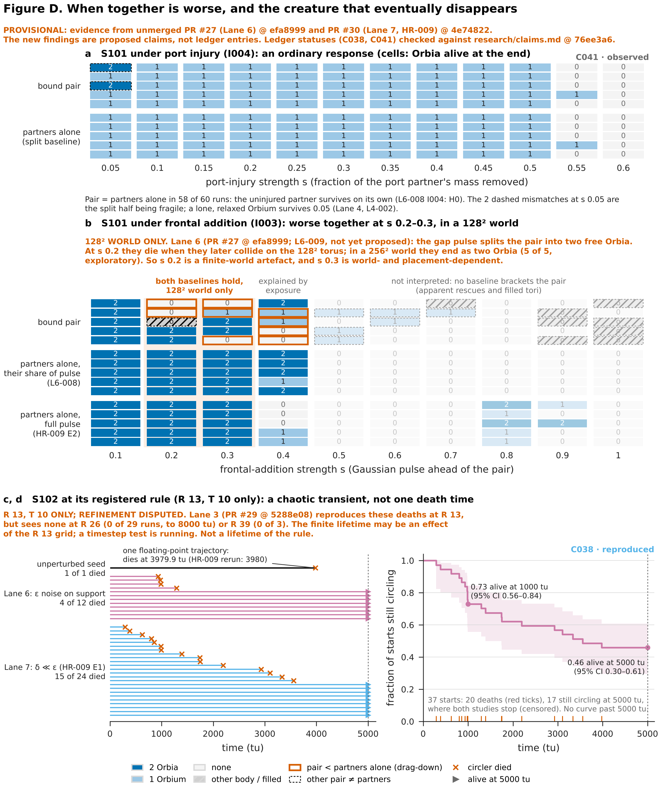

# Figure D: when together is worse, and the creature that eventually disappears (PROVISIONAL)



[PNG](figure-D.png) · [SVG](figure-D.svg) · [PDF](figure-D.pdf) ·
pair runs [`figure-D-pair.csv`](figure-D-pair.csv) · lifetimes and survival estimate
[`figure-D-lifetimes.csv`](figure-D-lifetimes.csv) · provenance [`figure-D.provenance.json`](figure-D.provenance.json)

> **Provisional exhibit draft.** Everything plotted comes from two unmerged PRs:
> - Lane 6's PR #27 (L6-007 and L6-008), read at `efa8999`;
> - Lane 7's hostile review HR-009, PR #30, read at `4e74822`.
>
> **Panel b is 128² world only, with a world-size caveat.** Lane 6's later L6-009 note (in
> PR #27 @ `efa8999`; its own PR is not yet open) finds that the gap pulse splits the pair into two
> free Orbia. At s 0.2 they die when they later collide on the 128² torus, while in a 256² world the
> same edited states end as two Orbia in 5 of 5 phases (exploratory). So the s 0.2 drag-down is a
> finite-world artefact, and the s 0.3 deaths are world- and placement-dependent. The figure will
> be redrawn when L6-009's data is in a PR.
>
> **Panels c and d are R 13, T 10 only, and refinement is disputed.** Lane 3's independent
> replication (PR #29 @ `5288e08`, L3-003) reproduces these R 13 deaths exactly. But no copy died
> at R 26 (0 of 29 runs, up to 8000 tu) or at R 39 (0 of 3), so the finite lifetime may be an
> effect of the R 13 grid rather than of the rule. A timestep test that separates grid from step
> is running. L3-003 is cited here, not plotted.
>
> Both are read with `git show`, and nothing is copied here. The findings shown are *proposed* claims
> (L6-c, L6-d, L6-f) as Lane 6 revised them after HR-009. They are not in `research/claims.md`, so the
> figure prints no status for them. If #27 or #30 change, this figure must be rebuilt at their new heads.

## What it shows

| Finding | Where it stands | Panel |
| --- | --- | --- |
| **L6-c**: under port injury, the pair survives because the uninjured partner does | proposed (PR #27); accepted as written by HR-009 | a |
| **L6-d**: under frontal addition, the bound pair dies where each partner alone survives | proposed (PR #27), narrowed by Lane 6 after HR-009 to s 0.2–0.3; preregistered verdict INCONCLUSIVE. Lane 6's L6-009 note: s 0.2 is a 128² collision artefact, s 0.3 is placement-dependent | b |
| **L6-f**: S102 is a long, chaotic transient, not an attractor | proposed (PR #27), revised by Lane 6 after HR-009: a chaotic transient whose lifetime distribution is the target. Lane 3's PR #29 replicates it at R 13, T 10 but sees no death at R 26 or R 39 | c, d |
| **C041**: S101 survives port injury of 10–50% by shedding to a single Orbium | OBSERVED (ledger) | a |
| **C038**: one rule supports a glider, a circler (S102) and a static ring | REPRODUCED (ledger) | c, d |

C041 and C038 statuses are read from the ledger at build time (`figlib.ledger`), and the build
stops if either changes. Panel a reads against C041's wording, because L6-008 explains the
shedding as the uninjured partner surviving. Panels c and d read against C038's "supports a
circler", because the circler eventually dies. Reconciling those claims is the archivist's job
once #27 and #30 are reviewed. This figure does not change them.

## Caption

**a. Port injury (I004).** L6-008: the bound pair S101 at S001's rule, with the port partner cut by
fraction s at five phases (t0 = 3000–3004). Each cell is one run and counts the Orbia alive at
the end. The top block is the pair. The bottom block is the same two partners cut apart before
the edit and run alone (L6-008's split baseline), so it shows the sum port + starboard. In 58 of
60 runs the pair ends exactly as its partners do alone: the port side dies and the starboard side
lives. The two dashed cells at s 0.05 are the split half being fragile, not rescue. A lone,
relaxed Orbium survives 0.05 (Lane 4, L4-002).

**b. Frontal addition (I003).** Same layout, with a Gaussian pulse added ahead of the pair, and a
third block from HR-009 E2: each partner alone given the *full* pulse. L6-008's split baseline
gives each partner only its half of the pulse, cut at the seam. Red outlines mark runs where the
pair ends with fewer Orbia than its partners alone.
- At **s 0.2–0.3** (shaded), the pair dies or degrades in 6 runs where both partners survive even
  the full pulse: together is worse, *in a 128² world*. Lane 6's L6-009 note finds the s 0.2 deaths
  come from the two split-off Orbia colliding on the torus, which they do not do at 256². Five of these have red outlines. In the sixth (s 0.2, third
  phase, dashed) the pair became a non-Orbium body.
- At **s 0.4**, the full pulse kills or weakens the lone partners too, so exposure explains the
  pair's losses.
- At **s ≥ 0.5** (faded), neither baseline brackets the pair. The apparent rescues and filled tori
  there are not interpreted.

HR-009's preregistered verdict on the whole test is INCONCLUSIVE: 6 of the 10 drag-down runs
survive the full-pulse control, against a threshold of 8. The narrower observation at s 0.2–0.3
stands within that verdict.

**c. S102 lifelines.** 37 starts of the circler at its registered rule (μ 0.155, σ 0.020, R 13,
T 10, 128²), each run for 5000 tu. Everything in c and d is at R 13, T 10 only (see the limits). Each line is one start, and a cross marks the time its mass fell
below 0.01.
- The unperturbed seed (black) dies at 3979.9 tu. HR-009's rerun on the same engine gives 3980
  at 10-step sampling. That is one floating-point trajectory, not the creature's lifetime.
- Lane 6's 12 starts add uniform noise of size ε 0.01 or 0.03 on the seed's support.
- HR-009's 24 starts add perturbations of only δ = 1e−14 to 1e−10. Twin circlers separate at about
  0.2 per tu, so even these tiny perturbations scatter death times from 292 tu to beyond the horizon.

**d. Survival estimate.** Kaplan–Meier product-limit estimate over the 37 starts, with a 95%
Greenwood band (log-log). Runs alive at 5000 tu are censored. Steps fall only at observed deaths,
and nothing is drawn past 5000 tu. About three quarters of starts still circle at 1000 tu and
under half at 5000 tu. 10 of the 20 deaths come before 1000 tu, so the hazard is front-loaded.

## How to read the limits

- **Panels a and b are a split-pair design, not the full story.** The split halves start as cut-out,
  unrelaxed bodies. That is conservative for drag-down and biased for rescue (HR-009). Only I003 at
  s 0.2–0.3 survives both baselines.
- **One world size.** Every pair run is on a 128² torus. Lane 6's L6-009 note (exploratory, data
  not yet in a PR) finds the s 0.2 drag-down disappears at 256², and that s 0.3 depends on where the
  pulse lands. Only s 0.3 remains a candidate for coupling, pending L6-009.
- **One rule, one grid, five phases.** Every pair run is at S001's rule, R 13, T 10. The phases are
  consecutive steps.
- **R 13, T 10 only; refinement disputed.** Lane 3's L3-003 (PR #29 @ `5288e08`) reproduces
  Lane 6's death step and all 12 noisy fates at R 13, and finds 10 of 24 δ = 1e−12 copies ending
  within 5000 tu, which agrees with Lane 7. At R 26 none of 29 runs died (to 8000 tu), and at R 39
  none of 3. So the transient replicates across implementations but not across resolution. Whether
  the collapse comes from the grid or the timestep is not yet known (T 20 and T 40 are one run
  each, both alive). The exhibit should not present a lifetime as a property of the rule.
- **Lifetimes are a sample, not a law.** 37 starts with three perturbation recipes are pooled, as
  HR-009 pools them. The band reflects only the sampling of these starts. It does not cover another
  engine, timestep or grid.
- **Death detection differs slightly.** Lane 6 records the first step with mass below 0.01, and
  HR-009 the first 10-step sample. The difference is at most 1 tu.
- **No mechanism is shown.** The figure does not say why the pair is fragile to frontal mass, or
  whether S102 has two circling regimes (HR-009 suggests it may, untested).

## Alt text

Four-part figure, marked provisional. Part b carries a red warning that it holds only in a 128²
world, where the s 0.2 deaths are a collision artefact. Parts c and d carry a red warning that they hold only at
R 13, T 10, because a replication saw no deaths at finer resolution.
(a) A grid of small tiles, 12 strengths of port injury by five phases, for the bound pair above and
the two partners run alone below. Almost every tile reads 1 in both blocks up to s 0.5 and 0 beyond,
so the pair behaves like its partners alone.
(b) The same kind of grid for frontal addition, with a third block for the partners given the full
pulse. At s 0.2 and 0.3 (shaded) several pair tiles read 0 with red outlines while every lone-partner
tile reads 2. At s 0.4 the full-pulse partners also die. Columns from 0.5 up are faded.
(c) 37 horizontal lines from time 0. About half end in a red cross between 292 and 3980 tu, and the
rest run to an arrow at 5000 tu. One black line, the unperturbed seed, ends at 3980 tu.
(d) A stepped survival curve falling from 1.0 to about 0.73 at 1000 tu and 0.46 at 5000 tu, inside
a shaded uncertainty band.

## Sources

| Data | Path | Commit | Panel |
| --- | --- | --- | --- |
| L6-008 pair runs and split baseline | `research/experiments/L6-008-pair-coupling/pair-coupling.csv` | PR #27 head `efa8999` | a, b |
| HR-009 E2 full-pulse halves | `research/experiments/HR009-l6-review/e2.csv` | PR #30 head `4e74822` | b |
| L6-007 circler lifetimes (exploratory follow-up) | `research/experiments/L6-007-attractor-geography/circler-lifetimes.csv` | `efa8999` | c, d |
| HR-009 E1 twin and δ-perturbed circlers | `research/experiments/HR009-l6-review/e1.csv` | `4e74822` | c, d |
| L6-009 world-size note (cited, not plotted) | `research/experiments/L6-008-pair-coupling/README.md` | PR #27 head `efa8999` | b caveat |
| L3-003 refinement result (cited, not plotted) | `research/experiments/L3-003-circler-lifetime/README.md` | PR #29 head `5288e08` | c, d caveat |
| Claim statuses | `research/claims.md` | stamped on the figure | badges |

Blob IDs and SHA-256s of every file read are in `figure-D.provenance.json` (`pinned_inputs`).

## Reproduce

```bash
git fetch origin claude/night0-field-tmbx06 claude/night0-hostile-review-o3avnq claude/night0-replication-13cz1b
.venv/bin/python research/figures/D-pair-and-circler/make_figure.py
```

The output is byte-for-byte deterministic. The script runs no simulation.
