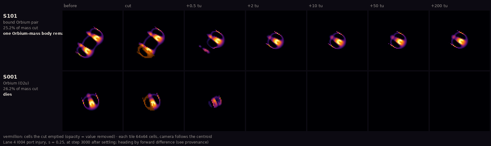
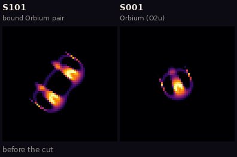
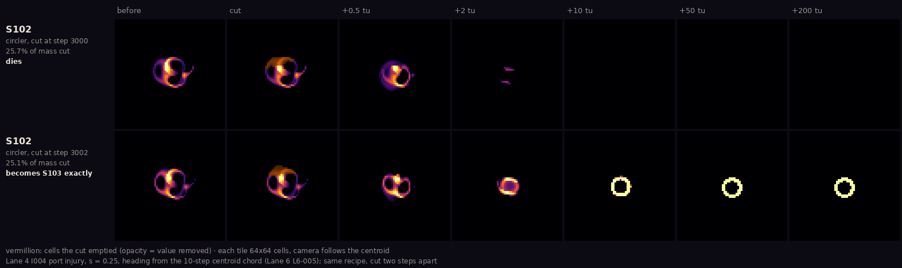
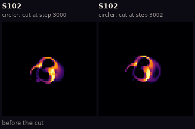
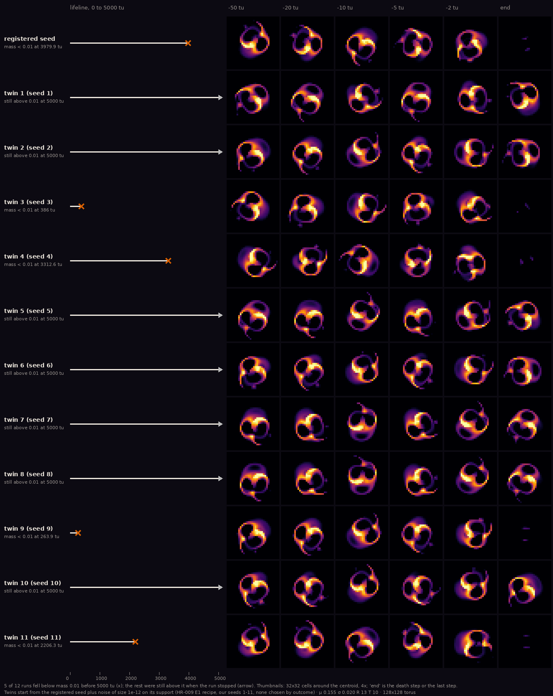
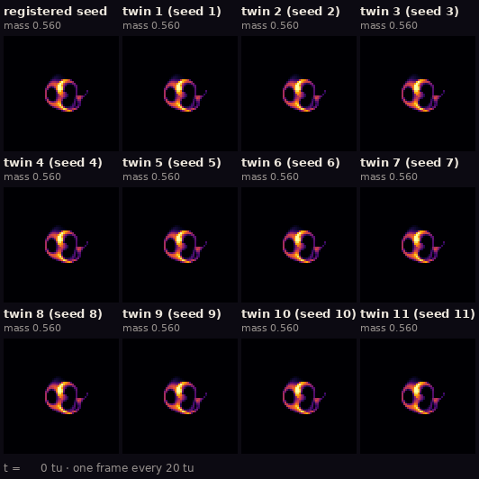

# The ALM specimen gallery

Everything in this gallery is a picture of an actual simulation. Nothing is drawn, painted or
generated by hand: each frame is the state of a Lenia world at a recorded step of a recorded run,
and the render script refuses to draw unless its replay of that run ends in exactly the same
state, bit for bit, as the run's manifest says.

**New to Lenia?** Lenia is a grid of cells, each holding a number between 0 (empty, black here)
and 1 (full, pale yellow here). At every step, each cell looks at a ring of neighbours out to a
radius R (13 cells in all of these runs) and grows or shrinks by a fixed rule. That is all. The
"creatures" below are patterns that keep their shape while the rule rewrites every cell they are
made of, ten times per unit of time. Some of them travel; one of them never changes at all.

## Exhibits

| ID | Exhibit | Subjects | Added |
| --- | --- | --- | --- |
| [G001](#g001--four-ways-to-move) | Four ways to move (animated) | S001, S101, S102, S103 | 2026-10-07 |
| [G002](#g002--portraits) | Portraits | S001, S101, S102, S103 | 2026-10-07 |
| [G003](#g003--contact-sheet-half-a-time-unit-at-a-time) | Contact sheet | S001, S101, S102, S103 | 2026-10-07 |
| [G004](#g004--same-cut-two-fates) | Same cut, two fates (before and after) | S101, S001 | 2026-10-07 |
| [G005](#g005--two-steps-apart) | Two steps apart: the circler becomes the ring | S102 → S103 | 2026-10-07 |
| [G006](#g006--the-circler-that-eventually-disappears-provisional) | The circler that eventually disappears (*provisional*) | S102 × 12 starts | 2026-10-08 |

### G001 — Four ways to move


Full-quality video: [`four-ways.mp4`](exhibits/G001-four-ways-to-move/four-ways.mp4) ·
provenance: [`provenance.json`](exhibits/G001-four-ways-to-move/provenance.json)

Four worlds, one clock: the last 40 time units of each run (steps 2600–3000), played at 4 time
units per second. Each panel is a whole 128 × 128 world. The worlds wrap around, so a creature
leaving one edge comes back on the opposite edge. The blue line traces each creature's centre of
mass over the last 30 time units.

- **Observation.** S001 crosses its world in straight lines. S101 does the same with twice the
  body. S102 moves about as fast as S001 but along a circle only a few cells across, so it goes
  nowhere. S103 does not change at all.
- **Interpretation.** The ledger, not this picture, says what is established. S001's straight
  heading is held by the grid at R = 13 rather than chosen freely ([C011, C013](../claims.md)). S102
  and S103 live under a slightly different rule from S001 (μ 0.155, σ 0.020 instead of 0.15,
  0.015), at which Orbium also persists ([C038](../claims.md), Lane 6, not yet reproduced by a second
  lane).

### G002 — Portraits

| | |
| --- | --- |
|  |  |
|  |  |

Each portrait is a 64 × 64-cell window at step 3000, shifted by whole cells so the creature's
centre sits in the middle. Each square block of pixels is one cell. The white bar is one kernel
radius R = 13 cells. Provenance: [`provenance.json`](exhibits/G002-portraits/provenance.json).

- **S001, Orbium (O2u).** It has a bright crescent core, a dimmer shell and a thin outer arc.
- **S101, bound Orbium pair.** Two Orbium bodies side by side, joined by one shared thin shell.
  Its mass is 2.004 × Orbium's, and it travels 1.4% slower ([C041](../claims.md), from Lane 6's dossier).
- **S102, circler.** Its shape is never the same twice (see G003).
- **S103, static ring.** It is a ring of fully saturated cells, and nothing in it moves. The
  ring is exactly the same at step 0 and at step 3000: the run's initial and final state hashes
  are equal (`a81efdac…`), as Lane 6 reported ([C042](../claims.md)).

### G003 — Contact sheet: half a time unit at a time


Eight frames per creature, 5 steps (0.5 time units) apart, ending at step 3000. Here the camera
follows each creature, so travel is hidden and only changes of shape remain. G001 shows the
travel. Provenance: [`provenance.json`](exhibits/G003-contact-sheet/provenance.json).

- **Observation.** S001 and S101 look almost the same in every frame. S102 looks different in
  every frame. S103 looks identical in every frame.
- **Not a claim.** Eight frames do not establish a period. S102's turning rate (about 95° per
  time unit, one lap per ~3.8 time units) comes from Lane 6's dossier, not from this sheet.

### G004 — Same cut, two fates





Video: [`port-injury.mp4`](exhibits/G004-port-injury/port-injury.mp4) · provenance:
[`provenance.json`](exhibits/G004-port-injury/provenance.json)

Both creatures settle for 300 time units. Then each gets the same injury: Lane 4's I004 "port
injury" removes about a quarter of the mass, taken from the left-hand side relative to the
direction of travel (s = 0.25). In the "cut" column, the vermillion cells are what was removed.
After that the world runs on with no further help. The camera follows each creature. The film
covers 2 time units before the cut to 60 after it and holds on the cut frame for one second.

- **Observation.** In the pair, the cut takes most of one partner. What is left of that partner
  is a small fragment at half a time unit and is gone by 2 time units. The other partner
  glides on, and from then on it looks like an ordinary single Orbium. Its mass at the end of
  the run, 200 time units later, is 0.437 (a single Orbium's is 0.4358). The single Orbium
  loses the same share of itself and is gone (zero mass) 13 steps after the cut.
- **Interpretation, from the ledger.** This matches Lane 6's C041 (*observed*, not yet reproduced
  by a second lane). There, 18 of 18 pair runs at injuries of 10–50% ended as one Orbium, and every
  single-Orbium control died at 10% or more. Lane 6's own caveat applies here too: the cut lands
  mostly on one partner because they sit side by side. So the pair is not healing. The coupling
  just does not drag the uninjured partner down.
- **Disclosed difference.** Lane 4 takes the direction of travel from the previous step. The
  gallery's wrapper ([`galintervene.py`](galintervene.py)) takes it from one probe step forward,
  because the runner's intervention hook does not see the previous state. The cut itself is Lane
  4's `i004_port_injury` unchanged.

### G005 — Two steps apart





Video: [`circler-ring.mp4`](exhibits/G005-circler-to-ring/circler-ring.mp4) · provenance:
[`provenance.json`](exhibits/G005-circler-to-ring/provenance.json)

Two copies of the circler S102 get the same injury: Lane 4's I004 port injury at s = 0.25. The
only difference is timing. One is cut at step 3000, the other two steps later at step 3002. The
cut follows Lane 6's own recipe from L6-005. "Port" is taken from the direction the circler moved
over the previous 10 steps. A circler turns fast, so that direction differs by about 15° between
the two cuts. Both films are aligned on their own cut.

- **Observation.** Cut at step 3000, the circler falls apart and is gone 25 steps later. Cut at
  step 3002, it shrinks into a small bright ring within about 10 time units. From 46 time units
  after the cut, it stops changing at all. Its final state is S103 exactly: cell for cell the
  same values, shifted on the grid (checked by `equals_up_to_shift` in `render.py`).
- **Interpretation, from the ledger.** This is Lane 6's C040 (*observed*, not yet reproduced by a
  second lane). There, a port injury turned the circler into S103 in 2 of 38 I004 runs, both in
  this phase. The gallery's run repeats Lane 6's numbers exactly through `alm.run`. That stepper is
  bitwise equal to Lane 6's (C038), so this is a rerun, not an independent check. Two runs
  cannot show how often the switch happens or why one phase and not the other.
- **Why it is here.** One exhibit has the gallery's three behaviours in a single lineage: a
  circler, a death, and a still ring. It also shows how much the outcome depends on two steps
  of timing.

### G006 — The circler that eventually disappears (*provisional*)

> **Provisional.** The evidence it quotes from Lane 3's
> [L3-003](../experiments/L3-003-circler-lifetime/README.md) (PR #29) and Lane 7's
> [HR-009](../reports/hostile-review.md) (PR #30) and Lane 6's
> [L6-007](../experiments/L6-007-attractor-geography/README.md) follow-up (PR #27, merge 7cbf5ae)
> are all merged on main, and they draw the same line as this caption (divergence at every setting,
> collapse seen only at R 13, T 10, step 39 799 one trajectory). The ledger holds no claim on
> S102's lifetime yet. The
> pictures are verified replays; the reading of them below is not settled.
>
> **Shown at R 13, T 10 only; not seen under refinement.** Lane 3's L3-003 (merged)
> reproduces Lane 6's R 13, T 10 deaths in an independent engine, but sees none when the grid is
> finer (0 of 29 runs at R 26, to 5000–8000 tu; 0 of 3 at R 39, 8000 tu) or the timestep smaller
> (0 of 24 at T 20 and 0 of 24 at T 40, R 13, 8000 tu each). So the disappearance below is
> specific to the R 13, T 10 discretization, the grid and the step together, not a property the
> creature has been shown to keep in finer simulations. Whether S102 lasts forever there is not
> established either: every refined run was simply still alive when it stopped.





Video (one frame every 10 tu): [`eventually-gone.mp4`](exhibits/G006-eventually-gone/eventually-gone.mp4) ·
provenance: [`provenance.json`](exhibits/G006-eventually-gone/provenance.json)

Twelve runs of the circler S102 at its registered rule, each for 5000 time units (50 000 steps).
One starts from the registered seed. The other eleven are twins: the same seed plus noise of size
10⁻¹² on the cells it covers, which is Lane 7's HR-009 recipe drawn with our own random seeds
1–11. None was chosen by outcome. A run counts as gone when its total mass falls below 0.01
(in units of R²), the threshold Lane 6 and Lane 7 use.

- **Observation.** Five of the twelve are gone before 5000 tu, at 264, 386, 2206, 3313 and
  3980 tu. The other seven are still circling when the run stops, with mass 0.51–0.54. In the
  sheet's last-moments columns, each of the five still looks like a whole circler 2 tu before it
  is gone, so the collapse takes under 2 tu. We could not see any sign in the film of which runs
  would go. The registered seed is gone at step 39 799 (3979.9 tu), the same step as in Lane 6's
  L6-007 follow-up.
- **Interpretation, provisional.** Two things are going on, and the refinement results separate
  them. *Divergence:* twins that start 10⁻¹² apart separate about e-fold every 5 tu at R 13, T 10
  (HR-009 E1), so the step at which one run dies belongs to that floating-point trajectory, not to
  the rule. *Collapse:* at R 13, T 10 some of those trajectories fall apart; Lane 7 pools 37 runs
  (20 deaths, earliest at 292 tu, censored mean about 5900 tu, more early deaths than an
  exponential predicts). Under refinement the divergence persists but weakens (HR-009b: half the
  rate at T 20, about 13 times slower at R 26), while the collapse was not observed at all within
  L3-003's horizons. So the collapse needs something the R 13, T 10 discretization adds; HR-009b
  names lattice-driven mass fluctuation as a candidate, untested. None of this shows the circler
  lasts forever on a finer grid, only that no run there ended before it was stopped. Our twelve
  are a picture of the spread, not a lifetime estimate; seven of them say only "still alive at
  5000 tu". The matching step 39 799 is not an independent check: HR-009 attributes that
  agreement to engines that perform the same FFT operations, while L3-003 reproduces Lane 6's
  R 13 deaths in an independent engine. Lane 9's Figure D
  (`research/figures/D-pair-and-circler/`, PR #33, provisional) pools 37 starts into a survival
  curve. When the ledger records a claim, this caption will cite it and drop the provisional
  label.
- **Why it is here.** One canonical death time would be the wrong picture. Twelve near-identical
  starts show what the evidence so far supports at this resolution: the circler can last
  thousands of time units and then fall apart abruptly, and when it goes is not predictable from
  how it looks. On a finer grid or with a smaller step, L3-003 has not seen it fall apart at all.

## Field note, 7 October 2026

> *What I saw.* Four animals, four temperaments. The Orbium set off at once along a line it never
> left, steady as a commuter. The pair travelled the same way, shoulder to shoulder, slightly
> slower, as pairs do. The circler moved about as fast as either of them and got nowhere: it
> chased its own tail around a circle smaller than its own body, a different shape at every
> glance. The ring sat where it was put and never changed by a single bit in three hundred time
> units.
>
> *What I think it means (unverified).* The ring is the strangest of the four. It is alive only
> in the sense that the rule keeps rebuilding it. Lane 6 says every full cell is pushed back up
> to 1 and every empty one back down to 0 by the hard clip ([C042](../claims.md)), so a version of
> Lenia without the clip might not have this animal at all. ~~The circler's tight loop is just as
> fragile: at twice the resolution it dies at this rule ([C039](../claims.md)).~~ I photographed
> them because they are beautiful, not because they are settled.
>
> *Correction, 8 October.* The struck sentence was wrong. The circler did not die because the
> resolution doubled. It died because of how its starting pattern was enlarged. Enlarged by
> bilinear interpolation, it dies at 2× and 3× resolution. Enlarged by block copying,
> nearest-neighbour or cubic resizing, it keeps circling at both. Lane 3 measured this
> ([L3-002](../experiments/L3-002-property-persistence/README.md)), and Lane 6 got the
> same eight outcomes in its own engine
> ([L6-007 D2](../experiments/L6-007-attractor-geography/README.md)). The ledger lists C039 as
> *refuted* as worded, superseded by [C047](../claims.md), which is *independently checked* for
> the eight seeds tested (four resize methods at R 26 and 39, one rule, 1000 time units).
> The method used to resize a seed is a choice, and here it decided the outcome. That is a
> different fragility from resolution itself.

## Specimens shown

Names are the registered names; no nicknames. Statuses are as of the ledger on 2026-10-08; "reproduced" here means clean-process reruns by Lane 6, not a second lane. S101–S103 are catalogued species carried to nearby
rules, not new forms ([C043](../claims.md)).

| ID | Registered name | Rule | Behaviour in its run (steps 1000–3000) | Ledger |
| --- | --- | --- | --- | --- |
| S001 | Orbium unicaudatus (O2u) | R 13, T 10, μ 0.15, σ 0.015 | mass 0.4358, speed 0.479 R/tu, heading 68.2° | dossier [`S001-orbium.md`](../specimens/S001-orbium.md); C001–C016 |
| S101 | bound Orbium pair (Synorbium-like) | S001's rule | mass 0.8736, speed 0.473 R/tu, heading 35.5° | C041 *observed*; C043 *observed* (not yet reproduced by a second lane) |
| S102 | Gyrorbium-like circler | R 13, T 10, μ 0.155, σ 0.020 | mass 0.522 (sd 0.010), net speed 0.003 R/tu | C038 *reproduced*; C039 *refuted* as worded, superseded by C047 *independently checked* for the eight seeds tested (L3-002 and L6-007 D2: survives 2× and 3× resolution unless the seed is resized bilinearly); C040, C043 *observed* |
| S103 | Circium-like static ring | same as S102 | mass 0.3787, final state = initial state | C038, C042 *reproduced*; C043 *observed* |

All four use the poly kernel core and poly growth, β [1], Euler steps with a hard clip to
[0, 1], float64 and a periodic 128 × 128 world. Headings are measured from +x toward +y, with y
pointing down.

## Provenance

| Specimen | Run ID (trace) | Steps | Final state sha256 | Seed cells from |
| --- | --- | --- | --- | --- |
| S001 | [`S001-7c75573885`](../traces/S001-7c75573885/) | 0–3000 | `b42e8fbb…` | main: `research/specimens/S001-orbium/` |
| S101 | [`S101-9ea05a4377`](../traces/S101-9ea05a4377/) | 0–3000 | `6d3055fc…` | `research/specimens/S101-orbium-pair/` (vendored copy at run time) |
| S102 | [`S102-12fd60e362`](../traces/S102-12fd60e362/) | 0–3000 | `12c6dcad…` | `research/specimens/S102-circler/` (vendored copy at run time) |
| S103 | [`S103-57feb4ccc4`](../traces/S103-57feb4ccc4/) | 0–3000 | `a81efdac…` | `research/specimens/S103-static-ring/` (vendored copy at run time) |
| S101 + I004 0.25 at step 3000 (G004) | [`S101-2ca50bbd39`](../traces/S101-2ca50bbd39/) | 0–5000 | `3db8b6da…` | `research/specimens/S101-orbium-pair/` (vendored copy at run time) |
| S001 + I004 0.25 at step 3000 (G004) | [`S001-f51c4e7c2e`](../traces/S001-f51c4e7c2e/) | 0–5000 | `fa43239b…` | main |
| S102 + I004 0.25 at step 3000 (G005) | [`S102-3769097a3c`](../traces/S102-3769097a3c/) | 0–5002 | `fa43239b…` (empty world) | main |
| S102 + I004 0.25 at step 3002 (G005) | [`S102-ab87e3d6e0`](../traces/S102-ab87e3d6e0/) | 0–5002 | `8f6edaba…` | main |
| S102 registered seed, and twins 1–11 with 1e-12 noise (G006) | twelve runs, listed with seeds and death steps in G006's [`provenance.json`](exhibits/G006-eventually-gone/provenance.json) and keyed `G006:S102#k` in [`runs.json`](runs.json) | 0–50000 | in each trace's manifest | main |

The G001–G003 runs were made with `alm.run` at commit `96cb86c`, the G004 runs at `066878d` and
the G005 runs at `de6f69c` and the G006 runs at `63fb816`, all with a clean `src/`. The full rule,
grid, environment and hashes are in each trace's `manifest.json`. Each exhibit's `provenance.json`
lists its frame range, view, overlays and disclosures.

**Specimen sources.** S101–S103 came from Lane 6's PR #11. Until #11 merged, the gallery ran
them from byte-identical copies of its seed files, which is why the traces' manifests name a
`research/gallery/vendor/pr11/` source. Those copies were removed after #11 merged on 2026-10-07.
`tests/test_gallery.py` checks that the cells registered on main still hash to the values
recorded in every gallery run.

## How the pictures are made

- **Geometry is untouched.** Each cell becomes one square block of pixels (nearest neighbour, no
  smoothing, no interpolation). Crops are whole-cell shifts of the wrapped world. Nothing is
  rotated, warped or resampled.
- **Colour is a choice, not data processing.** The cell value A in [0, 1] maps linearly onto
  matplotlib's `inferno` colormap (black → purple → orange → pale yellow). There is no gamma, no
  contrast stretch and no per-frame normalisation, so the same colour means the same value in
  every frame and every exhibit.
- **Overlays are listed.** These are the centroid trail (G001), the scale bar (G002), the lifelines and
  mass readouts (G006) and the text labels. The centroid is the periodic circular-mean centre of mass, computed on every step of the
  replay.
- **Lossy formats are disclosed.** GIFs use a 128-colour palette. The MP4 is H.264. The PNGs are
  lossless.

## Reproduce

```bash
./scripts/bootstrap.sh
.venv/bin/python research/gallery/render.py collect    # run any configuration runs.json lacks
.venv/bin/python research/gallery/render.py render     # replay, verify hashes, draw exhibits
```

`collect` writes `research/traces/<run_id>/` and `runs.json`, running only the configurations
`runs.json` does not already list. Run IDs include the commit, so a fresh `collect` gives new IDs,
but it reproduces the final-state hashes above on any commit. `render` replays each run listed
in `runs.json` from its manifest and stops with an error unless the replay's final state matches
`final_state_sha256`. A single run can also be repeated on its own:

```bash
.venv/bin/python -m alm.run --specimen S001 --steps 3000 --every 10
.venv/bin/python -m alm.run --specimen S102 --steps 3000 --every 10
.venv/bin/python research/gallery/run_specimen.py --specimen S101 --steps 5000 --every 10 \
    --intervene 3000:gallery_port_injury:s=0.25                                        # G004
.venv/bin/python research/gallery/run_specimen.py --specimen S102 --steps 5002 --every 10 \
    --intervene 3002:gallery_port_injury_h:s=0.25,hx=-0.9988910184063488,hy=0.047082197772908396  # G005
.venv/bin/python research/gallery/run_specimen.py --specimen S102 --steps 50000 --every 10 --seed 3 \
    --intervene 0:gallery_tiny_noise:delta=1e-12                                       # G006 twin 3
```

`tests/test_gallery.py` runs the whole pipeline end to end on short (60-step) real runs in a
scratch folder. It collects, replays, verifies the hashes and renders G001–G006, then checks every
listed media file and provenance entry. It also checks that a run with a wrong final hash is
refused. Re-running `render` on the committed runs reproduces the committed media byte for byte.

`run_specimen.py` is `python -m alm.run` with the gallery's `gallery_port_injury`,
`gallery_port_injury_h` and `gallery_tiny_noise` interventions ([`galintervene.py`](galintervene.py)) registered. G005's
heading values come from `galintervene.chord_heading("S102", 3002)`. The G004 S001 run uses the same flag with
`--specimen S001`.

## Gallery conventions

- **Exhibit IDs** are `G` + three digits, assigned in order and never reused. Each exhibit lives
  in `exhibits/G###-<slug>/` with its media and a `provenance.json`.
- **Every exhibit records** the specimen IDs, rule, simulation settings, run IDs, frame range and
  rendering method, and the render must verify against the run's final hash.
- **Captions** separate observation (what the frames show) from interpretation, and they cite the
  ledger instead of making claims. No species names or nicknames that the ledger does not use.
- **Claim statuses** are copied from the ledger and written in the same plain words that Lane 9's
  figures use as badges (*independently checked*, *reproduced*, *observed*, *numerically fragile*,
  *refuted*). Where an exhibit marks edits, it follows Lane 9's encoding: vermillion `#D55E00`
  for mass removed, blue `#0072B2` for mass added (PR #13, `research/figures/conventions.json`).
  Creature colormaps are the gallery's own.
- **Revisits** replace an exhibit's media in place and add a line to the cycle log, so the old
  version stays in git history.
- **Planned exhibits** (also numbered G###): before-and-after disturbance sequences, contact
  sheets across rules or resolutions, and numerical artifacts worth seeing (the lattice-locked
  heading, the mass wobble).

## Cycle log

- **2026-10-08, G006 (Lane 8).** The circler from twelve starts 10⁻¹² apart, run to 5000 tu:
  five fall apart at different times, seven are still circling. Provisional, pending PR #27
  and a ledger claim; shown at R 13, T 10 only, since L3-003 (merged) sees no deaths at R 26,
  R 39, T 20 or T 40. Closeout check: caption re-read against PR #27 as merged (7cbf5ae), which agrees;
  pictures unchanged.
- **2026-10-08, ledger follow-up.** Ledger PR #22 and Lane 6's rerun (PR #23) merged. The
  field note and specimens table now quote the ledger as it stands: C039 *refuted* as worded,
  C047 *independently checked* for the eight seeds tested (ledger PR #25). No pictures changed.
- **2026-10-08, correction.** C039's broad claim was refuted by L3-002 (merged); the ledger
  update is ledger PR #22 (open). The field note and specimens table no longer say that S102
  dies at twice the resolution; its death there depended on bilinear seed resizing. No
  pictures changed.
- **2026-10-07, cycle 3 (Lane 8).** G005: the circler cut at two phases two steps apart. One
  dies, the other becomes S103 exactly (C040).
- **2026-10-07, after PR #11 merged.** Retired the vendored S101–S103 copies and the
  registration shim. The committed runs and media are unchanged.
- **2026-10-07, cycle 2 (Lane 8).** G004: the bound pair and a single Orbium under the same port
  injury (C041), from two new runs with the injury at step 3000.
- **2026-10-07, cycle 1 (Lane 8).** First gallery: G001–G003 from four new runs of S001 and
  S101–S103.
