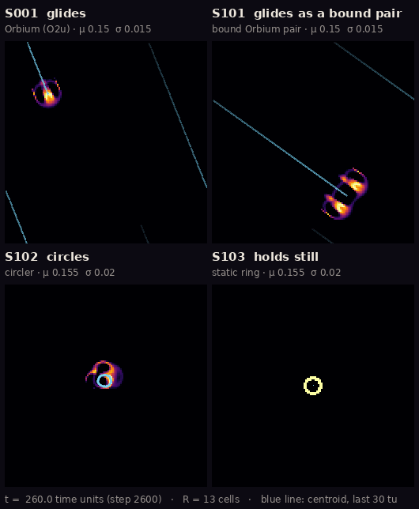
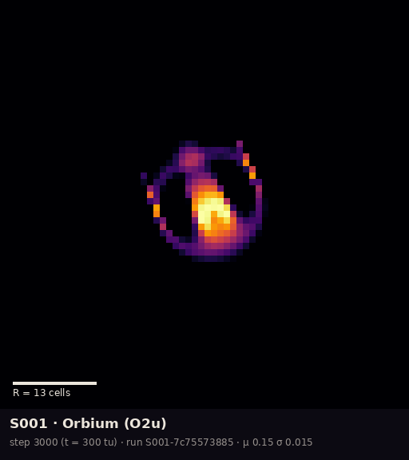
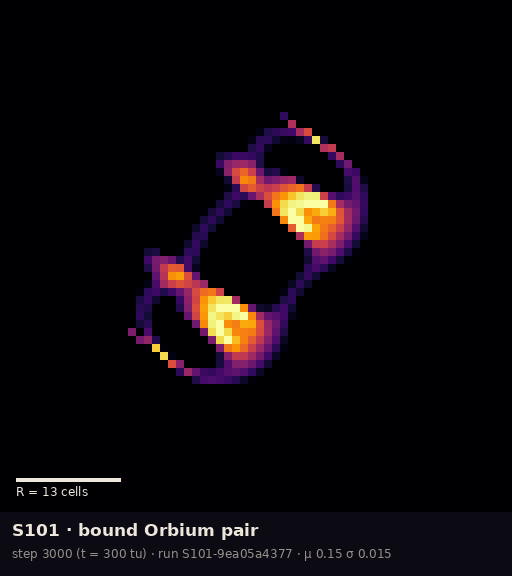
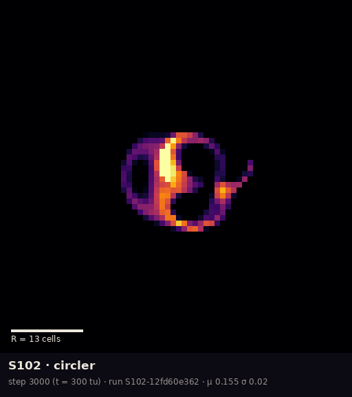
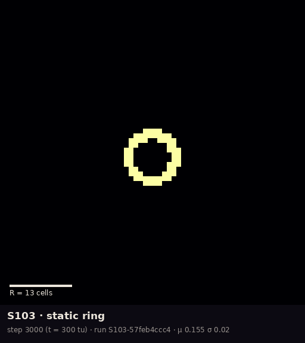
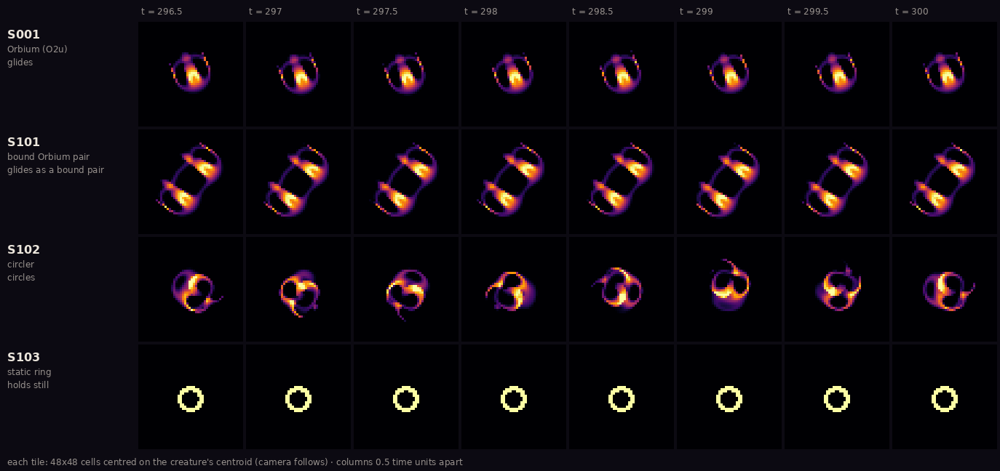

# The ALM specimen gallery

Everything in this gallery is a picture of an actual simulation. Nothing is drawn, painted or
generated by hand: each frame is the state of a Lenia world at a recorded step of a recorded run,
and the render script refuses to draw unless its replay of that run ends in exactly the same
state, bit for bit, as the run's manifest says.

**New to Lenia?** Lenia is a grid of cells, each holding a number between 0 (empty, black here)
and 1 (full, pale yellow here). At every step, each cell looks at a ring of neighbours out to a
radius R (13 cells in all of these runs) and grows or shrinks by a fixed rule. That is all. The
"creatures" below are patterns that keep their shape while the rule rewrites every cell they are
made of, ten times per unit of time. Some of them travel; one of them never changes at all.

## Exhibits

| ID | Exhibit | Subjects | Added |
| --- | --- | --- | --- |
| [G001](#g001--four-ways-to-move) | Four ways to move (animated) | S001, S101, S102, S103 | 2026-10-07 |
| [G002](#g002--portraits) | Portraits | S001, S101, S102, S103 | 2026-10-07 |
| [G003](#g003--contact-sheet-half-a-time-unit-at-a-time) | Contact sheet | S001, S101, S102, S103 | 2026-10-07 |

### G001 — Four ways to move



Full-quality video: [`four-ways.mp4`](exhibits/G001-four-ways-to-move/four-ways.mp4) ·
provenance: [`provenance.json`](exhibits/G001-four-ways-to-move/provenance.json)

Four worlds, one clock: the last 40 time units of each run (steps 2600–3000), played at 4 time
units per second. Each panel is a whole 128 × 128 world. The worlds wrap around, so a creature
leaving one edge comes back on the opposite edge. The blue line traces each creature's centre of
mass over the last 30 time units.

- **Observation.** S001 crosses its world in straight lines. S101 does the same with twice the
  body. S102 moves about as fast as S001 but along a circle only a few cells across, so it goes
  nowhere. S103 does not change at all.
- **Interpretation.** The ledger, not this picture, says what is established. S001's straight
  heading is held by the grid at R = 13 rather than chosen freely ([C011, C013](../claims.md)). S102
  and S103 live under a slightly different rule from S001 (μ 0.155, σ 0.020 instead of 0.15,
  0.015), at which Orbium also persists ([C038](../claims.md), Lane 6, not yet reproduced by a second
  lane).

### G002 — Portraits

| | |
| --- | --- |
|  |  |
|  |  |

Each portrait is a 64 × 64-cell window at step 3000, shifted by whole cells so the creature's
centre sits in the middle. Each square block of pixels is one cell. The white bar is one kernel
radius R = 13 cells. Provenance: [`provenance.json`](exhibits/G002-portraits/provenance.json).

- **S001, Orbium (O2u).** It has a bright crescent core, a dimmer shell and a thin outer arc.
- **S101, bound Orbium pair.** Two Orbium bodies side by side, joined by one shared thin shell.
  Its mass is 2.004 × Orbium's, and it travels 1.4% slower ([C041](../claims.md), from Lane 6's dossier).
- **S102, circler.** Its shape is never the same twice (see G003).
- **S103, static ring.** It is a ring of fully saturated cells, and nothing in it moves. The
  ring is exactly the same at step 0 and at step 3000: the run's initial and final state hashes
  are equal (`a81efdac…`), as Lane 6 reported ([C042](../claims.md)).

### G003 — Contact sheet: half a time unit at a time



Eight frames per creature, 5 steps (0.5 time units) apart, ending at step 3000. Here the camera
follows each creature, so travel is hidden and only changes of shape remain. G001 shows the
travel. Provenance: [`provenance.json`](exhibits/G003-contact-sheet/provenance.json).

- **Observation.** S001 and S101 look almost the same in every frame. S102 looks different in
  every frame. S103 looks identical in every frame.
- **Not a claim.** Eight frames do not establish a period. S102's turning rate (about 95° per
  time unit, one lap per ~3.8 time units) comes from Lane 6's dossier, not from this sheet.

## Field note, 7 October 2026

> *What I saw.* Four animals, four temperaments. The Orbium set off at once along a line it never
> left, steady as a commuter. The pair travelled the same way, shoulder to shoulder, slightly
> slower, as pairs do. The circler moved about as fast as either of them and got nowhere: it
> chased its own tail around a circle smaller than its own body, a different shape at every
> glance. The ring sat where it was put and never changed by a single bit in three hundred time
> units.
>
> *What I think it means (unverified).* The ring is the strangest of the four. It is alive only
> in the sense that the rule keeps rebuilding it. Lane 6 says every full cell is pushed back up
> to 1 and every empty one back down to 0 by the hard clip ([C042](../claims.md)), so a version of
> Lenia without the clip might not have this animal at all. The circler's tight loop is just as
> fragile: at twice the resolution it dies at this rule ([C039](../claims.md)). I photographed
> them because they are beautiful, not because they are settled.

## Specimens shown

Names are the registered names; no nicknames. Statuses are as of the ledger on 2026-10-07; "reproduced" here means clean-process reruns by Lane 6, not a second lane. S101–S103 are catalogued species carried to nearby
rules, not new forms ([C043](../claims.md)).

| ID | Registered name | Rule | Behaviour in its run (steps 1000–3000) | Ledger |
| --- | --- | --- | --- | --- |
| S001 | Orbium unicaudatus (O2u) | R 13, T 10, μ 0.15, σ 0.015 | mass 0.4358, speed 0.479 R/tu, heading 68.2° | dossier [`S001-orbium.md`](../specimens/S001-orbium.md); C001–C016 |
| S101 | bound Orbium pair (Synorbium-like) | S001's rule | mass 0.8736, speed 0.473 R/tu, heading 35.5° | C041 *observed*; C043 *observed* (not yet reproduced by a second lane) |
| S102 | Gyrorbium-like circler | R 13, T 10, μ 0.155, σ 0.020 | mass 0.522 (sd 0.010), net speed 0.003 R/tu | C038 *reproduced*; C039 *numerically fragile*; C040, C043 *observed* |
| S103 | Circium-like static ring | same as S102 | mass 0.3787, final state = initial state | C038, C042 *reproduced*; C043 *observed* |

All four use the poly kernel core and poly growth, β [1], Euler steps with a hard clip to
[0, 1], float64 and a periodic 128 × 128 world. Headings are measured from +x toward +y, with y
pointing down.

## Provenance

| Specimen | Run ID (trace) | Steps | Final state sha256 | Seed cells from |
| --- | --- | --- | --- | --- |
| S001 | [`S001-7c75573885`](../traces/S001-7c75573885/) | 0–3000 | `b42e8fbb…` | main: `research/specimens/S001-orbium/` |
| S101 | [`S101-9ea05a4377`](../traces/S101-9ea05a4377/) | 0–3000 | `6d3055fc…` | vendored from PR #11 ([`vendor/pr11/`](vendor/pr11/)) |
| S102 | [`S102-12fd60e362`](../traces/S102-12fd60e362/) | 0–3000 | `12c6dcad…` | vendored from PR #11 |
| S103 | [`S103-57feb4ccc4`](../traces/S103-57feb4ccc4/) | 0–3000 | `a81efdac…` | vendored from PR #11 |

All four runs were made with `alm.run` at commit `96cb86c` with a clean `src/`. The full rule,
grid, environment and hashes are in each trace's `manifest.json`. Each exhibit's `provenance.json`
lists its frame range, view, overlays and disclosures.

**Unmerged dependency.** S101–S103 are proposed in Lane 6's PR #11, which is not merged. Their
seed cells and rules are vendored in one place, [`vendor/pr11/`](vendor/pr11/README.md), and
registered by [`galspec.py`](galspec.py) only if main lacks them. If main later registers
different cells under these IDs, the scripts refuse to run.

## How the pictures are made

- **Geometry is untouched.** Each cell becomes one square block of pixels (nearest neighbour, no
  smoothing, no interpolation). Crops are whole-cell shifts of the wrapped world. Nothing is
  rotated, warped or resampled.
- **Colour is a choice, not data processing.** The cell value A in [0, 1] maps linearly onto
  matplotlib's `inferno` colormap (black → purple → orange → pale yellow). There is no gamma, no
  contrast stretch and no per-frame normalisation, so the same colour means the same value in
  every frame and every exhibit.
- **Overlays are listed.** These are the centroid trail (G001), the scale bar (G002) and the text
  labels. The centroid is the periodic circular-mean centre of mass, computed on every step of the
  replay.
- **Lossy formats are disclosed.** GIFs use a 128-colour palette. The MP4 is H.264. The PNGs are
  lossless.

## Reproduce

```bash
./scripts/bootstrap.sh
git checkout 96cb86c                                   # the commit the runs were made at
.venv/bin/python research/gallery/render.py collect    # re-run the four simulations
.venv/bin/python research/gallery/render.py render     # replay, verify hashes, draw exhibits
```

`collect` writes `research/traces/<run_id>/` and `runs.json`. At `96cb86c` it reproduces the run
IDs above, and on any commit it reproduces the final-state hashes. `render` replays each run listed
in `runs.json` from its manifest and stops with an error unless the replay's final state matches
`final_state_sha256`. A single run can also be repeated on its own:

```bash
.venv/bin/python -m alm.run --specimen S001 --steps 3000 --every 10
.venv/bin/python research/gallery/run_specimen.py --specimen S102 --steps 3000 --every 10   # S101–S103
```

`run_specimen.py` is `python -m alm.run` with the vendored specimens registered. Once PR #11 is
merged, plain `alm.run` does the same.

## Gallery conventions

- **Exhibit IDs** are `G` + three digits, assigned in order and never reused. Each exhibit lives
  in `exhibits/G###-<slug>/` with its media and a `provenance.json`.
- **Every exhibit records** the specimen IDs, rule, simulation settings, run IDs, frame range and
  rendering method, and the render must verify against the run's final hash.
- **Captions** separate observation (what the frames show) from interpretation, and they cite the
  ledger instead of making claims. No species names or nicknames that the ledger does not use.
- **Claim statuses** are copied from the ledger and written in the same plain words that Lane 9's
  figures use as badges (*independently checked*, *reproduced*, *observed*, *numerically fragile*,
  *refuted*). Where an exhibit marks edits, it follows Lane 9's encoding: vermillion `#D55E00`
  for mass removed, blue `#0072B2` for mass added (PR #13, `research/figures/conventions.json`).
  Creature colormaps are the gallery's own.
- **Revisits** replace an exhibit's media in place and add a line to the cycle log, so the old
  version stays in git history.
- **Planned exhibits** (also numbered G###): before-and-after disturbance sequences, contact
  sheets across rules or resolutions, and numerical artifacts worth seeing (the lattice-locked
  heading, the mass wobble).

## Cycle log

- **2026-10-07, cycle 1 (Lane 8).** First gallery: G001–G003 from four new runs of S001 and
  S101–S103.
