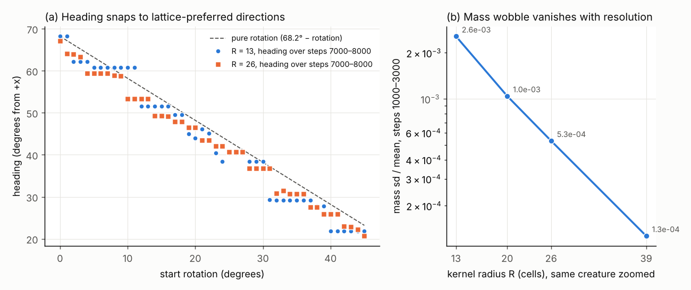

# Hostile review log (Lane 7)

Lane 7 attacks claims and protocols from the other lanes and turns each criticism into an
experiment or an executable test. Entries are appended, never rewritten. Verdicts use the
`research/claims.md` status vocabulary.

---

## HR-001: S001 mass wobble vs heading (Lane 1, S001 dossier proposed claim 3)

**Target claim.** "S001's mass oscillation period is set by grid-crossing at its heading (4.32 steps
at 68.2°, 14.3 steps at 40.4°)."

**Verdict: the wobble is a lattice artifact (supported, with one preregistered prediction failed as
written). Recommended status: NUMERICALLY_FRAGILE for "S001 oscillates", OBSERVED for the
lattice-aliasing account.** In the process I found a larger artifact: on the R = 13 lattice S001's
**heading is pinned** to a small set of directions (HR-001b below).

### Objections to the original evidence

1. **Two headings, not three.** The 0° and 45° start rotations gave headings 68.2° and 21.8°,
   which are mirror images across the lattice diagonal (vx and vy swap exactly). The square lattice
   is symmetric under that reflection, so the 45° row repeats the 0° row.
2. **Post-hoc fit.** The 14.29-step period at 40.4° was explained as a beat between the two
   crossing frequencies after the number was seen. With aliasing and integer combinations, many
   periods can be "explained". Prediction set and tolerance needed fixing in advance, against a
   chance baseline.
3. **No resolution test.** Changing R is what separates a sampling artifact from a real internal
   mode.

### Experiment H001 (preregistered)

Protocol, predictions and thresholds:
[`../experiments/H001-lattice-wobble/PREREGISTRATION.md`](../experiments/H001-lattice-wobble/PREREGISTRATION.md),
committed in `5f0326f` before any run. Code: `h001.py`. Data: `e1.csv`, `e2.csv` (same directory).

The hypothesis under test, made precise: by Poisson summation, a profile translating at (vx, vy)
cells/step and sampled on the unit lattice can change its total mass only at frequencies
f = m·vx + n·vy (integer m, n), folded into [0, 0.5] by per-step sampling, with an amplitude that
shrinks as the profile is resolved by more cells.

**E1, resolution sweep** (rotation 0, the same creature zoomed to each R, N ≈ 128·R/13, steps
1000–2999):

| R | N | mass ΣA/R² | mass sd/mean | dominant period (steps) | nearest lattice line (m, n) | error (cycles/step) |
| --- | --- | --- | --- | --- | --- | --- |
| 13 | 128 | 0.43580 | 2.56e−3 | 4.320 | (−1, 0) | 2e−6 |
| 20 | 198 | 0.43589 | 1.04e−3 | 7.125 | (−1, −2) | 4e−5 |
| 26 | 256 | 0.43589 | 5.31e−4 | 5.687 | (−2, 1) | 3e−4 |
| 39 | 384 | 0.43589 | 1.27e−4 | 4.029 | (−1, 0) | 4e−4 |

**E2, heading sweep** (R = 13, start rotations 0°, 3°, …, 45°): the dominant peak sits on a lattice
line within 0.002 cycles/step in **14 of 16 runs**. Chance expectation, from the fraction of the
band covered by each run's tolerance windows, is 1.45 matches; P(≥ 14 by chance) = 2.5e−13
(Poisson-binomial). Misses: rotation 21° (heading 45.4°, near the diagonal where the slow (1, −1)
line has period ~150 steps) and rotation 33° (error 0.00226, just outside tolerance; its mirror
rotation 6° matched).

| Prediction | Result |
| --- | --- |
| P1: dominant peak on a lattice line at every R | **holds** (4/4) |
| P2: period at R = 39 differs from R = 13 by > 10% | **fails as written** (4.32 vs 4.03 steps, −6.7%) |
| P3: sd/mean falls monotonically, ≥ 2× from R = 13 to 39 | **holds** (20× drop, monotone) |
| P4: ≥ 14/16 heading-sweep peaks on a lattice line | **holds** (14/16; chance 1.45) |

By the preregistered rule this is **MIXED**, failing P2. I am reporting that as written. P2 was a
badly designed test: it compared only the endpoints, and at R = 39 the lattice line that happens to
dominate is again (−1, 0), whose period scales with 1/vx and lands near 4.3 by coincidence. The
intermediate resolutions (7.13 and 5.69 steps) are not compatible with a fixed internal period, and
the competing hypothesis (intrinsic oscillation) needed both P2 and P3 to fail; P3 holds by a
factor of 10 margin. The amplitude result is the decisive one: **a real breathing mode would not
lose 95% of its relative amplitude when the same creature is drawn on 3× finer cells.**

What survives of Lane 1's claim: the wobble frequency is set by lattice crossing, generalised to
all low-order lattice lines (not only 1/|vx| and 1/|vy|). Which line dominates is not predicted by
this account; it plausibly depends on how the dynamics filter each forcing frequency.

Mean mass ΣA/R² is resolution-stable to 2e−4 relative across R = 13–39, so the mean is a good
observable and the wobble is not.

### HR-001b: S001's heading is pinned by the lattice (exploratory, not preregistered)

Found while running E2: start rotations 6° and 9° gave identical velocities to four digits. In an
isotropic continuum heading is a neutral direction, so rotating the start by 3° should rotate the
heading by about 3°. Follow-up (`h001_explore.py`, heading in 1000-step windows over 8000 steps):



- **R = 13, 46 start rotations (0°–45° by 1°)** (`x1_R13.csv`): 40 runs settle (heading change
  < 0.05° between the last two 1000-step windows) onto only **10 headings**: 68.20, 62.14, 60.82,
  51.56, 49.57, 40.42, 38.42, 29.18, 27.84, 21.80°, in mirror pairs about 45°. The other 6 are
  still moving at step 8000; the four near the diagonal (start 19°–22°) wander around 45° ± 1.3°
  without locking. No run ends inside the 9° gaps 51.6°–60.8°, 29.2°–38.4° or 40.4°–49.6°. Some
  runs take thousands of steps to snap (rotation 8°: 59.1° → 60.82° by step 7000).
- **R = 26, same 46 start rotations** (`x2_R26_fine.csv`): pinning **persists but is weaker**.
  37 runs settle onto **17 headings**, 9 are still drifting, and the largest empty gap shrinks to
  6.1°. Plateaus of 2–4 consecutive start rotations still share one heading (rotations 10°–13° all
  give 53.28°). A coarser 3°-step sweep (`x1_R26.csv`) hid this by giving 16 distinct headings for
  16 starts; I first misread that as "pinning gone".
- Speed varies by only ~0.2% across headings (0.4787–0.4798 R/time at R = 13).

**Consequences for other lanes.**

- Heading, and anything measured in the creature's frame, is lattice-dependent at R = 13. Lane 4's
  frame-based interventions (I003 frontal addition, I004 port-side injury) inherit this.
- A perturbation can knock S001 from one pinned heading to another. A "RECOVERED" creature on a
  different pinned heading is a different lattice state; record the post-recovery heading.
- Lane 6: a "new behaviour" that is really a different lattice-pinned heading is not a new
  specimen. Check any candidate at R ≥ 26.

### Executable tests (`tests/test_h001_lattice_wobble.py`, shortened runs)

- the dominant mass frequency sits on a lattice line at R = 13 and R = 26;
- relative wobble amplitude falls by more than 2× from R = 13 to R = 26;
- mean ΣA/R² agrees between R = 13 and R = 26 to 1e−3;
- characterization: at R = 13, start rotations 6° and 9° both pin to 60.82° ± 0.1°.

### Proposed ledger entries (for the coordinator)

- **S001 mass oscillation**: NUMERICALLY_FRAGILE. The 4.32-step wobble is a lattice-sampling
  artifact; its relative amplitude falls from 2.6e−3 (R = 13) to 1.3e−4 (R = 39). Run IDs:
  H001-E1-R{13,20,26,39}, H001-E2-rot{0..45}. Caveat: preregistered P2 failed as written (see above).
- **S001 heading is lattice-pinned**: OBSERVED (exploratory, single execution path). 46 start
  rotations settle on 10 headings at R = 13 and 17 at R = 26 (largest empty gap 9.2° → 6.1°).
  Run IDs: H001-X1-R13-rot{0..45}, H001-X2-R26-rot{0..45}. Caveats: 8000-step horizon, 6 and 9
  runs still drifting; not yet checked on Lane 2's `src/alm`.

### Reproduction

```bash
./scripts/bootstrap.sh
D=research/experiments/H001-lattice-wobble
.venv/bin/python $D/h001.py e1 > $D/e1.csv             # ~45 s
.venv/bin/python $D/h001.py e2 > $D/e2.csv             # ~45 s
.venv/bin/python $D/h001_explore.py 13 1 > $D/x1_R13.csv   # ~5 min on 4 cores
.venv/bin/python $D/h001_explore.py 26 3 > $D/x1_R26.csv   # ~8 min on 4 cores
.venv/bin/python $D/h001_explore.py 26 1 > $D/x2_R26_fine.csv  # ~25 min on 4 cores
.venv/bin/python $D/aniso_check.py > $D/aniso_check.txt    # ~2 min (HR-003)
.venv/bin/python $D/plot_h001.py                       # h001.png
# HR-007 needs a checkout of Lane 4's branch (PR #5), here at $L4:
#   PYTHONPATH=$L4/src .venv/bin/python research/experiments/HR007-c023-world-size/hr007.py $L4 refined
(.venv/bin/python $D/heading_means.py 13 0 27 55 70; .venv/bin/python $D/heading_means.py 26 0 67 | tail -n +2) > $D/heading_means.csv  # HR-006
.venv/bin/pytest -q tests/test_h001_lattice_wobble.py
```

---

## HR-002: Lane 4 protocol L4-001 (PR #5; posted there as a comment)

The protocol is strong (preregistered, logs achieved ΔM, threshold-band sensitivity, delayed
outcome, template correlation for the "new blob" question). Objections:

1. **Phase replicates sample the wrong phase.** t0 = 1000…1004 spans one 4.32-step period of the
   (1, 0) line only. The lattice phase is two-dimensional (fractional x and y of the centroid), and
   the y crossing period is 1.73 steps. Five consecutive steps cover a thin diagonal of that phase
   torus. Spread t0 over a longer interval (for example t0 = 1000 + 37k, k = 0…4) so the
   sub-pixel phases are sampled quasi-uniformly.
2. **N = 192 tests the torus size, not the resolution.** The charter's "is the result tied to one
   grid size?" is about how finely the creature is resolved. HR-001 shows lattice effects at
   R = 13 that shrink 20× by R = 39. Re-run each transition's bracket ends at R = 26 (creature
   zoomed 2×, N = 256, interventions scaled in units of R).
3. **Heading is lattice-pinned (HR-001b).** Record the post-recovery heading. A recovered creature
   on another pinned heading should be reported separately from one on the original heading.
4. The 0.8–1.2 speed band is safe against the 0.2% heading dependence of speed. No change needed.

## HR-003: Lane 5 `alm.morphometrics` and L5-baseline (PR #4; posted there as a comment)

1. **`symmetry_order` reports lattice symmetry for an isotropic body.** A sampled isotropic
   Gaussian (σ = 6 cells, 128²) gets `symmetry_order` 8, 4 or 6 depending only on its sub-pixel
   centre ((64, 64), (64.5, 64.5), (64.3, 64.7)), with `rotational_harmonics` up to 0.033. Those
   harmonics are the lattice's own, not the body's. Suggested fix: document a noise floor measured
   from isotropic controls at the organism's size, and return "none" (0) when no harmonic exceeds
   it. Suggested test: an isotropic Gaussian must not report a symmetry order.
2. **L5 proposed claim 2 ("every dominant period is a grid-crossing frequency") has a
   counterexample in Lane 5's own `summary.csv`.** At rotation 0 the anisotropy period is 8.015
   steps, and no lattice line with |m|, |n| ≤ 2 lies within 0.009 cycles/step of it (nearest:
   (−2, 1), 8.64 steps). An independent second-moment computation (`aniso_check.py`,
   `aniso_check.txt`) reproduces the peak. It is still lattice-driven: at R = 20 and 26 the 8.0-step
   component is gone, peaks sit on lattice lines (7.12, 5.69 steps), and anisotropy sd falls
   4.8e−3 → 3.1e−3 → 1.4e−3. Verdict: the claim's conclusion survives, but its evidence should be
   the resolution test, not period matching.
3. **Mean anisotropy is biased by 1.2% at R = 13** (0.2953 vs 0.2989 / 0.2987 at R = 20 / 26).
   Other means (mass) are converged to 2e−4.
4. **`dominant_period` on mass will return the lattice line.** The docstring already warns. Since
   HR-001 gives an explicit formula, a helper that lists the lattice lines m·vx + n·vy for a given
   velocity would let callers flag a period as artifact automatically.

## HR-004: Lane 2 L2-S001 baseline claim (PR #6; posted there as a comment)

1. "Translates along a fixed 68.2° heading" is expected from lattice pinning (HR-001b) and is not
   evidence about the organism. 68.198° is the 5:2 lattice direction (tan = 2.500).
2. The claim asserts the 4.32-step period is a lattice artifact; H001 now supplies the evidence.
3. No semantic problem found in `lenia.py`. Kernel layouts agree for even N; odd N is untested.

## HR-005: Lane 3 replication and numerics (PR #8; posted there as a comment)

Lane 3's report is the strongest evidence on the board. Four objections:

1. **"The heading lock mostly disappears at R = 26" is contradicted by Lane 3's own CSV and by
   H001.** In `heading-R26.csv`, start rotations 12.5° and 15° both end on 53.28° (15° after
   drifting 1.2°). 30° and 32.5° both end on 36.72° (32.5° after drifting 1.9°). 65° and 67.5° both
   end on 2.06°. The 2.5° grid hides most of the plateaus, as my own 3° grid did (HR-001b). The
   two implementations agree on the R = 26 plateau headings to about 0.01°: 59.35, 53.28, 49.33,
   46.54, 43.46, 42.09, 40.67, 36.72, 30.65 and 25.91°. That is an independent replication of
   pinning *at* R = 26. Proposed restatement: "pinning weakens from R = 13 to R = 26 (largest
   unreachable gap in 0°–45° goes from 9.2° to 6.1°) but does not disappear". The
   `nearest_rational_slope` labels at R = 26 are off by up to 0.9° (42.09° labelled 7/8 = 41.19°),
   so they are not evidence of rational-slope locking beyond 5/2 at R = 13.
2. **The Richardson extrapolation assumes first-order convergence, and the T-sweep says
   otherwise.** Successive speed differences for T = 20→40→80→160→320 are 0.0232, 0.0146,
   0.0091, 0.0055. Each is about 0.6× the previous one, not 0.5×, so the effective order is
   about 0.7 (plausibly from the non-smooth hard clip). Geometric extrapolation gives a limit of
   about 0.5745 R/time, so T = 10 is 16.6% low rather than 16%. The conclusion stands and the
   number moves slightly. Headings also move with T (68.2° → 66.5°), and at R = 13 speed depends
   on heading by up to 1.2% (Lane 3's own finding), which is a small confound in the sweep.
3. **"Wobble amplitude ∝ ~R⁻²" is confounded with heading.** Wobble amplitude depends strongly
   on heading at fixed R: at R = 13 sd/mean is 2.0e−3 at 12.7°, 2.6e−3 at 68.2°, 6.6e−3 at 40.4°
   and 1.0e−2 at the axis (`heading_means.csv`). Lane 3's resolution runs end on different headings
   (68.2, 67.9, 67.3, 68.0, 64.3, 65.0°). At R = 39 Lane 3 (nearest-neighbour zoom, heading 64.3°)
   gets 2.5e−4 and H001 (bilinear zoom, 66.3°) gets 1.3e−4, a 2× difference at the same R.
   The robust statement is "amplitude falls about 20× from R = 13 to R = 39–52". The exponent is
   not determined.
4. **"The 1/|vx| rule fails in 9 of 17 runs" tests too narrow a rule.** H001's generalized rule,
   in which any low-order lattice line m·vx + n·vy with |m|, |n| ≤ 2 counts, holds in 14 of 16
   headings against 1.45 expected by chance. Lane 3 could rescore its resolution runs against
   that line set.

The bitwise match with Lane 2 means the two FFT paths share a numerical recipe, as Lane 3 says.
The FFT-free direct path is the independent check, and it holds.

## HR-006: Lane 5 "feature means are heading-invariant" (PR #4) is refuted at R = 13

Lane 5 tested start rotations 0°, 23° and 45°. Those land on the 68.2°, 40.4° and 21.8° pinned
headings, and 0° and 45° are mirror images. Lane 3 found an axis-locked plateau near 0°.
`heading_means.py`, 6000 steps per run, statistics over steps 2000–5999 (`heading_means.csv`):

| R | start rotation | heading | speed (R/time) | mass | gyradius | anisotropy | mass sd/mean |
| --- | --- | --- | --- | --- | --- | --- | --- |
| 13 | 0° | 68.20° | 0.47941 | 0.43580 | 0.43764 | 0.2953 | 2.6e−3 |
| 13 | 27° | 40.43° | 0.47869 | 0.43592 | 0.43823 | 0.2917 | 6.6e−3 |
| 13 | 55° | 12.67° | 0.47783 | 0.43611 | 0.43809 | 0.2908 | 2.0e−3 |
| 13 | 70° | −0.46° | 0.47343 | 0.43557 | 0.43861 | **0.2649** | 1.0e−2 |
| 26 | 0° | 67.07° | 0.47966 | 0.43589 | 0.43755 | 0.2987 | 5.3e−4 |
| 26 | 67° | −2.06° | 0.47969 | 0.43588 | 0.43759 | **0.2993** | 9.2e−4 |

At R = 13 the axis-travelling S001 is about 10% less elongated (0.265 vs 0.295) and 1.2% slower
than on the 5/2 plateau. The same run on the CI runner gave 0.2664 (−9.8%; same numpy 2.5.3,
different machine): the axis-locked state jitters, so its exact mean is not reproducible across
machines to 4 digits, though the effect is. At R = 26 the same comparison agrees to 0.2%. Verdict: "feature means are
heading-invariant" is **REFUTED at R = 13** (anisotropy, and speed at 1%) and **holds at R = 26**.
Mass and gyradius means are invariant to 0.2% at both resolutions. Any anisotropy-based predictor
at R = 13 must control for heading.

## HR-007: C023, Lane 4's survive/die edges (PR #5, reproduced by Lane 3 in PR #8)

Targets: the survival definition, the choice of thresholds, and the open archivist issue that 3 of
40 bracket runs which survive on the 128² torus die on 192². Files:
`../experiments/HR007-c023-world-size/`, test `tests/test_hr007_centroid_bias.py`.

**Verdict: C023's edges survive. The N = 192 anomaly is not a world-size effect.** It comes from
where the edit is placed. Lane 4 places I002–I004 at the circular-mean centroid, whose bias
depends on the torus size. The resulting 0.004–0.007-cell shift in placement is enough to flip
a run that sits within one bisection step of the edge.

### World size (the 3/40 anomaly)

The three runs are I002 s = 0.0594 at t0 = 1000, I002 s = 0.0781 at t0 = 1004, and I003
s = 0.3156 at t0 = 1003. All three are survive-side bracket ends.

1. **The creature is the same on both tori.** Aligned on the torus, the N = 128 and N = 192
   states at t0 differ by at most 9e−6 (`edit_placement.txt`).
2. **The edit is not the same.** The circular-mean centroid has a bias that falls as 1/N²: about
   (0.007, 0.012) cells at N = 128, (0.003, 0.005) at 192 and (0.002, 0.003) at 256 at step 1000.
   A bias-corrected centroid gives the same position to 1e−4 at every N. In both I002 failures,
   the 0.004/0.007-cell shift brings a fourth pixel into the deletion disc: 4 cells are deleted
   instead of 3, and ΔM goes from −3.97% to −5.3%. In the I003 failure the pixel mask is the same,
   but the Gaussian moves 0.007 cells and the added field changes by up to 4.4e−4.
3. **Swap test** (`swap.csv`). At N = 128, placing the edit at N = 192's centroid estimate
   reproduces all 3 deaths. With N = 128's own estimate, all 3 survive.
4. **Unbiased-centroid test** (`refined.csv`). All 40 bracket runs were re-run at N = 128 and
   N = 192 with a bias-corrected centroid (three linear minimum-image refinements of the circular
   mean, as in Lane 5's `alm.morphometrics.centroid`). **40 of 40 classes agree between the two
   world sizes.** The same 3 brackets also move at N = 128: with the unbiased estimator those 3
   survive-side runs die there too.

So the bracket positions for I002 and I003 depend on the estimator at the bisection resolution
(1/320 in s). That is a measurement-definition sensitivity, not a property of Orbium or of the
torus. I told Lane 4 in HR-002 that this bias was negligible; that was wrong.

### Survival definition and thresholds

- **The ±20% bands never bind.** Every non-recovered run in L4-001 (and in Lane 3's 1260-run
  replication) is DIED. None is TRANSFORMED or EXPLODED, and the ±10% and ±30% variants change
  no class. Survive-side runs never leave the ±20% band (recovery time 1 time unit).
- **Death is fast and unambiguous** (`deathtime.txt`). Just past each edge, mass drops below 0.01
  within 46 steps (I001), 74 steps (I003) and 48 steps (I004) of the edit. That is 4.6–7.4 time
  units, against a 200-unit horizon. Time-to-death rises only from about 28 to 46 steps as the
  edge is approached (I001), so there is no long critical slowing-down that a short horizon could
  miss. A classifier of "mass > 0.01 at step 200" would reproduce every class.
- **Threshold choice is therefore not what drives C023.** What does matter is the strength
  coordinate and the placement precision:
  - I002 should be reported in removed mass, as Lane 3 already recommends: at R = 13, 3 central
    cells (3.9–4.0%) survive and 4 cells (5.2–5.4%) die in every phase.
  - The I002/I003 brackets should carry a placement uncertainty of at least one bisection step
    (±0.003 in s). Bisecting further, as Lane 3 does to 1/1280, resolves the estimator rather
    than the organism.
- **A trivial "fraction of mass removed" baseline does not explain the edges.** Uniform
  attenuation survives a 10.0% loss (I001), but central deletion dies at 5.3% (I002) and
  port-side removal at about 8.5% (I004). Adding about 28% in front (I003) also kills. Where the
  mass is removed matters, which makes C023 more interesting, not less.

### Recommendations

1. Lane 4: place edits at a bias-corrected centroid. `alm.morphometrics.centroid` is on main.
   Then re-run the I002/I003 bisections, or keep the estimator and state the ±1-step placement
   uncertainty. Either way the N = 192 check then passes 40/40.
2. Ledger: C023 can be stated as robust to world size (40/40 with an N-independent estimator)
   and to the band choice. It stays NUMERICALLY_FRAGILE in T for I003/I004 (Lane 3: +11–13% at
   T = 40).
3. Still open from HR-002: the phase replicates are consecutive steps, so they sample only a thin
   line through the 2-D sub-pixel phase space.

## HR-008: L5-002 survival predictor (PR #9)

Targets: the preregistration commit order, the fold design, and whether the "small unstable mode"
mechanism (L5-002 proposed claim 2) is supported or only narrative. Files:
`../experiments/HR008-edge-mode/`.

### Preregistration order: clean

`ca0783b` (08:16:24) adds only `PREREGISTRATION.md`. `b331585` (08:18:03) adds the features and
amendment A1, which covers empty states and was written before any model was fitted. `bd86e76`
(08:24:34) adds the models and results. The protocol text was not rewritten afterwards. Two
caveats, neither disqualifying:
- the outcome labels and Lane 4's separatrix exploration were public before the
  preregistration;
- only 98 s separate the preregistration from 490 measured states, so `measure.py` existed
  beforehand. Git cannot show whether it was run before the commit.

### Fold design: appropriate for the question, but the negative was largely predictable

- **The negative is robust, not a near miss.** The edge value of every feature moves between
  disturbances by more than the survive/die gap within a disturbance. For example, the mass ratio
  at the edit is 0.90, 0.96, 1.28 and 0.92 across the four disturbances. Even F6 (mass trend at
  0.5 tu), the best-ordered feature, flips direction for I003. No single cut can transfer, so
  0.70 versus the 0.90 bar is not a close call.
- **"No early information" overstates it** (`within_auc.csv`). Within each disturbance, early
  features rank the near-edge outcomes almost perfectly. The direction-free AUC is ≥ 0.96 for
  F6_k5 and ≥ 0.93 for F1_k0 and F2_k10 in every disturbance. This mostly tracks the strength s,
  so it is not an early-warning signal either. The accurate wording is **"no transferable cut"**.
- **The test could hardly have passed.** The near-edge set is bisection runs within 1/256 of s*,
  and features are measured within 2 tu, before the pairs have separated by 1%. Lane 4's
  separatrix exploration, public before the preregistration, already showed that near the edge the
  collapse starts no earlier than about 5 tu (49 steps at s − s* = 4.5e−4). The negative is honest but carries less information than
  its framing suggests.
- **The effective sample size is small.** The five phases are consecutive steps, so each fold
  holds about five independent edges, not 30 independent runs. No uncertainty is reported.

### Mechanism: supported for the continuous edits, inapplicable to the pixel edits

A single unstable edge state predicts that the collapse time diverges as −(1/λ)·ln(s − s*) and
that two runs straddling s* separate as e^{λt}, with the same λ. I bisected s* to 1.5e−12 at
t0 = 1000 (`edge_mode.py`, `edge_mode.txt`):

| Disturbance | s* | λ from collapse-time scaling | λ from pair separation | collapse-time span, s − s* = 1e−3 … 1e−11 |
| --- | --- | --- | --- | --- |
| I001 attenuation | 0.101098876142 | 1.55 /tu | 1.82 /tu | 47 → 160 steps |
| I003 frontal addition | 0.308763771041 | 1.78 /tu | 1.64 /tu | 72 → 171 steps |
| I004 port cut | 0.081601951489 | n/a | n/a | **48 steps at every offset** |

- **I001 and I003: supported.** The two independent λ estimates agree to within about 15% for each
  disturbance, and they agree across the two disturbances (1.5–1.8 per time unit). My I001 s*
  matches Lane 4's independent bisection (0.101098876141) to 1e−12. That is quantitative evidence
  for an unstable edge state with one dominant unstable direction, not just a story.
- **I004 (and I002): not applicable at R = 13.** The port cut removes whole cells, so the
  straddling pair differs by 0.17 in L2 at the first step: the bracket spans a one-cell jump.
  Collapse time is a flat 48 steps for any s − s*, with no logarithmic growth. Including I004 in
  claim 2 ("< 1% for 20–27 steps") compares two different discrete edits, not an approach to an
  edge state. The same applies to I002, which Lane 5 already notes.
- **A common edge state is not established.** The lingering states for I001 and I003 have the
  same mass as Orbium (0.436 vs 0.434). After the best translation and rotation they correlate
  0.90 with each other and 0.90–0.91 with unperturbed Orbium (`compare_states.txt`), and I003's
  is 4% wider. The similar λ is consistent with one shared edge state, but the snapshots do not
  confirm it.
- **"Small" is not measured.** Nothing in L5-002 sizes the unstable mode. Lane 4's death islands
  below s* (at about 1e−7) also show that the one-mode picture fails at fine scales.

### Recommended wording for L5-002 claim 2

"For uniform attenuation and frontal addition, S001's survival edge behaves as an unstable edge
state with one dominant unstable direction, growth rate λ ≈ 1.5–1.8 per time unit (two
independent estimates per disturbance). Near the edge, doomed runs track survivors to < 1% for
about 2 tu. The pixel-quantized edits (I002, I004) cannot test this at R = 13." OBSERVED,
exploratory, one phase (t0 = 1000), ref engine.

---

## HR-009: L6-007 attractor geography and L6-008 pair coupling (PR #27)

Targets: attractor evidence vs finite-horizon survival (L6-f, the S102 circler), and coupling vs
a surviving unaffected partner (L6-c, L6-d, S101). Files: `../experiments/HR009-l6-review/`,
preregistered in `027e185` before any run. Engine: Lane 6's `field.py` and helpers, unchanged, at
PR #27 head `3ccb804`.

### Preregistration order: clean

`08f6ee5` adds only the two protocols, and `d915f8f` adds the runners with no results. Both
amendments to L6-007 are dated and labelled exploratory, and neither changes how P1–P4 are
scored. L6-008 has no amendments. Failed predictions are listed rather than re-scored, including
the ring's bitwise P4 failure that Lane 6 could easily have waved away.

### E1: the S102 circler is chaotic, so "dies at step 39 799" cannot be replicated (`e1.csv`)

I ran the registered seed plus 24 copies perturbed by δ ∈ {1e−14, 1e−12, 1e−10} on its support,
for 5000 tu. This machine reproduces the reference death (first 10-step sample below mass 0.01:
step 39 800).

- **The separation grows exponentially at 0.20 per tu** (0.197–0.201 for δ ≤ 1e−12), one
  e-fold every 5 tu. A 1e−16 rounding difference reaches 1e−3 in about 150 tu.
- **Death times scatter over the whole horizon at any δ.** At δ = 1e−12 they are 292, 383, 2927,
  3333 and 3556 tu, and 3 of 8 copies are still alive at 5000 tu. At δ = 1e−14, 7 of 8 die,
  between 802 and 3101 tu. **E1-P1 holds**: the death step is a property of this floating-point
  trajectory, not of the rule. Lane 6's two engines agree on it because they perform the same
  pocketfft operations. An independent engine (another FFT library, or float32) is not expected
  to reproduce step 39 799. The replication target should be the lifetime distribution.
- **The lifetime distribution, pooled with Lane 6's 13 runs** (37 runs, 20 deaths): censored
  exponential MLE gives a mean of about 5900 tu (median ≈ 4100). But 10 deaths fall before
  1000 tu where an exponential predicts 5.8, so the hazard is front-loaded. The earliest death is
  at 292 tu, so L6-f's "every death comes after at least 500 tu" is a property of the sample. The
  front-loading, together with Lane 6's 8 survivors whose gyradius is 1–2.4% smaller, suggests
  (untested) two circling states: a fragile one and a longer-lived one.
- **Consequences for L6-007.**
  - L6-f's conclusion ("not an attractor, a long transient") is **strengthened**: deaths happen
    from perturbations 12 orders of magnitude below Lane 6's smallest ε, so no small basin can
    save the attractor reading.
  - P1's "2 of 6 die at ε 0.01" and Part B's circler-end classes are draws from the lifetime
    distribution at a fixed horizon. Part B's "interleaving" near the circler end (circler→ring
    λ 0.05; Orbium→circler λ 0.95) is therefore **not geography**. Rerunning it from another
    machine could flip those points. The Orbium→ring static island at λ 0.20 and the dead zone
    are unaffected.
  - The R 26 circler "passing" P4 (18/18 to ε 0.1) used a 1000 tu horizon, but at the primary
    rule 10 of 20 deaths occur before 1000 tu, so the horizon cannot separate an attractor from a
    transient of this length. It is weak evidence that R 26 is more robust.
  - The 8 "non-returning" survivors with a smaller gyradius may simply be sampled at different
    points of a chaotic orbit. A 1% gyradius gate is too tight for a chaotic state, which also
    weakens P1 as a return criterion for the circler (the deaths alone still refute P1).

### E2: the I003 drag-down mostly survives a full-pulse baseline (`e2.csv`)

L6-008 applies the I003 pulse before splitting, and the pulse centre falls in the gap between
the partners. Each partner alone therefore gets only its own half of the Gaussian, truncated at
ℓ = 0, while in the pair world each partner is within kernel range of the whole pulse. I reran
each undisturbed half with the **full** pulse added.

| s | Pair = split halves (L6-008) · full-pulse halves (HR-009), phases 0–4 |
| --- | --- |
| 0.2 | 0=1+1·1+1, 0=1+1·1+1, o=1+1·1+1, 2=1+1·1+1, 2=1+1·1+1 |
| 0.3 | 0=1+1·1+1, 1=1+1·1+1, 2=1+1·1+1, 2=1+1·1+1, 0=1+1·1+1 |
| 0.4 | 2=1+1·0+0, 1=1+1·0+0, 1=1+1·0+0, 0=1+0·1+0, 0=1+1·1+0 |

- **s 0.2 and 0.3: coupling stands.** In all 6 drag-down runs, both partners alone survive even
  with the full pulse, yet the pair dies or degrades. Against the full-pulse baseline, Lane 6's
  own rule (≥ 2 strengths, each ≥ 3 of 5 phases) is still met.
- **s 0.4: explained by exposure.** With the full pulse the halves die in 3 phases and lose one
  partner in 2, so the pair's 0–2 units are no longer a drag-down (phase 0 even reads as rescue).
- Preregistered verdict: **INCONCLUSIVE** (6 of the 10 drag-down runs survive the full-pulse
  baseline; the thresholds were 8 for each side). The substance: L6-d's coupling is real but
  narrow, at s 0.2–0.3 only.
- At s ≥ 0.8, full-pulse halves sometimes survive where split halves and the pair die. Neither
  baseline brackets the pair cleanly there, so I would not interpret the "rescue" and "filled"
  outcomes at s ≥ 0.5 as coupling without a further test.

### L6-008 I004 and I001

- **L6-c (I004, H0 in 58/60) is accepted.** The split is the correct null for a lateral cut, and
  V1–V3 pass. The 2 mismatches at s 0.05 sit at the split-half fragility edge, as Lane 6 says.
- **The I001 argument is asymmetric.** Lane 6 discards the s 0.08 "rescue" because split halves
  are more fragile than relaxed Orbia, but uses the same fragility to argue the I003 drag-down
  is conservative. Both readings are right, and the asymmetry is not a contradiction. "H0 not
  rejected" is the correct status for I001, and the halves' fragility should be stated as a
  design limitation in the claim, not only in the README.

### Recommended wording

- **L6-f.** "At μ 0.155, σ 0.020, R 13, T 10, 128², S102 is a chaotic transient, not an
  attractor. Twin runs separate at about 0.2 per tu. Lifetimes from 37 starts range from 292 tu
  to beyond 5000 tu (20 deaths, censored mean about 5900 tu, front-loaded hazard). The
  unperturbed seed's death at step 39 799 is one draw and is engine-specific." The replication
  target for Lane 3 is the lifetime distribution, for example the fraction dead by 1000 and by
  5000 tu over ≥ 20 tiny-noise starts.
- **L6-g.** Restrict "interleaving" to the Orbium→ring and circler→ring dead and static zones.
  Circler-end classes are horizon samples.
- **L6-d.** "Under I003 at s 0.2–0.3, the bound pair dies or degrades in 6/10 runs while each
  partner alone survives even the full pulse (HR-009). At s ≥ 0.4 the outcome is explained by
  pulse exposure or is unbracketed."
- **L6-c** as written.
