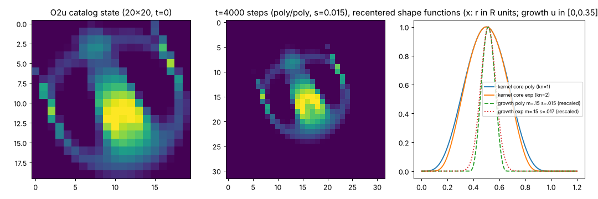

# S001: Orbium unicaudatus (catalog code `O2u`)

Stable ID **S001**. Nickname: none. It is a catalogued species, so no nickname is earned.
Dossier owner: Lane 1 (Reference Naturalist), 2026-10-07.
Supporting files: [`S001-orbium/`](S001-orbium/). Semantics background:
[`../reports/reference-dossier.md`](../reports/reference-dossier.md).

## Provenance

- Source: `Chakazul/Lenia` @ `adfc542939266de7f4bb7ebb552e8499701ee107`, file
  `Python/animals.json` (sha256 `09cf0a831c1ef8a73ebfaa9126257fbe076108362b706a98d88650ca9848d206`).
  It is the **only** entry with `"code": "O2u"` (array index 4).
- Taxonomy (from catalog headers): class Exokernel → order Orbiformes → family Orbidae →
  subfamily Haplorbinae. Name "Orbium unicaudatus", Chinese/Japanese name 球虫(單尾).
- It is the default 2-D startup creature of upstream `LeniaND.py` (`ANIMAL_KEY_LIST['1'] = 'O2u'`).
- The same cells are byte-identical in `Python/old/animals.json` as `O2(a)`, but with σ = 0.017
  there. The JS catalog runs Orbium with an exponential core and Gaussian growth at σ = 0.017. See
  the reference dossier §3.1 for why S001 pins the LeniaND rule below.

## Canonical rule (S001 baseline)

| Parameter | Value | Note |
| --- | --- | --- |
| R | 13 | cells per kernel radius |
| T | 10 | Δt = 0.1 |
| μ (`m`) | 0.15 | |
| σ (`s`) | 0.015 | |
| β (`b`) | [1] | single ring |
| kernel core | **polynomial** `(4r(1−r))^4` | catalog `kn = 1` as executed by upstream code (UI mislabels it "Exponential") |
| growth | **polynomial** `2·max(0, 1−(u−μ)²/(9σ²))^4 − 1` | catalog `gn = 1` as executed |
| integrator | Euler, hard clip to [0, 1], float64 | |
| boundary | periodic torus (FFT) | |
| baseline grid | 128 × 128 | upstream default world size |

## Exact initial state

The state is a 20 × 20 array of integer levels 0..255; cell value = level / 255. Rows are y
(downward) and columns are x. Integer level sum = 19600, so initial mass = 19600/255/13² = 0.4548.

- Verbatim RLE from the catalog:
  ```
  7.MD6.qL$6.pKqEqFURpApBRAqQ$5.VqTrSsBrOpXpWpTpWpUpCrQ$4.CQrQsTsWsApITNPpGqGvL$3.IpIpWrOsGsBqXpJ4.LsFrL$A.DpKpSpJpDqOqUqSqE5.ExD$qL.pBpTT2.qCrGrVrWqM5.sTpP$.pGpWpD3.qUsMtItQtJ6.tL$.uFqGH3.pXtOuR2vFsK5.sM$.tUqL4.GuNwAwVxBwNpC4.qXpA$2.uH5.vBxGyEyMyHtW4.qIpL$2.wV5.tIyG3yOxQqW2.FqHpJ$2.tUS4.rM2yOyJyOyHtVpPMpFqNV$2.HsR4.pUxAyOxLxDxEuVrMqBqGqKJ$3.sLpE3.pEuNxHwRwGvUuLsHrCqTpR$3.TrMS2.pFsLvDvPvEuPtNsGrGqIP$4.pRqRpNpFpTrNtGtVtStGsMrNqNpF$5.pMqKqLqRrIsCsLsIrTrFqJpHE$6.RpSqJqPqVqWqRqKpRXE$8.OpBpIpJpFTK!
  ```
- Decoded integer levels: [`S001-orbium/initial-cells-u8.csv`](S001-orbium/initial-cells-u8.csv).
  Decoder `reconstruct.py:rle2int` matches upstream `Board.rle2arr` on all 548 catalog entries.
- Placement: centre the 20 × 20 patch in the world with offset `((N−20)//2, (N−20)//2)` (upstream
  `Board.add`, `is_centered=True`). Every other cell is 0. There is no randomness, so no seed.
- Reconstruction command (repo root, after `./scripts/bootstrap.sh`):
  ```bash
  .venv/bin/python research/specimens/S001-orbium/reconstruct.py --steps 4000 --every 10
  ```

## Preview



Left: catalog state. Middle: after 4000 steps under the baseline rule, recentred. Right: kernel-core
and growth shapes for both families.

## Baseline behaviour (reference script, single run, OBSERVED)

Run: `reconstruct.py --steps 4000 --every 10`, 128² torus, baseline rule. The trace is
[`S001-orbium/reference-trace.csv`](S001-orbium/reference-trace.csv) (sha256 `d69d3756…`) and it
regenerates byte-identically. Statistics are over steps 1000–4000, and the step-1 sampling run gave
the same values.

| Metric | Value | Definition |
| --- | --- | --- |
| survival | alive at 4000 steps (also at 5000) | mass > 1e−10 |
| mass ΣA/R² | 0.4358 ± 0.0011 (range 0.433–0.438) | upstream `m` units |
| positive growth Σmax(G,0)/R² | ≈ 0.475 | upstream `g` |
| gyradius | 0.4376 R | about the periodic centroid |
| speed | 0.4796 R per time unit = 0.623 cells/step | periodic centroid, sampled every step |
| heading | 68.2° from +x toward +y (image y-down) | fixed by the catalog orientation |
| dominant mass period | 4.32 steps | **lattice artifact**, see below |

Do not estimate speed from a coarse sampling interval. At `--every 250` the creature travels
about 156 cells per sample on a 128 grid, and the wrapped estimate gave a wrong 0.185 R/time.
Keep displacement per sample below N/2.

## Cross-check against upstream code (OBSERVED, distinct execution path)

`S001-orbium/xcheck_upstream.py` extracts upstream `Board` and `Automaton` from `LeniaND.py` with
`ast` and steps them headless (the GPU compile fails, so upstream falls back to its numpy path).

- The initial world array is identical, and `max|ΔK̂| = 0` for the kernel FFT.
- max |A_ours − A_upstream|: 5.6e−17 after 1 step, 3.4e−14 after 100, 1.6e−9 after 500, 1.1e−6
  after 1000, 1.1e−7 after 2000. Normalised mass agrees to 6 decimals throughout.
- The growth from 1e−17 to 1e−6 is the expected amplification of float rounding differences
  (`fft2` vs `fftn` ordering). It is not a semantic difference. Upstream's **GPU** path is float32
  and was not exercised.

## Rule-variant sweep (OBSERVED; 5000 steps, 128², stats over steps 1000–5000, sampled every 50)

| Core / growth | σ | Alive | Mean mass | Gyradius | Speed (R/time) |
| --- | --- | --- | --- | --- | --- |
| poly / poly | 0.014 | yes | 0.4234 | 0.4283 | 0.4635 |
| **poly / poly** | **0.015** | **yes** | **0.4358** | **0.4376** | **0.4794** |
| poly / poly | 0.016 | yes | 0.4457 | 0.4461 | 0.4994 |
| poly / poly | 0.017 | yes | 0.4550 | 0.4553 | 0.5193 |
| exp / exp | 0.015 | yes | 0.4208 | 0.4337 | 0.4730 |
| exp / exp | 0.017 | yes | 0.4495 | 0.4526 | 0.4939 |

Command: `reconstruct.py --steps 5000 --every 50 --kernel {poly,exp} --growth {poly,exp} --sigma S`.
Mass, size and speed all rise monotonically with σ, and the creature survives every rule recorded
upstream for these cells.

## Resolution note (OBSERVED, single run)

The upstream GUI blows the catalog state up to R = 20 with nearest-neighbour zoom (31 × 31). That
version also survives 3000 steps at R = 20, μ = 0.15, σ = 0.015, poly/poly, with ΣA/R² = 0.435
(vs 0.436 at R = 13). Normalised mass is resolution-stable at this level. This is not a substitute
for Lane 3's resolution study.

## Lattice-heading observation (OBSERVED; proposed as a claim)

`S001-orbium/lattice_heading.py` rotates the start state (bilinear) and compares the mass spectrum
with the creature's grid-crossing periods 1/|vx| and 1/|vy|:

| Start rotation | Heading | Mass sd/mean | Dominant mass period | 1/\|vx\|, 1/\|vy\| (steps) |
| --- | --- | --- | --- | --- |
| 0° | 68.2° | 2.6e−3 | 4.32 | 4.32, 1.73 |
| 23° | 40.4° | 6.6e−3 | 14.29 | 2.11, 2.48 (beat: 1/(1/2.11 − 1/2.48) ≈ 14.1) |
| 45° | 21.8° | 2.5e−3 | 4.32 | 1.73, 4.32 |

Both the period and the amplitude of Orbium's mass fluctuation follow its heading relative to the
grid. The fluctuation is a discretisation artifact, not an intrinsic oscillation. Speed (0.622–0.623
cells/step) is heading-independent.

## Tested perturbations

None yet; this is Lane 4's job. Upstream's built-in survival test is: mass > 1e−10, no mass on the
recentred world's border, and t ≥ 25 time units.

## Claims supported / refuted

None entered in the ledger. Proposed for the coordinator:

1. **S001 baseline glides stably** under the LeniaND rule for ≥ 5000 steps on 128² (mass 0.436 ±
   0.001, speed 0.480 R/time). OBSERVED; INDEPENDENTLY_CHECKED vs upstream `Automaton` CPU path
   for 2000 steps.
2. **S001 survives all four upstream-recorded rule variants** (poly/exp × σ 0.015/0.017).
   OBSERVED.
3. **S001's mass oscillation period is set by grid-crossing at its heading** (4.32 steps at 68.2°,
   14.3 steps at 40.4°). OBSERVED; a candidate for Lane 3/7 to try to kill. The obvious next test
   is to vary R and check that the period scales as 1/(speed in cells/step · cos heading).

## Numerical-stability notes

- Upstream has two precisions (CPU float64, GPU float32). The baseline is float64.
- Upstream's Adams–Bashforth option is dead code, so Euler is the only reference integrator.
- Sensitivity to T (timestep) has not been tested here; that belongs to Lane 3.
