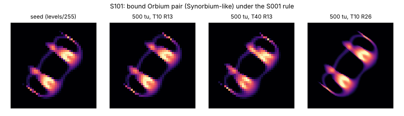

# S101: bound Orbium pair under the S001 rule (Synorbium ignis branch)

Stable ID **S101**. Nickname: none. It is the catalogued Synorbium ignis (`O4i`) carried over
to S001's rule, so no nickname is earned. Dossier owner: Lane 6 (Field Exploration), 2026-10-07.
Experiments: [`../experiments/L6-field/`](../experiments/L6-field/README.md).

## Provenance

Found in L6-003 `pairs` ([`sweep_seeds.py`](../experiments/L6-field/sweep_seeds.py)): two copies
of the S001 cells on a 192² torus, the second at the same orientation and offset (−1 R, +1 R),
run 5000 steps under the S001 rule. The same bound body formed from 7 of 175 two-Orbium starts,
at relative rotations 0°, 45°, 90° and 270°. Converged statistics agreed across all 7 to
2e-4 in mass and 1e-3 R in gyradius.

**Reference check:** the catalog's own `O4i` cells (Synorbium ignis, catalog rule μ 0.152,
σ 0.0156), run under the S001 rule, converge to the same attractor: mass 0.8737 vs 0.8736,
gyradius 0.8154 vs 0.8152 R, speed 0.4723 vs 0.4727 R/tu. This holds at T 40 and R 26 as well.

## Rule

Identical to S001: R 13, T 10, μ 0.15, σ 0.015, β [1], poly kernel core, poly growth, Euler +
hard clip, float64, periodic torus. Registered in `alm.specimens` as `S101`.

## Exact initial state

[`S101-orbium-pair/initial-cells-u8.csv`](S101-orbium-pair/initial-cells-u8.csv): 35 × 31
integer levels (cell = level/255), level sum 37 582. It is the settled state of the recipe
above, recentred on its periodic centroid, cropped to cells > 1e-6 and quantised. It is
rebuilt bit-for-bit by `python research/experiments/L6-field/make_seeds.py`. It is placed
centred as for S001.

## Preview

## Baseline behaviour

| Metric | T 10, R 13 | T 40, R 13 | T 10, R 26 |
| --- | --- | --- | --- |
| mass ΣA/R² | 0.8736 (sd 0.0011) | 0.8643 | 0.8738 |
| gyradius (R) | 0.815 | 0.815 | 0.816 |
| speed (R/tu) | 0.4727 | 0.5080 | 0.4724 |
| path straightness | 0.9993 | — | — |

The two partners sit side by side, travelling parallel, and the body is one connected
component. Its mass is 2.004 × Orbium's. It is 1.4% slower than a single Orbium at T 10.

Runs: `S101-3ffd856fba` (T 10, 10 000 steps; a second process gives the same final sha256
`107c9d26…`) and `S101-046982cbd6` (T 40, 20 000 steps). The heading (35.5° at T 10, 38.5° at
T 40) is not a trait. At R 13 it is lattice-selected (Lanes 3 and 7).

## Tested perturbations (L6-005, 2 phases, 500 tu after the edit)

| Disturbance (Lane 4 L4-001) | Outcome | Single Orbium (control) |
| --- | --- | --- |
| I001 attenuation | pair survives ≤ 0.05; at 0.10 → **single Orbium** (one phase) or death | survives ≤ 0.05 (0.10 in one phase) |
| I002 central deletion | pair survives ≤ 0.50 R | ≤ 0.05 R |
| I003 frontal addition | phase-dependent: pair, single Orbium or death up to 0.85; FILLED ≥ 0.90 | ≤ 0.30, then DIED |
| I004 port injury | ≤ 0.05 pair; **0.10–0.50 → single Orbium, 18/18**; ≥ 0.55 died | ≤ 0.05, then DIED (36/36) |

After fission the survivor is an ordinary Orbium: mass 0.4358, speed 0.4794, the S001 values.

**Caveats.** The I002 disc is centred on the pair's centroid, which falls in the gap between
the partners. Up to 0.4 R it removes < 1% of the mass, so "survives I002" is trivial. I004 cuts
along the heading, and the partners sit side by side, so the cut mostly lands on one partner.
The fission result says only that the uninjured partner is not dragged down by the dying one.
It does not show that the pair heals.

## Claims

- Proposed L6-c (see the L6-field README): fission under port injury. OBSERVED; T and R
  persistence of the pair checked, disturbance runs at T 10, R 13 only.
- Novelty: REFUTED (catalogued `O4i` branch).

## Numerical-stability notes

Persists at T 40 and R 26 with the same mass and gyradius. The speed is 7% lower at T 10 than
at T 40, the same Euler effect Lane 3 measured for S001. It is sensitive to binding conditions:
14 of the 21 double-mass outcomes in L6-003 stayed as two separate Orbia.
