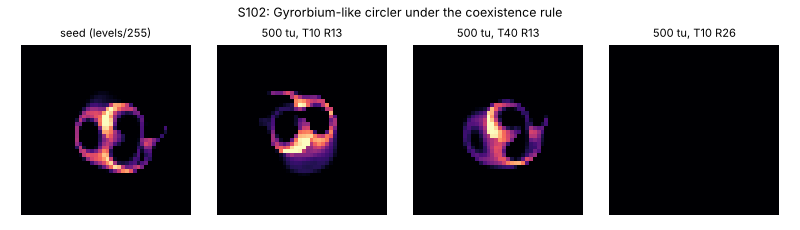

# S102: Gyrorbium-like circler under the coexistence rule

Stable ID **S102**. Nickname: none. It is the catalogued Gyrorbium gyrans (`OG2g`) carried to a
nearby rule, and it fails the resolution check at its own rule. Dossier owner: Lane 6,
2026-10-07. Experiments: [`../experiments/L6-field/`](../experiments/L6-field/README.md).

## Provenance

In L6-001 (μ × σ sweep seeded with S001's cells), Orbium at μ 0.155, σ 0.022 turned into a
circler within 100 tu. The seed is that state after 20 000 steps (T 10, R 13, 128²). It is
registered under the **coexistence rule** μ 0.155, σ 0.020, where Orbium gliders (and S103)
also persist (L6-004).

**Reference check:** catalog `OG2g` Gyrorbium gyrans (μ 0.156, σ 0.0224) cells under the
coexistence rule converge to the same body: mass 0.5228 vs 0.5223, gyradius 0.5155 vs 0.5158,
path speed 0.498 vs 0.497 R/tu.

## Rule

R 13, T 10, **μ 0.155, σ 0.020**, β [1], poly kernel core, poly growth, Euler + hard clip,
float64, periodic torus. Registered in `alm.specimens` as `S102`.

## Exact initial state

[`S102-circler/initial-cells-u8.csv`](S102-circler/initial-cells-u8.csv): 21 × 24 levels, sum
24 129, rebuilt bit-for-bit by `make_seeds.py`. Placed centred.

## Preview

## Baseline behaviour

It moves about as fast as Orbium but in a tight circle, so it goes nowhere.

| Metric | T 10, R 13 | T 40, R 13 | T 10, R 26 |
| --- | --- | --- | --- |
| mass | 0.522 (sd 0.010, 1.9%) | 0.497 | 0.5234 (block/nearest/cubic seed); bilinear seed died |
| gyradius (R) | 0.516 | 0.499 | — |
| net speed (R/tu) | 0.0008 | 0.0004 | 0.0055 |
| path speed, 1-tu velocity (R/tu) | 0.44–0.50 | 0.48–0.57 | 0.500 (window mean) |
| turning rate | 95°/tu (one lap per ~3.8 tu) | 109–113°/tu | — |
| circle radius | ~0.27 R | ~0.25 R | — |

Runs: `S102-5bfac8f95f` (T 10; second process identical, final sha256 `10d65755…`) and
`S102-7b439113e1` (T 40). The mass oscillates (dominant period 8.9 steps at T 10, 30.5 steps at
T 40).

## Tested perturbations (L6-005, coexistence rule, 2 phases)

It is the most fragile of the three phenotypes under this rule. Survival is phase-dependent
already at the smallest strengths: I001 0.05, I002 0.05–0.10, I004 0.05–0.10. I003 is survived
to 0.10. In one phase, **I004 port injury at 0.15 and 0.25 turned it into the S103 static
ring** (2 of 38 I004 runs). It never turned into a glider.

## Claims

- Proposed L6-a (coexistence with Orbium and S103 under one rule): the circler is one of the
  three phenotypes.
- Proposed L6-b: no circler → glider switch under I001–I004.
- Novelty: REFUTED (catalogued `OG2g` branch).

## Numerical-stability notes

**Correction (2026-10-08, dispute D2): S102 survives doubling the resolution.** Night 0 reported
that it died at R 26 at its own rule. That came from the seed, not the resolution: the seed had
been enlarged with bilinear interpolation (`ndimage.zoom` order 1). Lane 3 (C047, PR #18) found
that block, nearest-neighbour and cubic enlargements survive. Lane 6's engine reproduces this
([`d2-resize.csv`](../experiments/L6-007-attractor-geography/d2-resize.csv)): those three seeds
stay circlers at R 26 and R 39 for 1000 tu (mass 0.5234–0.5235), and the bilinear seed dies at
t = 8.3 tu (R 26) and 6.0 tu (R 39). So the claim of fragility under resolution is withdrawn.
What remains is sensitivity to the initial condition. At T 40 it persists, turning ~15% faster. The
coexistence band with Orbium exists at all three settings but sits at different σ
(L6-004 table).

**Lifetime (2026-10-08, L6-007 follow-up and HR-009): S102 is a chaotic transient, not a stable
state.** At its registered rule on 128², the registered seed circles until step 39 799
(t = 3979.9 tu) and then dies. Both `field.py` and `alm.lenia` give that step, but that is **one
floating-point trajectory, not the lifetime of S102**. Lane 7 (HR-009, PR #30) showed that twins
differing by 1e−12 separate at about 0.2 per tu, and that tiny-noise copies die anywhere from
292 tu to beyond 5000 tu. In Lane 6's follow-up, 4 of 12 starts with 1–3% noise die between 934
and 1291 tu, and 8 still circle at 5000 tu. Treat the lifetime as a distribution with censored
survivors. Lane 3's independent check (PR #29) reproduces this at R 13, but at R 26 and R 39 no
circler died within 5000–8000 tu. So the finite lifetime may be an R 13 discretisation effect, and
the transient label applies at R 13, T 10 only. See
[`L6-007`](../experiments/L6-007-attractor-geography/README.md). Night 0's runs (20 000 steps)
were too short to see this.
