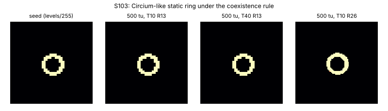

# S103: Circium-like static ring under the coexistence rule

Stable ID **S103**. Nickname: none. It is the catalogued Circium lithos apertus (`C0la`)
carried to the coexistence rule. Dossier owner: Lane 6, 2026-10-07. Experiments:
[`../experiments/L6-field/`](../experiments/L6-field/README.md).

## Provenance

Found in L6-005: the S102 circler under the coexistence rule (μ 0.155, σ 0.020), with Lane 4's
I004 port injury at s = 0.15 applied after step 3002, settled into a motionless ring. The seed is
that state after 5000 more steps. The same mass (0.378698) appears whenever this rule produces a
static body from the circler or OG2g seeds.

**Reference check:** catalog `C0la` Circium lithos apertus (R 15, μ 0.16, σ 0.022), resized to
R 13 and run under the coexistence rule, settles to mass 0.378698, the same as S103.

## Rule

Same as S102: R 13, T 10, μ 0.155, σ 0.020, β [1], poly/poly, Euler + hard clip, float64,
periodic torus. Registered in `alm.specimens` as `S103`.

## Exact initial state

[`S103-static-ring/initial-cells-u8.csv`](S103-static-ring/initial-cells-u8.csv): 12 × 12, level
sum 16 320. **Every cell is 0 or 255**: 64 full cells in a ring two cells thick around an empty
6 × 6 core. Placed centred. Rebuilt by `make_seeds.py`.

## Preview

## Baseline behaviour

It does not move or change. After 10 000 steps at T 10 and 20 000 steps at T 40, the final
state is **bitwise identical** to the initial state: runs `S103-1d8c158cdd` and
`S103-4982ff6f4d`, both with final sha256 = initial sha256 `a81efdac…`, and a second process
agrees. Mass 0.3787, gyradius 0.387 R.

Why: on the placed seed, every full cell has G(U) ≥ +0.028 and is held at 1 by the clip, and
every empty cell has G(U) ≤ −0.125 and is held at 0. Being an exact fixed point of the
*clipped* map makes it independent of T. It is a creature of the hard clip. A Lenia variant
without clipping (or with soft clipping) would not have it in this form.

## Tested perturbations (one phase; it has no internal phase)

| Disturbance | Outcome |
| --- | --- |
| I001 attenuation 0.05–0.20 | returns **bitwise** to S103 |
| I001 ≥ 0.30 | died |
| I002 central deletion | no-op (the centre is empty) |
| I003 frontal addition (+x side) 0.10 | returns to S103; ≥ 0.30 fills the world |
| I004 side cut 0.05 | returns to S103; ≥ 0.10 died |

Under the coexistence rule it is the most attenuation-tolerant of the three phenotypes:
ring 20%, Orbium 10%, circler < 5% in every phase.

## Claims

- Proposed L6-a: one of three phenotypes coexisting under the coexistence rule.
- It is an attracting fixed point: small attenuation returns it exactly. OBSERVED.
- Novelty: REFUTED (catalogued `C0la` branch).

## Numerical-stability notes

T-independent by construction (it is a clip fixed point). Its seed resized to R 26 is also
static, with the same mass. It is not tied to grid size beyond fitting on the torus.
